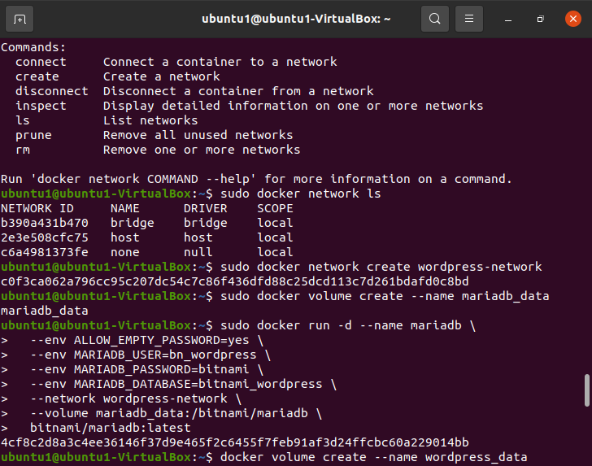

# Pratice 1 - Using the Docker Command Line

### Using the Docker Command Line

If you want to run the application manually instead of using `docker-compose`, these are the basic steps you need to run:

#### Step 1: Create a network

```console
$ docker network create wordpress-network
```

#### Step 2: Create a volume for MariaDB persistence and create a MariaDB container

```console
$ docker volume create --name mariadb_data
$ docker run -d --name mariadb \
  --env ALLOW_EMPTY_PASSWORD=yes \
  --env MARIADB_USER=bn_wordpress \
  --env MARIADB_PASSWORD=bitnami \
  --env MARIADB_DATABASE=bitnami_wordpress \
  --network wordpress-network \
  --volume mariadb_data:/bitnami/mariadb \
  bitnami/mariadb:latest
```

#### Step 3: Create volumes for WordPress persistence and launch the container

```console
$ docker volume create --name wordpress_data
$ docker run -d --name wordpress \
  -p 8080:8080 -p 8443:8443 \
  --env ALLOW_EMPTY_PASSWORD=yes \
  --env WORDPRESS_DATABASE_USER=bn_wordpress \
  --env WORDPRESS_DATABASE_PASSWORD=bitnami \
  --env WORDPRESS_DATABASE_NAME=bitnami_wordpress \
  --network wordpress-network \
  --volume wordpress_data:/bitnami/wordpress \
  bitnami/wordpress:latest
```
