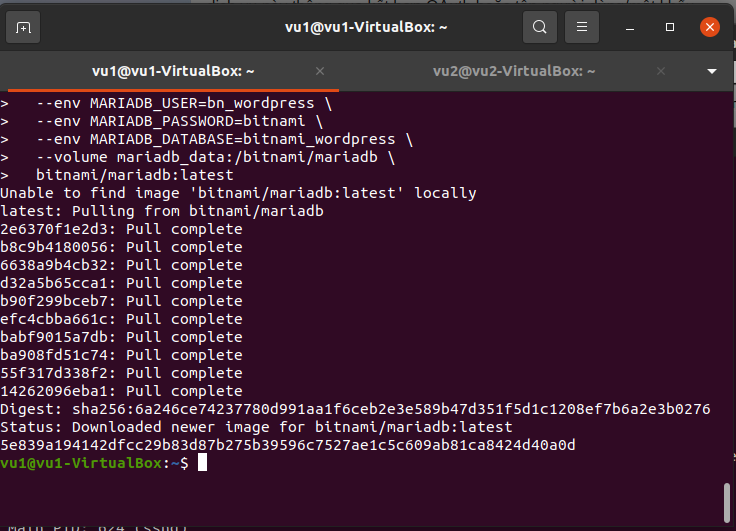
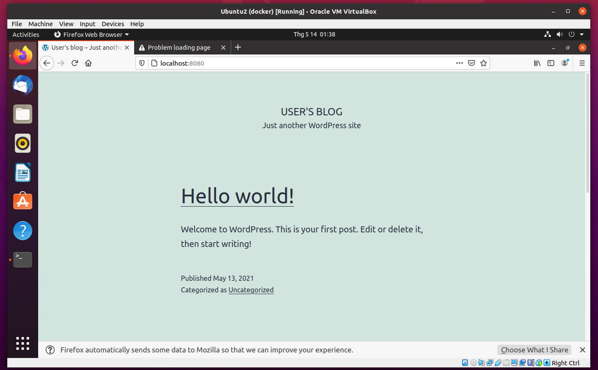

# Pratice 1 - 

>• Create two Ubuntu virtual machines

>• Setup Docker inside VMs

>• Deploy WordPress with Command Line on two virtual machines

>• Example: https://github.com/bitnami/bitnami-docker-wordpress#run-
the-application-using-docker-compose

>• Requirements:

>• MariaDB container on VM1

>• WordPress container on VM2


## Setup Docker inside VMs

VM1:
ip 192.168.31.169

VM2:
ip 192.168.31.150

## Enable port
```
$ sudo ufw enable

$ sudo ufw allow 8080

$ sudo ufw allow 22 
```

## VM1 create volume for container mariadb and run the image mariadb:latest

```
$ docker volume create --name mariadb_data

$ docker run -d --name mariadb \
  -p 3306:3306 \
  --env ALLOW_EMPTY_PASSWORD=yes \
  --env MARIADB_USER=bn_wordpress \
  --env MARIADB_PASSWORD=bitnami \
  --env MARIADB_DATABASE=bitnami_wordpress \
  --volume mariadb_data:/bitnami/mariadb \
  bitnami/mariadb:latest
```

 


## VM2 reate volume for container wordpress and run the image bitnami/wordpress:latest

```
$ docker volume create --name wordpress

docker run -d --name wordpress \
  -p 8080:8080 -p 8443:8443 \
  --env ALLOW_EMPTY_PASSWORD=yes \
  --env WORDPRESS_DATABASE_USER=bn_wordpress \
  --env WORDPRESS_DATABASE_PASSWORD=bitnami \
  --env WORDPRESS_DATABASE_NAME=bitnami_wordpress \
  --volume wordpress_data:/bitnami/wordpress \
  --add-host mariadb: 192.168.31.169 \
  bitnami/wordpress:latest
```
 Publish a container via port 8080 and 8443
	- add host mariadb as 192.168.31.169

 


 access at localhost:8080 
 