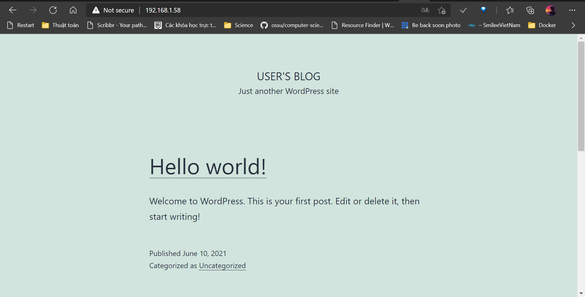
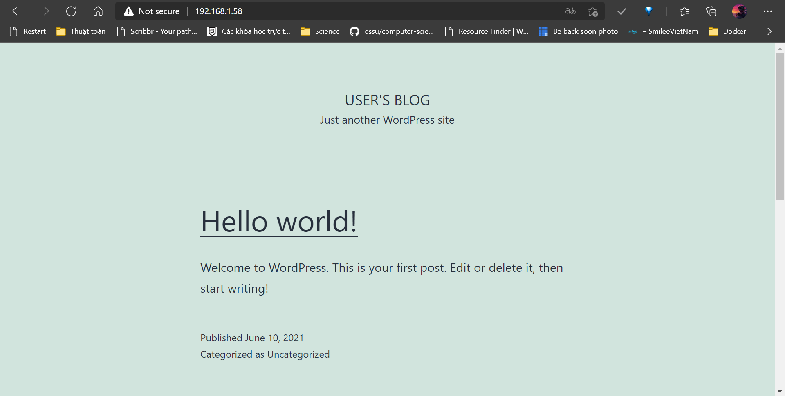
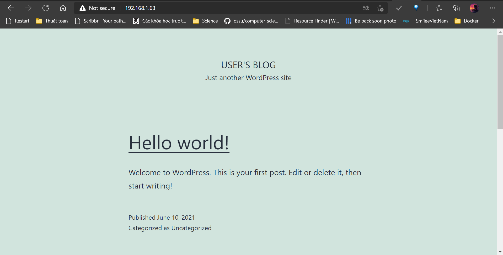

# Week 1

## Bài tập 1

1. Đầu tiên ta tạo network:

    ```console
    docker network create wordpress-network
    ```

2. Tạo docker volume cho DB và container DB:

    ```console
    docker volume create --name mariadb_data
    docker run -d --name mariadb \
    --env ALLOW_EMPTY_PASSWORD=yes \
    --env MARIADB_USER=bn_wordpress \
    --env MARIADB_PASSWORD=bitnami \
    --env MARIADB_DATABASE=bitnami_wordpress \
    --network wordpress-network \
    --volume mariadb_data:/bitnami/mariadb \
    bitnami/mariadb:latest
    ```

3. Tạo docker volum cho Wordpress và container Wordpress:

    ```console
    docker volume create --name wordpress_data
    docker run -d --name wordpress \
    -p 80:8080 -p 8443:8443 \
    --env ALLOW_EMPTY_PASSWORD=yes \
    --env WORDPRESS_DATABASE_USER=bn_wordpress \
    --env WORDPRESS_DATABASE_PASSWORD=bitnami \
    --env WORDPRESS_DATABASE_NAME=bitnami_wordpress \
    --network wordpress-network \
    --volume wordpress_data:/bitnami/wordpress \
    bitnami/wordpress:latest
    ```

    Lưu ý: Port ta để cho wordpress là 80

4. Kiểm tra trạng thái container

    ```console
    docker ps -a
    CONTAINER ID   IMAGE                      COMMAND                  CREATED              STATUS              PORTS                                          NAMES
    25e4ba8e840d   bitnami/wordpress:latest   "/opt/bitnami/script…"   14 seconds ago       Up 12 seconds       0.0.0.0:8443->8443/tcp, 0.0.0.0:80->8080/tcp   wordpress
    3dd6903e11b9   bitnami/mariadb:latest     "/opt/bitnami/script…"   About a minute ago   Up About a minute   3306/tcp                                       mariadb
    ```

5. Mở port 80 để truy cập Wp từ ngoài máy ảo:

    ```console
    sudo ufw enable
    sudo ufw allow 80
    sudo ufw status
    ```

    Kết quả

    ```console
        Status: active
    To                         Action      From
    --                         ------      ----
    80                         ALLOW       Anywhere
    80 (v6)                    ALLOW       Anywhere (v6)

    ```

6. Kết quả
    

## Bài tập 2

1. Tải file docker-compose.yml

    ```console
    curl -sSL https://raw.githubusercontent.com/bitnami/bitnami-docker-wordpress/master/docker-compose.yml > docker-compose.yml
    ```

2. Chỉnh sửa file (để sử dụng image lastest)

   ```console
   nano docker-compose.yml
   ```

   ```yml
    version: '2'
    services:
    mariadb:
        image: docker.io/bitnami/mariadb:latest
        volumes:
        - 'mariadb_data:/bitnami/mariadb'
        environment:
        - ALLOW_EMPTY_PASSWORD=yes
        - MARIADB_USER=bn_wordpress
        - MARIADB_DATABASE=bitnami_wordpress
    wordpress:
        image: docker.io/bitnami/wordpress:latest
        ports:
        - '80:8080'
        - '443:8443'
        volumes:
        - 'wordpress_data:/bitnami/wordpress'
        depends_on:
        - mariadb
        environment:
        - ALLOW_EMPTY_PASSWORD=yes
        - WORDPRESS_DATABASE_HOST=mariadb
        - WORDPRESS_DATABASE_PORT_NUMBER=3306
        - WORDPRESS_DATABASE_USER=bn_wordpress
        - WORDPRESS_DATABASE_NAME=bitnami_wordpress
    volumes:
    mariadb_data:
        driver: local
    wordpress_data:
        driver: local
   ```

3. Chạy file docker-compose

    ```console
    docker-compose up -d
    ```

4. Kiểm tra trạng thái container

    ```console
    docker ps
    CONTAINER ID   IMAGE                      COMMAND                  CREATED          STATUS          PORTS                                         NAMES
    2bbee5817da3   bitnami/wordpress:latest   "/opt/bitnami/script…"   21 seconds ago   Up 20 seconds   0.0.0.0:80->8080/tcp, 0.0.0.0:443->8443/tcp   working_wordpress_1
    f08cc5c185a6   bitnami/mariadb:latest     "/opt/bitnami/script…"   22 seconds ago   Up 21 seconds   3306/tcp                                      working_mariadb_1
    ```

5. Mở port 80

    ```console
    sudo ufw enable
    sudo ufw allow 80
    sudo ufw status
    ```

    Kết quả

    ```console
        Status: active
    To                         Action      From
    --                         ------      ----
    80                         ALLOW       Anywhere
    80 (v6)                    ALLOW       Anywhere (v6)
    ```

6. Kết quả
    

## Bài tập 3

Ta sẽ có 2 VM lần lượt là VM1 (192.168.1.58) và VM2 VM1 (192.168.1.63)

### VM1

Ta sẽ tạo volume DB và run DB container (trên port 3306)

```console
docker volume create --name mariadb_data
docker run -d --name mariadb \
  -p 3306:3306 \
  --env ALLOW_EMPTY_PASSWORD=yes \
  --env MARIADB_USER=bn_wordpress \
  --env MARIADB_PASSWORD=bitnami \
  --env MARIADB_DATABASE=bitnami_wordpress \
  --network wordpress-network \
  --volume mariadb_data:/bitnami/mariadb \
  bitnami/mariadb:latest
```

Kiểm tra container

```console
docker ps
CONTAINER ID   IMAGE                    COMMAND                  CREATED          STATUS          PORTS                    NAMES
7ab05b5a8c7d   bitnami/mariadb:latest   "/opt/bitnami/script…"   26 seconds ago   Up 24 seconds   0.0.0.0:3306->3306/tcp   mariadb
```

Mở port 3306

```console
sudo ufw enable
sudo ufw allow 3306
sudo ufw status
```

Kết quả

```console
Status: active
To                         Action      From
--                         ------      ----
3306                       ALLOW       Anywhere
3306 (v6)                  ALLOW       Anywhere (v6)
```

### VM2

Ping thử đến database

```console
telnet 192.168.1.58 3306
```

Tạo network

```console
docker network create wordpress-network
```

Tạo volume và run container WP

```console
docker volume create --name wordpress_data
docker run -d --name wordpress \
  -p 80:8080 -p 8443:8443 \
  --env ALLOW_EMPTY_PASSWORD=yes \
  --env WORDPRESS_DATABASE_USER=bn_wordpress \
  --env WORDPRESS_DATABASE_PASSWORD=bitnami \
  --env WORDPRESS_DATABASE_NAME=bitnami_wordpress \
  --env WORDPRESS_DATABASE_HOST=192.168.1.58 \
  --network wordpress-network \
  --volume wordpress_data:/bitnami/wordpress \
  bitnami/wordpress:latest
```

Lưu ý WORDPRESS_DATABASE_HOST ta config là ip của `VM1` nơi run container DB

Mở port 80

```console
sudo ufw enable
sudo ufw allow 80
sudo ufw status
```

Kết quả

```console
Status: active
To                         Action      From
--                         ------      ----
80                         ALLOW       Anywhere
80 (v6)                    ALLOW       Anywhere (v6)
```

Kiểm tra:

