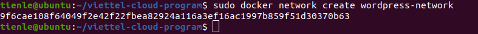
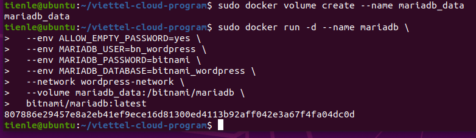
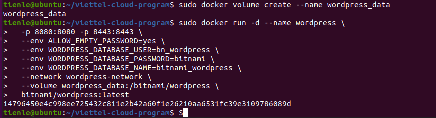
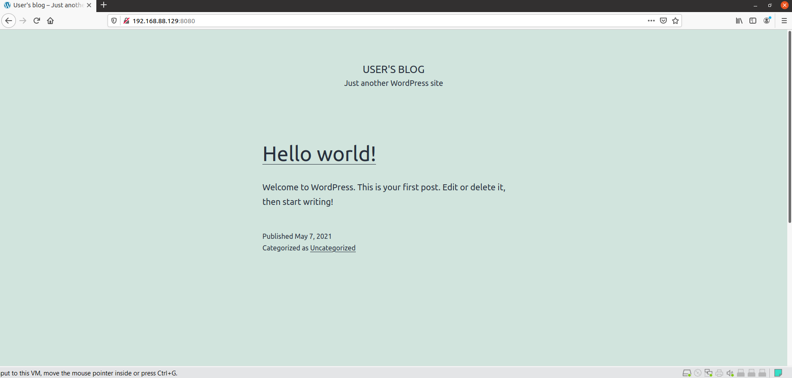
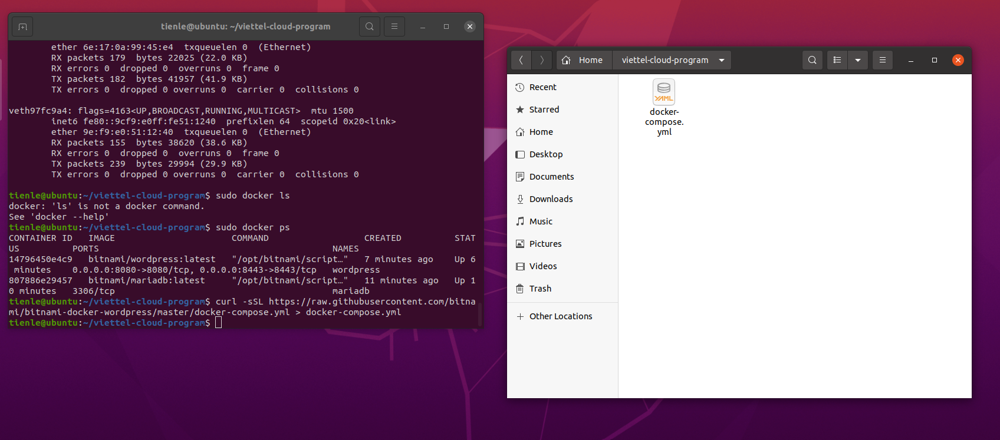
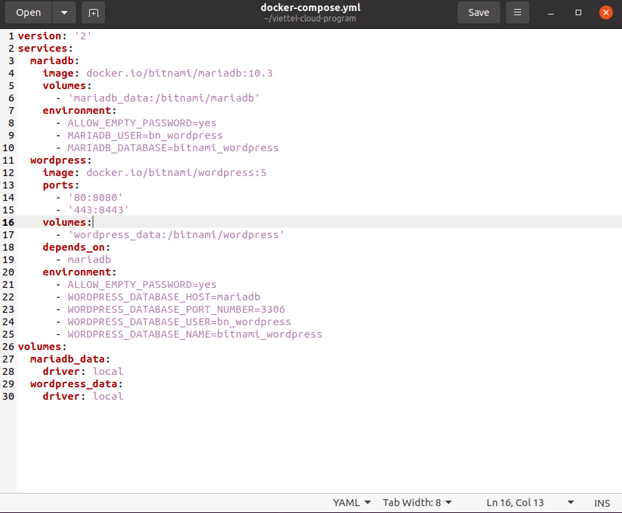
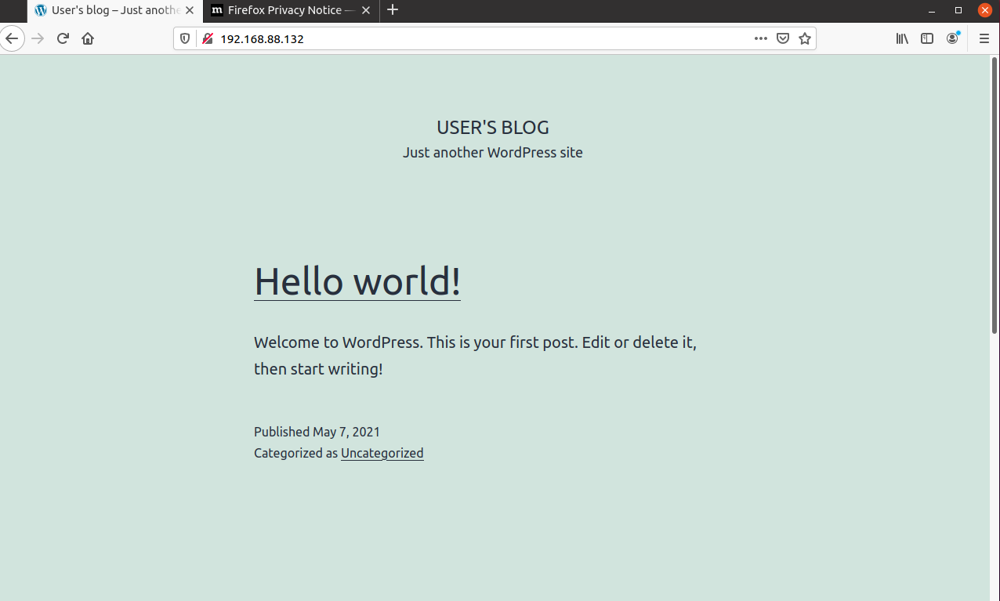
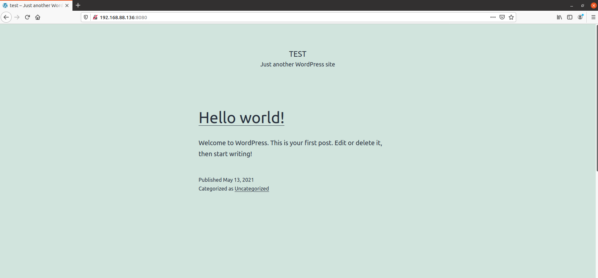

# PRACTICES DOCUMENT

## Set up (exclude set up VMs)


### 1. [Docker](https://docs.docker.com/engine/install/ubuntu/)

**Update the apt package index and install packages to allow apt to use a repository over HTTPS:**

```shell

$ sudo apt-get update
$ sudo apt-get install \
    apt-transport-https \
    ca-certificates \
    curl \
    gnupg \
    lsb-release
```
**Install Docker**

```shell
$ sudo apt install docker.io
// check version
$ docker --version
```

### 2. [Docker Compose](https://docs.docker.com/compose/install/)

**Download the current stable release of Docker Compose**

```shell
$ sudo curl -L "https://github.com/docker/compose/releases/download/1.29.1/docker-compose-$(uname -s)-$(uname -m)" -o /usr/local/bin/docker-compose
```

**Apply executable permissions to the binary**

```shell
$ sudo chmod +x /usr/local/bin/docker-compose
```


## Practice 1: Deploy Wordpress with Command Line

### Step 1: Create a network
```shell
$ sudo docker network create wordpress-network
```

_Success output:_



### Step 2: Create a volume for MariaDB persistence and create a MariaDB container
```shell
$ sudo docker volume create --name mariadb_data
$ docker run -d --name mariadb \
  --env ALLOW_EMPTY_PASSWORD=yes \
  --env MARIADB_USER=bn_wordpress \
  --env MARIADB_PASSWORD=bitnami \
  --env MARIADB_DATABASE=bitnami_wordpress \
  --network wordpress-network \
  --volume mariadb_data:/bitnami/mariadb \
  bitnami/mariadb:latest
```
_Success output:_



### Step 3: Create volumes for WordPress persistence and launch the container
```shell
$ docker volume create --name wordpress_data
$ docker run -d --name wordpress \
  -p 8080:8080 -p 8443:8443 \
  --env ALLOW_EMPTY_PASSWORD=yes \
  --env WORDPRESS_DATABASE_USER=bn_wordpress \
  --env WORDPRESS_DATABASE_PASSWORD=bitnami \
  --env WORDPRESS_DATABASE_NAME=bitnami_wordpress \
  --network wordpress-network \
  --volume wordpress_data:/bitnami/wordpress \
  bitnami/wordpress:latest
```

_Success output:_



#### Step 4: Open browser and see application in IP:8080 (my ip = 191.168.88.129)

_Success output:_




## Practice 2: Deploy WordPress with Docker Compose

#### Step 1: Use cUrl to get docker-compose.yml file

```shell
$ curl -sSL https://raw.githubusercontent.com/bitnami/bitnami-docker-wordpress/master/docker-compose.yml > docker-compose.yml
```



And this is content of [docker-compose.yml](./docker-compose.yml) file



#### Step 2: Run application by ```docker-compose up``` command

```shell
$ docker-compose up -d
```



## Practice 3: Deploy WordPress with Command Line on two virtual machines 

### Step 1: Set up openssh-server

Allow connect to machine via ssh port 22

```shell
$ sudo apt install openssh-server
```

Check SSH service

```shell
$ sudo service ssh status
```

### Step 2: Start MariaDB


#### Create a volume for MariaDB persistence and create a MariaDB container

>*Note: Use host network*

```shell
$ docker volume create --name mariadb_data
$ docker run -d --name mariadb \
  --env ALLOW_EMPTY_PASSWORD=yes \
  --env MARIADB_USER=bn_wordpress \
  --env MARIADB_PASSWORD=bitnami \
  --env MARIADB_DATABASE=bitnami_wordpress \
  --network host \
  --volume mariadb_data:/bitnami/mariadb \
  bitnami/mariadb:latest
```

### Step 3: Start Deploy WordPress (in another VM)

After set up all like previous Practices


####  Create WordPress volume for persistence Run WordPress container (same network with MariaDB container)

```shell
$ docker volume create --name wordpress_data
$ docker run -d --name wordpress -p 8080:8080 -p 8443:8443 --env ALLOW_EMPTY_PASSWORD=yes --env WORDPRESS_DATABASE_USER=bn_wordpress --env WORDPRESS_DATABASE_PASSWORD=bitnami --env WORDPRESS_DATABASE_NAME=bitnami_wordpress --network host --add-host mariadb:192.168.88.137 --volume wordpress_data:/bitnami/wordpress bitnami/wordpress:latest
```


