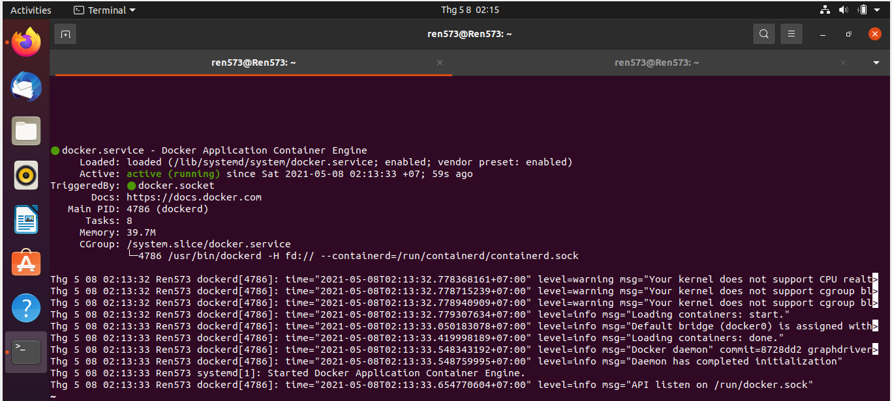
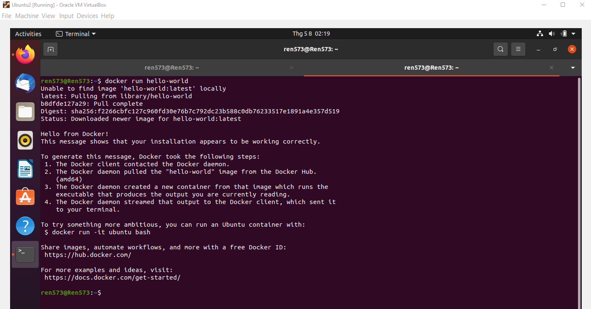
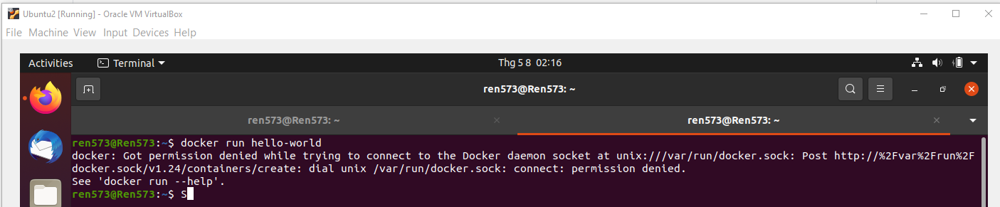
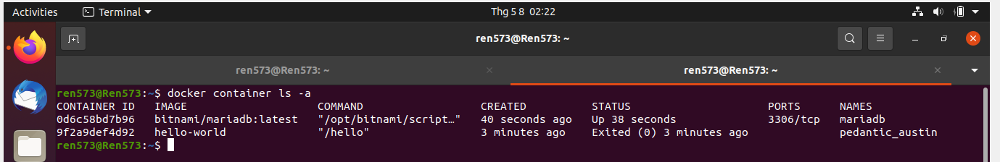
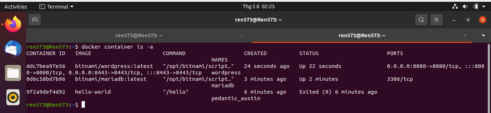
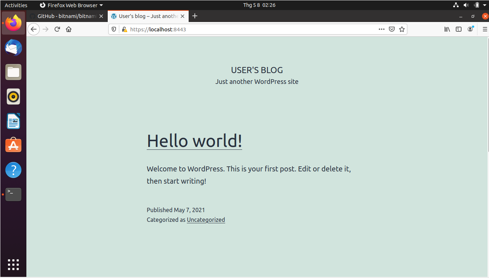
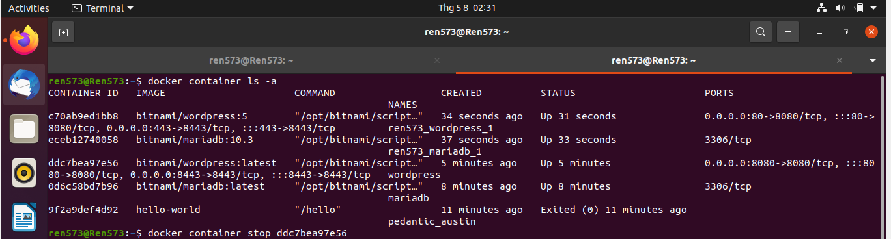

# Bài tập tuần 1
## Bài 1 : Tạo Virtual Machine, cài đặt docker trên VM, deploy Wordpress với Command line
## Cài đặt docker trên VM
### Chạy các lệnh sau trên terminal để cài đặt docker
 ### Cài đặt repository
```sh
  $  sudo apt-get update
  $  sudo apt-get install \
    	apt-transport-https \
    	ca-certificates \
    	curl \
    	gnupg \
    	lsb-release
  $ curl -fsSL https://download.docker.com/linux/ubuntu/gpg | sudo gpg --dearmor -o /usr/share/keyrings/docker-archive-keyring.gpg
  $ echo \
  	"deb [arch=amd64 signed-by=/usr/share/keyrings/docker-archive-keyring.gpg] https://download.docker.com/linux/ubuntu \
 	bionic stable" | sudo tee /etc/apt/sources.list.d/docker.list > /dev/null
```
 ### Cài đặt Docker Engine
```sh
 $ sudo apt-get update
 $ sudo apt-get install docker-ce docker-ce-cli containerd.io 
```
 #### Kiểm tra trạng thái docker engine
```sh
 $ sudo systemctl status docker
```


 #### Run 'hello-world' image để test docker engine
```sh
 $ sudo docker run hello-world
```
 Nếu thành sẽ được kết quả như sau : 



 Trong trường hợp gặp phải lỗi 'permission denied', thì sử dụng các câu lệnh sau :

```sh
 $ sudo usermod -aG docker ${USER}
 $ su - ${USER}
```
 Sau đó bạn thử run lại hello-world sẽ thành công. ( Chi tiết cách fix lỗi [Xem tại đây](https://www.digitalocean.com/community/questions/how-to-fix-docker-got-permission-denied-while-trying-to-connect-to-the-docker-daemon-socket)))
## Sau khi cài đặt xong môi trường, chúng ta bắt đầu deploy Wordpress với Command line
### Bước 1 : Tạo network:
```sh
$ docker network create wordpress-network
```
### Bước 2: Tạo volumes cho MariaDB và tạo MariaDB container
```sh
$ docker volume create --name mariadb_data
$ docker run -d --name mariadb \
  --env ALLOW_EMPTY_PASSWORD=yes \
  --env MARIADB_USER=bn_wordpress \
  --env MARIADB_PASSWORD=bitnami \
  --env MARIADB_DATABASE=bitnami_wordpress \
  --network wordpress-network \
  --volume mariadb_data:/bitnami/mariadb \
  bitnami/mariadb:latest
```
 Sau khi chạy thành công, chúng ta có thể kiểm tra lại bằng cách dùng lệnh 
```sh
$ docker container ls -a
```
 Chúng ta sẽ thấy 1 container 'mariadb' đã được tạo :

### Bước 3 : Tạo volumes cho Wordpress và khởi chạy
```sh
$ docker volume create --name wordpress_data
$ docker run -d --name wordpress \
  -p 8080:8080 -p 8443:8443 \
  --env ALLOW_EMPTY_PASSWORD=yes \
  --env WORDPRESS_DATABASE_USER=bn_wordpress \
  --env WORDPRESS_DATABASE_PASSWORD=bitnami \
  --env WORDPRESS_DATABASE_NAME=bitnami_wordpress \
  --network wordpress-network \
  --volume wordpress_data:/bitnami/wordpress \
  bitnami/wordpress:latest
```
 Tương tự bước trên, sau khi chạy thành công, chúng ta có thể kiểm tra lại container và thấy rằng
WordPress project đang được chạy ở port 8443:


 Sau đó, mở trình duyệt và truy cập địa chỉ "https://localhost:8443" để kiểm tra, chúng ta sẽ được
kết quả như sau:


## Bài 2 : Deploy Wordpress với Docker Compose
 ### Bước 1 : Cài đặt Docker Compose 
```sh
$ sudo apt install docker-compose
```
 ### Bước 2: Deploy với compose
```sh
$ curl -sSL https://raw.githubusercontent.com/bitnami/bitnami-docker-wordpress/master/docker-compose.yml > docker-compose.yml
$ docker-compose up -d
```
 Sau khi chạy thành công, chúng ta kiểm tra container, sẽ thấy có 2 container mới vừa được tạo:
 (trong ví dụ là 2 container với names : ren573_wordpress_1 / ren573_mariadb_1

 Mở trình duyệt, truy cập địa chỉ "https://localhost:443", chúng ta sẽ được 1 trang web giống bài 1


*Trong trường hợp để chắc chắn, chúng ta nên tắt container đã chạy ở bài 1 sau đó mới tiến hành truy cập địa chỉ*
```sh
$ docker container stop <your_containerID>
```

## Bài 3 : Tạo 2 Virtual Machines, 1 cái deploy MariaDB, 1 cái deploy WordPress
Tương tự như bài 1, Sau khi cài đặt 2 VM và docker trên 2 VM, chúng ta sẽ làm tiếp như sau:
### deploy MariaDB trên VM1:
### Bước 1 : Tạo network:
```sh
$ docker network create wordpress-network
```
### Bước 2: Tạo volumes cho MariaDB và tạo MariaDB container
#### Mở port 3306 để VM2 có thể kết nối đến
```sh
$ docker volume create --name mariadb_data
$ docker run -d --name mariadb \
  -p 3306:3306
  --env ALLOW_EMPTY_PASSWORD=yes \
  --env MARIADB_USER=bn_wordpress \
  --env MARIADB_PASSWORD=bitnami \
  --env MARIADB_DATABASE=bitnami_wordpress \
  --network wordpress-network \
  --volume mariadb_data:/bitnami/mariadb \
  bitnami/mariadb:latest
```
 Sau khi chạy thành công, chúng ta có thể kiểm tra lại bằng cách dùng lệnh 
```sh
$ docker container ls -a
```
 Chúng ta sẽ thấy 1 container 'mariadb' đã được tạo :

### deploy Wordpress trên VM2:
### Bước 1 : Tạo network:
```sh
$ docker network create wordpress-network
```
### Bước 2 : Tạo volumes cho Wordpress và khởi chạy
#### Khai báo địa chỉ mariadb để kết nối đến thông qua biến WORDPRESS_DATABASE_HOST
```sh
$ docker volume create --name wordpress_data
$ docker run -d --name wordpress \
  -p 8080:8080 -p 8443:8443 \
  --env ALLOW_EMPTY_PASSWORD=yes \
  --evn WORDPRESS_DATABASE_HOST=192.168.68.5
  --env WORDPRESS_DATABASE_USER=bn_wordpress \
  --env WORDPRESS_DATABASE_PASSWORD=bitnami \
  --env WORDPRESS_DATABASE_NAME=bitnami_wordpress \
  --network wordpress-network \
  --volume wordpress_data:/bitnami/wordpress \
  bitnami/wordpress:latest
```
 Tương tự bước trên, sau khi chạy thành công, chúng ta có thể kiểm tra lại container và thấy rằng
WordPress project đang được chạy ở port 8443:

 Sau đó, mở trình duyệt và truy cập địa chỉ "https://localhost:8443" để kiểm tra, chúng ta sẽ được
kết quả như sau:

