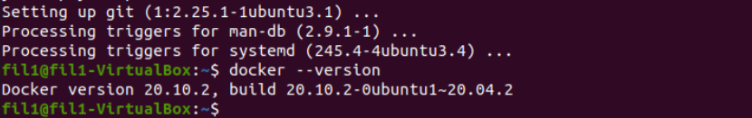
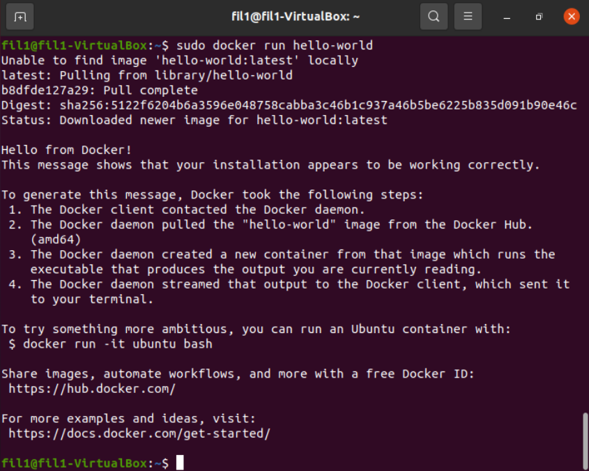
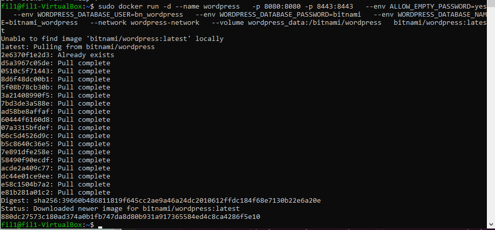
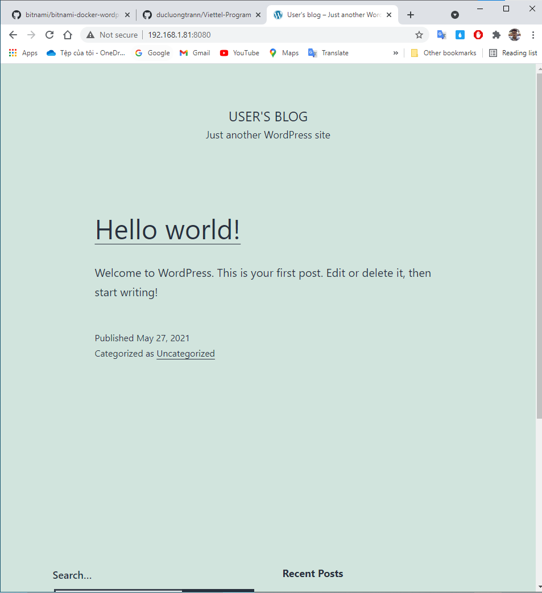
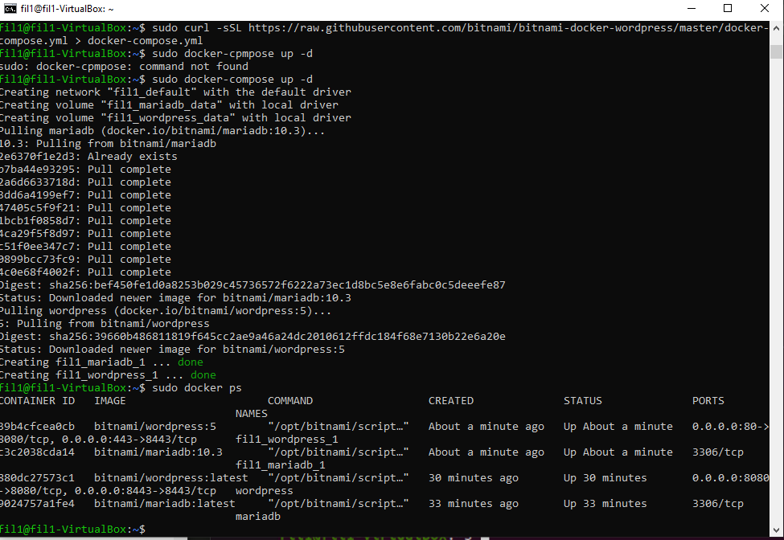
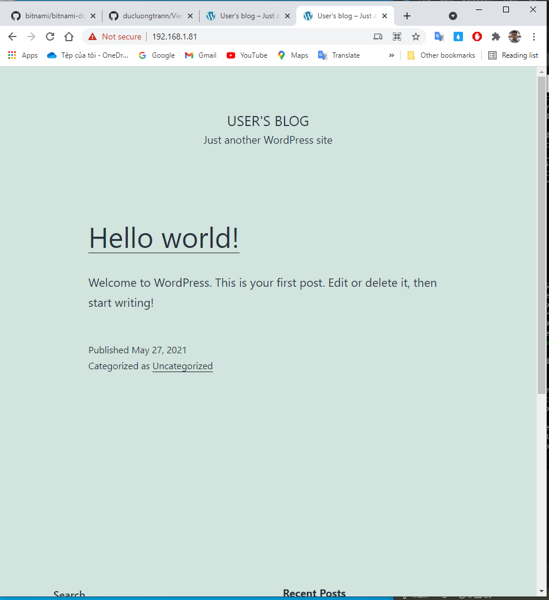
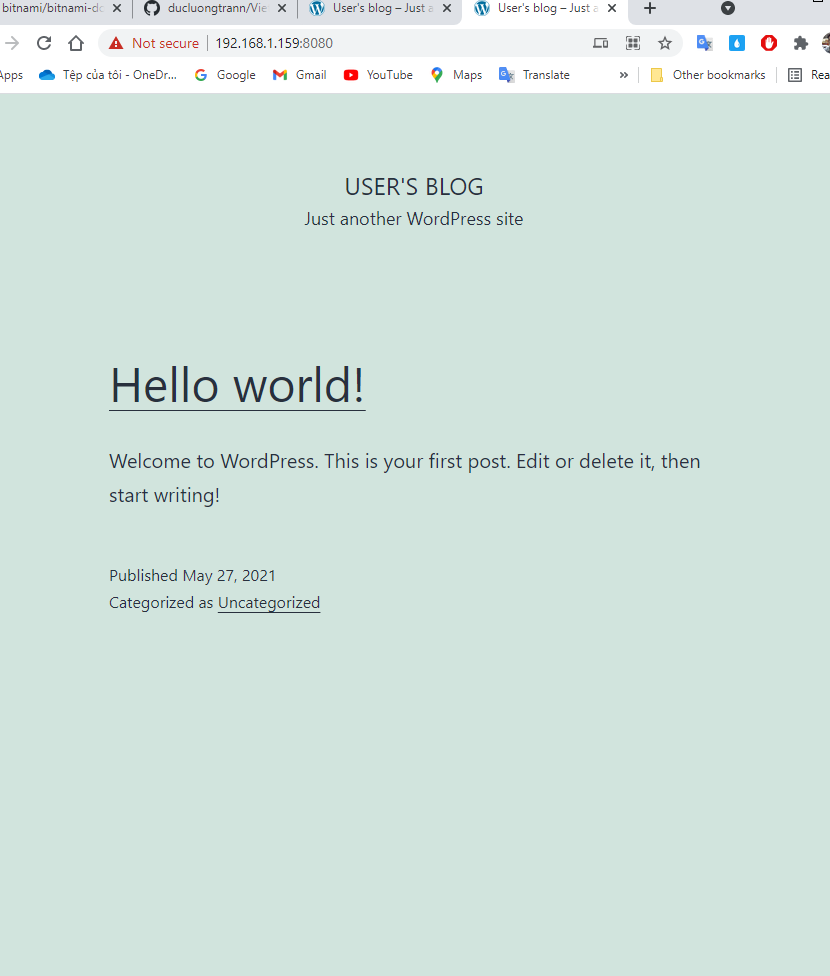

# Week 1 - Virtualization and Cloud - Deploy Wordpress

- [Week 1 - Virtualization and Cloud - Deploy Wordpress](#week-1---virtualization-and-cloud---deploy-wordpress)
- [Practice 1](#practice-1)
  - [Setup VirtualBox, create VM and setup Docker inside VM](#setup-virtualbox-create-vm-and-setup-docker-inside-vm)
  - [Deploy WordPress using Command Line](#deploy-wordpress-using-command-line)
- [Practice 2](#practice-2)
- [Practice 3](#practice-3)
  - [Setup MariaDB on VM1](#setup-mariadb-on-vm1)
  - [Setup Wordpress on VM2](#setup-wordpress-on-vm2)
- [Notes](#notes)

---

# Practice 1

```
Setup VirtualBox
Create Ubuntu virtual machine
Setup Docker inside VM
Deploy WordPress with Command Line

```

---

## Setup VirtualBox, create VM and setup Docker inside VM

1. Downloads VirtualBox and Ubuntu ISO file from this link below

- VirtualBox: [https://www.virtualbox.org/](https://www.virtualbox.org/)
- Ubuntu ISO: [https://ubuntu.com/download/desktop](https://ubuntu.com/download/desktop)

After downloads these files, you follow that link [https://www.freecodecamp.org/news/how-to-install-ubuntu-with-oracle-virtualbox/](https://www.freecodecamp.org/news/how-to-install-ubuntu-with-oracle-virtualbox/) step by step to install Ubuntu on VirtualBox. If you have any error, just google.

2. Setup Docker

```
sudo apt install docker.io
```




## Deploy WordPress using Command Line

*Using SSH*

- Create a network

```
sudo docker network create wordpress-network
```

- Create a volume for MariaDB persistence and create a MariaDB container

```
$ docker volume create --name mariadb_data
$ docker run -d --name mariadb \
  --env ALLOW_EMPTY_PASSWORD=yes \
  --env MARIADB_USER=bn_wordpress \
  --env MARIADB_PASSWORD=bitnami \
  --env MARIADB_DATABASE=bitnami_wordpress \
  --network wordpress-network \
  --volume mariadb_data:/bitnami/mariadb \
  bitnami/mariadb:latest
```


- Create volumes for WordPress persistence and launch the container

```
$ docker volume create --name wordpress_data
$ docker run -d --name wordpress \
  -p 8080:8080 -p 8443:8443 \
  --env ALLOW_EMPTY_PASSWORD=yes \
  --env WORDPRESS_DATABASE_USER=bn_wordpress \
  --env WORDPRESS_DATABASE_PASSWORD=bitnami \
  --env WORDPRESS_DATABASE_NAME=bitnami_wordpress \
  --network wordpress-network \
  --volume wordpress_data:/bitnami/wordpress \
  bitnami/wordpress:latest
```



**Open Web browser on host and go to that link  [https://192.168.1.81:8080](https://localhost:8080) with 192.168.1.81 is ip address of VM**



---

# Practice 2

Deploy WordPress with Docker Compose

**1. Install Docker compose**

```
sudo apt install docker-compose
```

**2. Deploy WordPress with Docker-compose**

```
curl -sSL https://raw.githubusercontent.com/bitnami/bitnami-docker-wordpress/master/docker-compose.yml > docker-compose.yml

docker-compose up -d

```



**Then, open web browser and access <https://192.168.1.81:443> to see result**


# Practice 3

Deploy WordPress with Command Line on two virtual machines

```
VM1 has IP address 192.168.1.81
VM2 has IP address 192.168.1.159
```

---

## Setup MariaDB on VM1

1. Create Network

```
docker network create wordpress-network
```

2. Create a volume for MariaDB persistence

```
sudo docker volume create --name mariadb_data
```

Run container

```
$ sudo docker run -d --name mariadb \
    -p 3306:3306 \
    --env ALLOW_EMPTY_PASSWORD=yes \
    --env MARIADB_USER=bn_wordpress \
    --env MARIADB_PASSWORD=bitnami \
    --env MARIADB_DATABASE=bitnami_wordpress \
    --network wordpress-network \
    --volume mariadb_data:/bitnami/mariadb \
    bitnami/mariadb:latest

```

## Setup Wordpress on VM2

1. Create a volume for Wordpress persistence

```
$ sudo docker volume create --name wordpress_data
$ sudo docker run -d --name wordpress \
    -p 8080:8080 -p 8443:8443 \
    --env ALLOW_EMPTY_PASSWORD=yes \
    --env WORDPRESS_DATABASE_HOST=192.168.1.81 \
    --env WORDPRESS_DATABASE_PORT=3306 \
    --env WORDPRESS_DATABASE_USER=bn_wordpress \
    --env WORDPRESS_DATABASE_PASSWORD=luong123 \
    --env WORDPRESS_DATABASE_NAME=bitnami_wordpress \
    --add-host mariadb:192.168.1.81 \
    --volume wordpress_data:/bitnami/wordpress \
    bitnami/wordpress:latest

```

**Then, open web browser and access <http://192.168.1.159:8080>**



# Notes

- Docker reference documentation: <https://docs.docker.com/reference/>
- Mot vai cau lenh co ban cho Docker: <https://phoenixnap.com/kb/how-to-list-start-stop-docker-containers#ftoc-heading-1>
- Configure Wordpress remote database: <https://www.linode.com/docs/guides/configure-wordpress-remote-database/#variables-used-in-this-guide>
- Docker basic: <https://viblo.asia/p/docker-nhung-kien-thuc-co-ban-phan-3-4dbZNoovlYM>
- Docker Network: <https://viblo.asia/p/docker-networking-nhung-khai-niem-va-cach-su-dung-co-ban-gGJ59P2JlX2>
