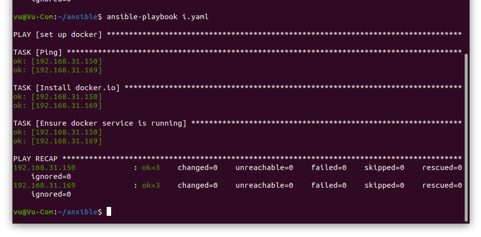
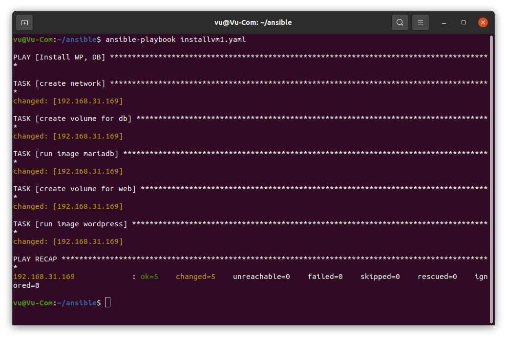
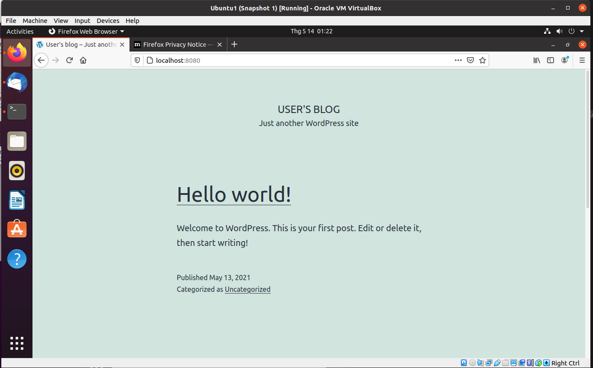
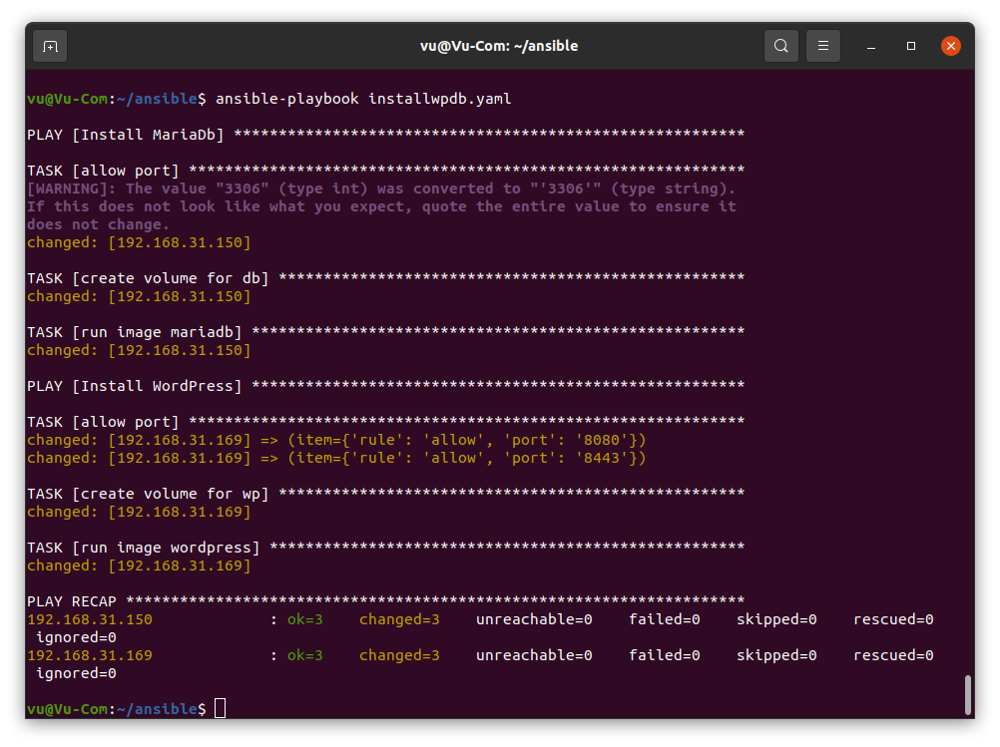
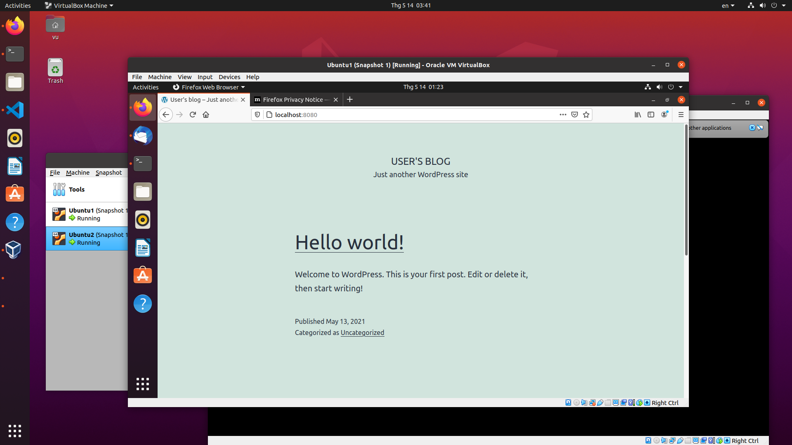

# Practice 1

## Setup Virtualbox

## Create Ubuntu virtual machine
[wp] -vm1
192.168.31.169 
[db] -vm1
192.168.31.150

## Setup Ansible on Controller machine
#### Tạo file config - ansible.cfg

```
[defaults]
host_key_checking = False
log_path = /home/vu/ansible/ansible.log
inventory = /home/vu/ansible/inventory.ini
remote_user = vu

```
#### Tạo file invetory - inventory.ini
```
[wp]
192.168.31.169 ansible_user=vu1
[db]
192.168.31.150 ansible_user=vu2

[all:vars]
ansible_become_pass=1
ansible_ssh_pass=1

```
#### Tạo playbook - Install docker, docker-compose
```
- name: Install docker, docker-compose
  hosts: all
  gather_facts: false
  become: yes
  tasks:
    - name: Ping
      ping:
      register: result
    - name: Install docker.io
      apt:
        name: docker.io
        state: present
    - name: Install docker-compose
      apt:
        name: docker-compose
        state: present
    - name: Ensure docker service is running
      service:
        name: docker
        state: started
```

## Using Ansible to setup Docker on Ubuntu VM

```
ansible-playbook installdocker.yaml
```



## Using Ansible to deploy Wordpress (docker) on Ubuntu VM

#### Tạo playbook - deploy Wordpress, DB on VM 1

```
- name: Install WP, DB
  hosts: wp
  gather_facts: false
  become: yes

  tasks:
  - name: create network
    command: docker network create wordpress-network
  - name: create volume for db
    command: docker volume create --name mariadb_data
  - name:  run image mariadb
    command: docker run -d --name mariadb --env ALLOW_EMPTY_PASSWORD=yes --env MARIADB_USER=bn_wordpress --env MARIADB_PASSWORD=bitnami --env MARIADB_DATABASE=bitnami_wordpress --network wordpress-network --volume mariadb_data:/bitnami/mariadb bitnami/mariadb:latest
  - name: create volume for web
    command: docker volume create --name wordpress_data
  - name:  run image wordpress
    command: docker run -d --name wordpress  -p 8080:8080 -p 8443:8443 --env ALLOW_EMPTY_PASSWORD=yes --env WORDPRESS_DATABASE_USER=bn_wordpress  --env WORDPRESS_DATABASE_PASSWORD=bitnami  --env WORDPRESS_DATABASE_NAME=bitnami_wordpress --network wordpress-network --volume wordpress_data:/bitnami/wordpress  bitnami/wordpress:late
```

#### Run Ansible

```
ansible-playbook installvm1.yaml
```

#### Kết quả




# Practice 2
## Host machine: Controller machine
## Ubuntu VM1: Managed machine (MariaDB)
## Ubuntu VM2: Managed machine (Wordpress)
## Using Ansible to setup Docker on two VMs
## • Using Ansible to deploy Wordpress (docker) on VM1
## • Using Ansible to deploy MariaDB (docker) on VM2

#### Tạo playbook - deploy Wordpress (docker) on VM1 and eploy MariaDB (docker) on VM2
```
- name: Install MariaDb
  hosts: db
  gather_facts: false
  become: yes
  tasks:
  - name: allow port
    ufw:
      rule: allow
      port: 3306
  - name: create volume for db
    command: docker volume create --name mariadb_data
  - name:  run image mariadb
    command: docker run -d --name mariadb --env ALLOW_EMPTY_PASSWORD=yes --env MARIADB_USER=bn_wordpress --env MARIADB_PASSWORD=bitnami --env MARIADB_DATABASE=bitnami_wordpress --network host --volume mariadb_data:/bitnami/mariadb bitnami/mariadb:latest    
- name: Install WordPress
  hosts: wp
  gather_facts: false
  become: yes
  tasks:
  - name: allow port
    ufw: rule={{ item.rule }} port={{ item.port }}
    with_items:
      - {rule: 'allow' ,port: '8080'}
      - {rule: 'allow' ,port: '8443'}
  - name: create volume for wp
    command: docker volume create --name wordpress_data
  - name:  run image wordpress
    command: docker run -d --name wordpress   --env WORDPRESS_DATABASE_HOST=192.168.31.150 --env ALLOW_EMPTY_PASSWORD=yes   --env WORDPRESS_DATABASE_USER=bn_wordpress   --env WORDPRESS_DATABASE_PASSWORD=bitnami   --env WORDPRESS_DATABASE_NAME=bitnami_wordpress   --network host   --volume wordpress_data:/bitnami/wordpress   bitnami/wordpress:latest

```

#### Run Ansible

```
ansible-playbook installwpdb.yaml
```
#### Kết quả


