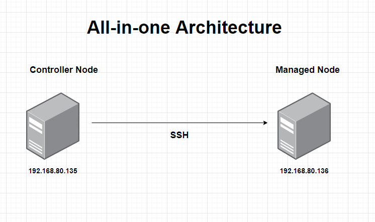
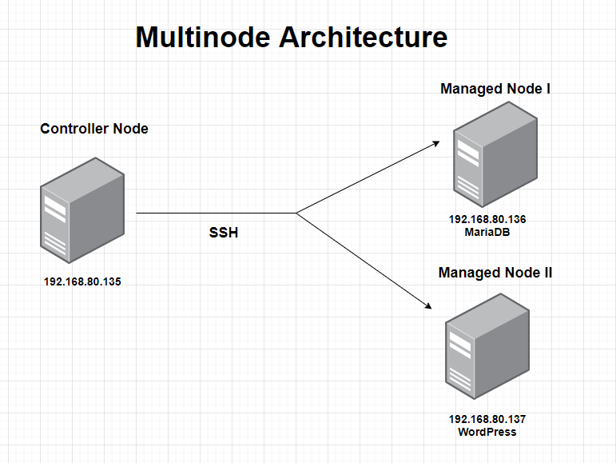
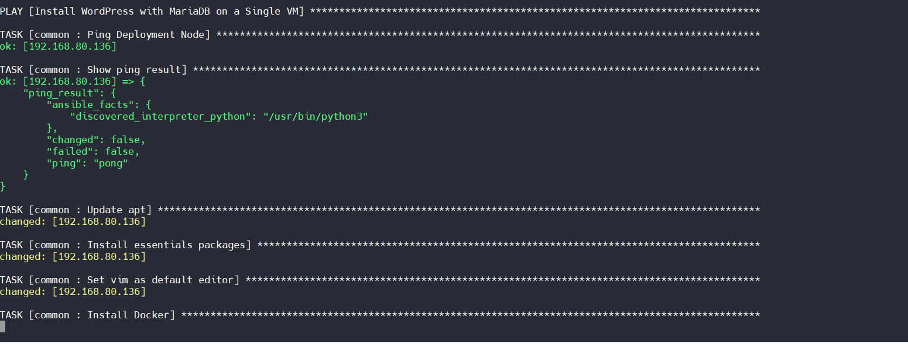
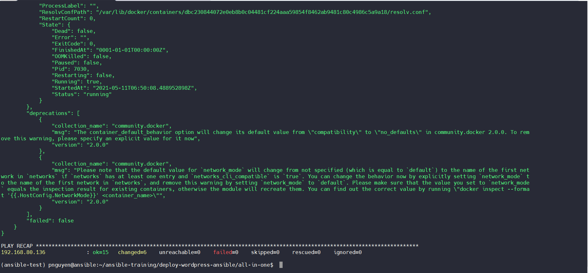
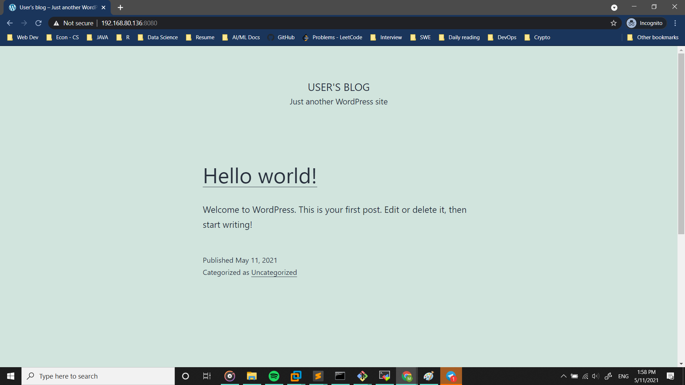
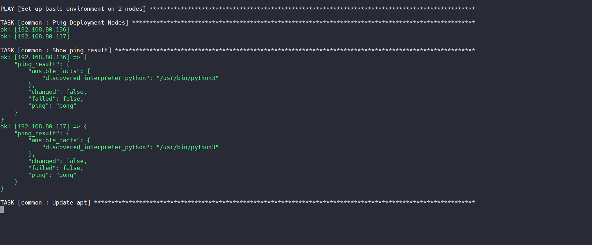
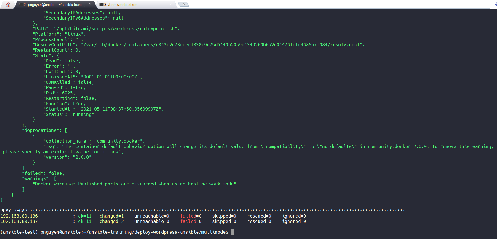
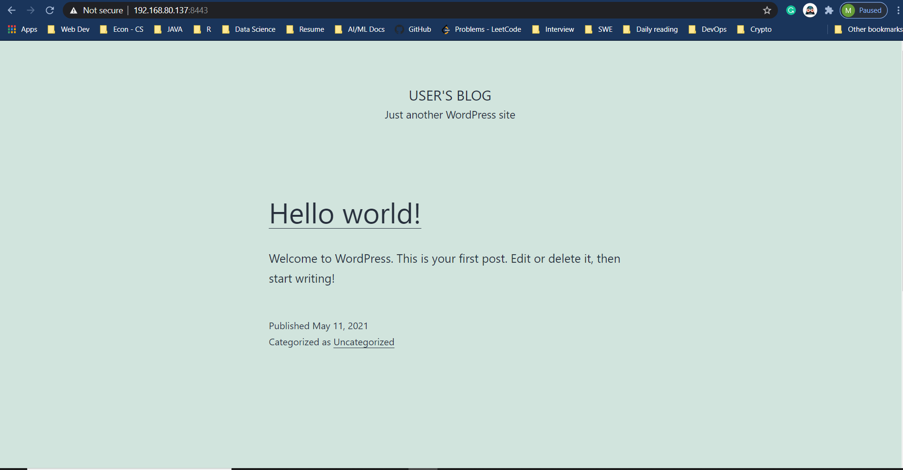
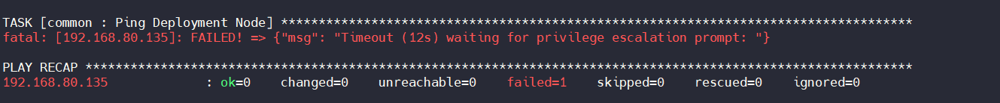

# WEEK-2 PRACTICES DOCUMENTATION
# AUTOMATION WITH ANSIBLE
---
## **Author:** *Julian (Phong) Ng.* 
**Date of issue**: *May 11th 2021*

> Welcome back! This is the documentation for my second training project at **Viettelnet**. Enjoy ur time :smile_cat:. Feel free to hit me up if any edition is needed!

# **I. OVERVIEW**:
## 1. Need to know:
- Basic on System Administration (Linux, Networking, etc)
- Basic on `Ansible`:
> *Ansible is an open-source software provisioning, configuration management, and application-deployment tool enabling infrastructure as code*
- Again, hope you familiar with this one :wink: :


## 2. Infrastructure Setup:

### **Terms Explained:** :fire:
> **Controller Node**: where Ansible scripts runs & establish SSH connections to other node(s) \
> **Managed Node(s)**: Running WordPress & its Data Persistence server (`MariaDB`)

### **Requirements**:
- Ubuntu Server Image (**Ubuntu 20.04** is used in below practices: [Download image](https://ubuntu.com/download/server))

- Desktop Hypervisor for running virtual machines (E.g: *Virtual Box, VM Workstation, etc*)

#### **Note:**
> *VMWare Workstation is **highly recommended** to use.*

### A. Practice 1: `All-in-one WordPress Deployment` 



> In my **local deployment**, Nodes have following addresses.

### 1. Controller Node:
-  IP: `192.168.80.135`

### 2. Managed Node: 
> Running both `WordPress` & `MariaDB` containers
-  IP: `192.168.80.136`

### B. Practice 2: `Multinode WordPress Deployment`



### 1. Controller Node:
-  IP: `192.168.80.135`

### 2. Managed Node:

#### a. MariaDB:
-  IP: `192.168.80.136`

#### b. WordPress:
-  IP: `192.168.80.137`

# II. SET UP `Controller Node`:
## 1. Update `apt` & Install essentials packages:
-  Update `apt`:
```
$ sudo apt-get update -y
```
- Install packages:
```
$ sudo apt-get install -y vim net-tools systemd git curl  
```

## 2. (Optional) Install `python3`:
```
$ sudo apt install software-properties-common
$ sudo apt install python3.8
```

## 3. Install `virtualenv`:
**Note**:
> `virtualenv` (*Python's isolated environment*) is used to install `Ansible` in this deployment. 
```
$ sudo apt install python-virtualenv
```

## 4. Start an `virtualenv` & install `Ansible` via `pip`:

```
$ python -m virtualenv ansible-test
$ source ansible-test/bin/activate 						#Activating virtualenv
$ python -m pip install ansible
```

#### Note:
> Only able to use `ansible` when virtualenv is `activated`.

## 5. Install `sshpass`: 
> SSH password-based login. User can specify `ssh` password in inventory file(s).

```
$ sudo apt-get install -y sshpass
```

## 6. Configure `ansible.conf`:
Below configuration can be use for reference
```
[defaults]
host_key_checking = False				
remote_user = pnguyen
timeout = 30

[ssh_connection]
pipelining = True
```

**Fields**:
<dl>
    <dt>
      host_key_checking
    </dt>
    <dd>
       Prompting for confirmation of the key. (<b>Default</b>: true)
    </dd>
	<dt>
		pipelining
	</dt>
	<dd>
		Speed up Ansible
	</dd>
</dl>


> Instead of setting `host_key_checking = False`,  `paramiko` package is an alternative.
```
$ pip install paramiko
$ ansible-playbook -i <inv-file> -c paramiko <entry-point> 			#Running playing w/ paramiko
```

## 7. Configure `hosts` / `hosts.yml`:
Specifying below information: 

1. **Hosts**
2. **Variables**


`host` configuration file can be some following format: `.ini`, `no format`, `.yml`

**Example:**
````
[mariadb-node]
192.168.80.xxx    ansible_ssh_user=pnguyen    ansible_ssh_pass=12345678

[all:vars]
network_docker=all-in-one-wordpress
db_host=192.168.80.136
db_user=pnguyen
db_name=wordpress_ansible
db_password=12345678

[mariadb-node:vars]
mariadb_img=bitnami/mariadb:latest
...

````

# III. ANSIBLE MODULES STEP-BY-STEP:

### Before Proceeding:
> Ensure that all the Nodes have been properly **CREATED** & **BOOTED**.

## A. General Configurations:
> Done on all `Managed Nodes` before running Asnible on `Controller Node`

- Allow port 22 for establishing `ssh` connection from `Controller`:

```
$ sudo ufw allow ssh
```


## B. PRACTICE 1: `All-in-one Deployment`
### **1. Directory Layout:**
```
│   ansible.cfg						--> Configuration file for Ansible
│   hosts							--->  Storing info on hosts (/host groups), varibles 
│   hosts.yml						---> Similar to `hosts` but in .YAML format
│   README.md
│   site.yml						---> Entrypoint to playbook
│
└───roles
    ├───common						---> Basic environment set-up for machine
    │   └───tasks
    │           main.yml
    │
    └───docker						---> Running Docker commands
        └───tasks
                main.yml

```

### **Structure**:
- 1 Major `Playbook` (accessing via `site.yml`) with 2 **Roles** (smaller playbooks):
	+ **`common`**
	+ **`docker`**

### **2. Step-by-step `Ansible`:**
> Below are the explainations of `Ansible` playbooks in a human-readable, simplified format. The described steps here are executed by Ansible in project `all-in-one`, `multinode`.

**Notes**:
> Each **section** (**a, b,...**) corresponding to a `Role`. \
> Each **headlines** (`-`) matches a single `Task`.

#### 2.1 Set up environment: `common`

- Validate connection to other Nodes (via `ping`)

-  Update apt

-  Install dependencies: net-tools, vim, git,...

- Set `vim` as  Default editor

-  Install Docker & Docker SDK (via `apt`):
    - `docker.io` 
    - `python3-docker`

-  Allows connection on specific ports: 
    - `3306`: MariaDB port
    - `8080`: HTTP port
    - `8443`: HTTPS port

#### 2.2 Docker Tasks: `docker`

- Create network

- Create volume for `MariaDB`

- Create volume for `WordPress`

- Run container `MariaDB`

- Run container `WordPress`

### **3. Expected Outcomes:**
> Deployment Process



> Playbook runs successfully



> Landing page



## B. PRACTICE 2: `Multinode`
### **1. Directory Layout:**
````
│   ansible.cfg             --> Configuration file for Ansible
│   hosts                   --->  Storing info on hosts (/host groups), varibles 
│   hosts.yml
│   README.md
│   site.yml                ---> Entrypoint to playbook
│
└───roles
    ├───common              ---> Basic environment set-up for machine
    │   └───tasks
    │           main.yml
    │
    ├───mariadb             ----> Running Container for MariaDB on its remote host
    │   └───tasks
    │           main.yml
    │
    └───wordpress           ----> Running Container for WordPress on its remote host
        └───tasks
                main.yml
````
### **Structure**:
- 1 Major `Playbook` (accessing via `site.yml`) with 3 **Roles** (smaller playbooks):
	+ **`common`**
	+ **`mariadb`**
	+ **`wordpress`**

### **2. Step-by-step Ansible:**


#### 2.1 Set up environment: `common`

> Below steps are executed on **BOTH** `Managed Nodes`.

**Notes**:
> Each **section** (**a, b,...**) corresponding to a `Role`. \
> Each **headlines** (`-`) matches a single `Task`.

- Validate connection to other Nodes (via `ping`)

-  Update apt

-  Install dependencies: net-tools, vim, git,...

- Set `vim` as  Default editor

-  Install Docker & Docker SDK (via `apt`):
    - `docker.io` 
    - `python3-docker`

-  Allows connection on specific ports: 
    - `3306`: MariaDB port -> `MariaDB Node`
    - `8080`: HTTP port -> `WordPress Node`
    - `8443`: HTTPS port -> `WordPress Node`

#### 2.2 MariaDB Tasks: `mariadb`

> Executed on `MariaDB Node`.

- Create volume for `MariaDB`

- Run container `MariaDB`

#### 2.3 WordPress Tasks: `wordpress`

> Executed on `WordPress Node`.

- Create volume for `WordPress`

- Run container `WordPress`

### **3. Expected Outcomes:**
> Deployment Process



> Playbook runs successfully on **BOTH NODES**



> Landing page



# IV. DEBUGGING:

> Some issues embraced while working on will be mentioned here.

### 1. `Timeout (12s) waiting for privilege escalation prompt`



#### a. Approach 1: `Using Paramiko`
	- Install `paramiko`
```
    $ pip install paramiko
```

	- Deploy `playbook`:
	$ ansible-playbook -i hosts -c paramiko site.yml

#### b. Approach 2: `Configure ansible.cfg` 

- Insert following line:

```
$  vi ansible.cfg

....
> host_key_checking = False				
....
```
### 2. `Non-string value found for <x> option`:
**Possible Reason:** Occurs when using Variables without specifying type.

- Follow following syntax:

    - **Issue**:
    ```
    env:
        WORDPRESS_DATABASE_USER: "{{ db_user }}"

    ```
    
    - **Debug**:

    ```
    env:
        WORDPRESS_DATABASE_USER: "{{ db_user | quote }}"

    ```
