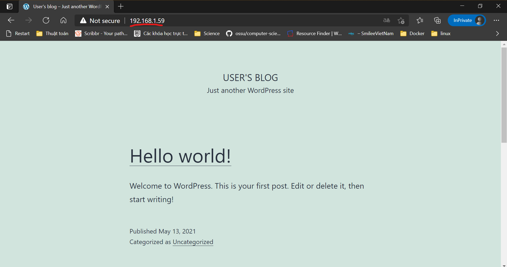

# Week 2 practices

## Mục lục

- [Week 2 practices](#week-2-practices)
  - [Mục lục](#mục-lục)
  - [I. Overview](#i-overview)
    - [1. Ansible](#1-ansible)
    - [2. Requirements](#2-requirements)
    - [3. Ý tưởng](#3-ý-tưởng)
  - [II. Practicing](#ii-practicing)
    - [Practice 1](#practice-1)
      - [Config file](#config-file)
      - [Inventory](#inventory)
      - [Docker](#docker)
      - [Mariadb](#mariadb)
      - [Wordpress](#wordpress)
      - [Site.yml](#siteyml)
      - [Running](#running)
    - [Practice 2](#practice-2)
  - [References](#references)

## I. Overview

### 1. Ansible

Như đã biết Ansible là 1 công cụ tự động hoá (automation) giúp ta quản lý 1 hoặc nhiều máy chủ khác nhau.
Các thành phần trong ansible:

- Control Node (machine with Ansible installed)
- Managed Node (servers are managed with Ansible)
- Inventory (a list of managed nodes)
- Modules (the units of code Ansible executes)
- Tasks (the units of action in Ansible)
- Playbooks (ordered lists of tasks)

Ngoài ra với sự giúp đỡ của ansible role thì việc phân chia công việc (tasks) càng rõ ràng và dễ sử dụng lại (mỗi role sẽ có riêng các thành phần như trên). Ta sẽ thấy rõ tác dụng lớn của ansible role trong việc tái sử dụng code (code reuse) ở 2 bài tập.

### 2. Requirements

Ở Control node ta phải cài đặt các requirement sau

- python3 (`version` >= 3.5)
- ansible (😁😁 hiển nhiên rồi nè)
- sshpass (nếu bạn đăng nhập các managed node bằng `password` mà không phải key thì bắt buộc phải tải cái này nhé ^^)

### 3. Ý tưởng

Ta thấy rõ ràng sự khác biệt khác nhau duy nhất giữa bài tập 1 và bài tập 2 là chỉ là cùng máy chủ và khác máy chủ. Vì vậy nếu làm được các phần (cài docker, mở port, cài mariadb v.v) chung 1 máy thì ta có thể làm tương tự ở 2 máy khác nhau và ngược lại.

`inventory.ini`

```ini
[mariadb]
ipmaria

[wordpress]
ipwp

[common:children]
mariadb
wordpress
```

Nếu chúng ta chia file inventory thành các phần nhỏ như ở trên ta hoàn toàn có thể dễ dàng sử dụng ansible role để chạy từng tasks trên cả 2 máy thậm chí cả 1 máy tuỳ thuộc ta gọi đến nhóm nào khi thực hiện.

Ở cả 2 bài tập ta sẽ cố gắng chia nhỏ từng tác vụ ra để dễ dàng linh hoạt hơn. Từ đề ta có thể liệt kê thành các nhóm tác vụ sau:

1. Cài đặt docker trên cả 2 máy (hoặc 1)
2. Cài đặt mariadb
3. Cài đặt wordpress

Tại sao lại gọi là `nhóm` tác vụ? Bởi vì ta không chỉ đơn giản cài docker hay wordpress mà xung quanh nó ta còn làm nhiều thứ khác. Vd: sau khi cài đặt xong mariadb ta phải mở port.

Từ 3 nhóm này ta có thể chia bài thành 3 roles tương ứng. :3 dài dòng vậy đủ rồi ta sẽ bước vào phần chính làm bài.

------------

## II. Practicing

### Practice 1

Như đã nói ở trên ta sẽ chia các `nhóm` thành 3 roles lần lượt và tiếp tục chia thành các tác vụ (tasks) nhỏ hơn. Cụ thể như sau:

1. Cài đặt docker
   - Ping kiểm tra kết nối
   - Update apt
   - Cài đặt pip3 (pip của python3)
   - Cài đặt api docker bằng pip
   - Cài đặt docker bằng apt
   - Kiểm tra docker service

2. Cài đặt mariadb
   - Tạo volume mariadb
   - Run image mariadb
   - Mở port cho mariadb

3. Cài đặt wordpress
   - Tạo volume wp
   - Run image wp
   - Mở port cho wp

Dù ta chạy chung 1 máy hay trên 2 máy ảo khác nhau ta sẽ đều phải có các phần cơ bản như vậy. Do đó ta sẽ có thư mục thành các phần như sau.

```bash
├── ansible.cfg--------------------------------------------------> Config của ansible
├── ansible.log--------------------------------------------------> Log của ansible
├── inventory.ini------------------------------------------------> Inventory
├── site.yml-----------------------------------------------------> Playbook chính
└── roles
   ├── docker
   │   └── tasks
   │       ├── main.yml
   │       ├── install.yml
   │       └── ping.yml
   ├── mariadb
   │   └── tasks
   │       ├── main.yml
   │       ├── install.yml
   │       └── ufw.yml
   └── wordpress
       └── tasks
           ├── main.yml
           ├── install.yml
           └── ufw.yml

```

Từ sơ đồ trên ta có thể thấy rõ ràng công việc của từng role và thậm chí từng tasks thông qua tên file.

------------

#### Config file

`ansible.cfg`

```cfg
[defaults]
host_key_checking = False
inventory = ./inventory.ini
log_path = ./ansible.log
```

Mặc định ansible sẽ tìm file config của nó `lần lượt` ở những vị trí sau

- ANSIBLE_CONFIG (environment variable if set)
- ansible.cfg (in the current directory)
- ~/.ansible.cfg (in the home directory)
- /etc/ansible/ansible.cfg

Vì vậy nếu bạn chạy ansible cùng thư mục file cfg trên thì ansible sẽ nhận. Đồng thời ta thấy trong file `ansible.cfg` cũng chỉ ra đường dẫn của file `inventory.ini` và file `ansible.log` do đó khi chạy ansible thì cũng không cần chỉ rõ ra 2 file này.

Trong file cũng sử dụng biến `host_key_checking=False`. Bình thường khi kết nối `ssh` đến 1 máy chủ bất kỳ lần đầu `openssh` luôn hỏi có lưu lại fingerprint của máy đích không? và nếu ta chọn `Yes` thì lúc đấy `openssh` sẽ cho ta kết nối.  Đặt thông số này là `False` sẽ giúp ansible không gặp tình trạng như vậy, giúp kết nối thông suốt.

------------

#### Inventory

`inventory.ini`

```ini
[mariadb]
192.168.1.59

[wordpress]
192.168.1.59

[common:children]
mariadb
wordpress

[common:vars]
ansible_user=moly7x
ansible_password=M@ly7x
mariadb_user="bn_wordpress"
mariadb_password="bitnami"
mariadb_database="bitnami_wordpress"

[mariadb:vars]
volume_maria_name=mariadb_data
mariadb_allow_empty_password="yes"

[wordpress:vars]
volume_wp_name=wordpress_data
wp_allow_empty_password="yes"
wp_database_host="192.168.1.59"
```

Ở file `inventory.ini` ta có thể thấy dù chung 1 máy chủ nhưng ta vẫn có thể hoàn toàn chia thành 2 nhóm riêng biệt và cũng có thể gộp lại thành nhóm chung. Nhưng dù bị trùng lặp thì ansible vẫn chỉ chạy 1 lần trên 1 máy. Ví dụ: chạy tasks trên nhóm common (gồm 2 nhóm mariadb và wordpress - trong bài tập này là chung 1 nhóm) thì ansible vẫn chỉ chạy 1 lần cho máy có ip là `192.168.1.59`.

Ngoài ra, trong từng nhóm riêng ta có thể khai báo biến của từng nhóm, phục vụ cho việc cài đặt wordpress và mariadb linh hoạt. Khi cần sửa giá trị ta chỉ cần vào file `inventory.ini` mà không cần phải vào từng file.

Riêng các biến như `mariadb_user`, `mariadb_password` hay `mariadb_database` ta cùng để chung vào common vì ở dưới ta sẽ dùng 2 biến này ở cả wordpress và mariadb.

Một điều cũng cần lưu ý nữa là ở đây để đỡ khỏi gõ khi kết nối thì mình cũng đã để `user` và `password` ở trong biến của nhóm common (khi sử dụng nhóm này nó sẽ sử dụng chung 1 `user` và `password`) mặc dù điều này không được khuyến khích vì lý do bảo mật.

Phần tiếp ta sẽ cùng đào sâu vào từng role 1 rồi sẽ quay trở lại file playbook chính `site.yml` sau.

------------

#### Docker

Đầu tiên cũng là quan trọng nhất, ta sẽ phải cài docker trên host.

`./docker/task/install.yml`

```yaml
- name: Update repositories cache
  apt:
    update_cache: yes

- name: Install pip3
  apt:
    name: python3-pip
    state: present

- name: Install docker api for python3
  pip:
    name: docker
    state: present

- name: Install docker.io
  apt:
    name: docker.io
    state: present

- name: Ensure docker service is running
  service:
    name: docker
    state: started
```

Như đã nói ở trên việc cài đặt `docker` không chỉ mỗi qua module `apt` mà ta còn phải cài mọi thứ xung quanh nó. Ansible điều khiển docker của managed node qua api docker của python do đó ta sẽ phải cài thêm api đó thông qua pip của python. Tương đương với lệnh: `pip3 install docker`
Vì vậy ta cũng cần cài `pip3` thông qua module `apt`. Tương đương 2 lệnh:

```bash
apt update
apt install pip3
```

Ngoài ra ta còn sử dụng module `ping` để kiểm tra đã kết nối tới managed node hay chưa và in ra kết quả.

`./docker/task/ping.yml`

```yaml
- name: ping
  ping:
  register: result

- name: print ping data
  debug:
    var: result
```

Cuối cùng ta sẽ tổng hợp các task này ở trong `main.xml`
`./docker/task/main.yml`

```yaml
- name: Check connect to managed node
  import_tasks: ping.yml

- name: Install docker
  import_tasks: install.yml
```

------------

#### Mariadb

`./mariadb/task/install.yml`

```yaml
- name: Create a volume mariadb
  docker_volume:
    name: "{{ volume_maria_name }}"
    state: present 

- name: Create and start container mariadb
  docker_container:
    name: mariadb
    image: bitnami/mariadb:latest
    state: started
    volumes:
      - "{{ volume_maria_name }}:/bitnami/mariadb"
    ports:
     - "3306:3306"
    env:
      ALLOW_EMPTY_PASSWORD: "{{ mariadb_allow_empty_password }}"
      MARIADB_USER: "{{ mariadb_user }}"
      MARIADB_PASSWORD: "{{ mariadb_password }}"
      MARIADB_DATABASE: "{{ mariadb_database }}"
```

Khi đã cài đặt được api docker cho python ở trên ta hoàn toàn có thể sử dụng module docker_volumes và docker_container trong `Ansible`. Ở trong file này ta còn sử dụng các biến mà ta đã khai báo trong file `inventory.ini`.

`./mariadb/task/ufw.yml`

```yaml
- name: Open port for mariadb
  ufw:
    rule: allow
    port: '3306'

- name: Open port for ssh
  ufw:
    rule: allow
    port: '22'

- name: Enable UFW
  ufw:
    state: enabled
```

Ta sẽ mở port `3306`, port mà ta đã dùng khi đã start container ở trên. Đồng thời cũng phải mở cho port `22`, port của ssh. Vì mặc định port ssh sẽ không có trong list allow của ufw do đó khi enbale ufw mà không có port này thì lần sau ta sẽ không thể kết nối bằng ssh được nữa (bị tường lửa chặn).

`./mariadb/task/main.yml`

```yaml
- name: Install mariadb inside docker
  import_tasks: install.yml

- name: Allow port for mariadb
  import_tasks: ufw.yml
```

Sau khi xong, ta tổng hợp lại ở trong `main.yml`.

------------

#### Wordpress

Tương tự `mariadb` ta có lần lượt các file `install.yml` và `ufw.yml`.

`./wordpress/task/install.yml`

```yaml
- name: Create a volume wordpress
  docker_volume:
    name: "{{ volume_wp_name }}"
    state: present 

- name: Create and start container wordpress
  docker_container:
    name: wordpress
    image: bitnami/wordpress:latest
    state: started
    volumes:
      - "{{ volume_wp_name }}:/bitnami/wordpress"
    ports:
     - "80:8080"
     - "8443:8443"
    env:
      WORDPRESS_DATABASE_HOST: "{{ wp_database_host }}"
      ALLOW_EMPTY_PASSWORD: "{{ wp_allow_empty_password }}"
      WORDPRESS_DATABASE_USER: "{{ mariadb_user }}"
      WORDPRESS_DATABASE_PASSWORD: "{{ mariadb_password }}"
      WORDPRESS_DATABASE_NAME: "{{ mariadb_database }}"
```

`./wordpress/task/ufw.yml`

```yaml
- name: Open port 80 for wordpress
  ufw:
    rule: allow
    port: '80'

- name: Enable UFW
  ufw:
    state: enabled
```

Và tổng hợp lại ở `main.yml`

`./wordpress/task/main.yml`

```yaml
- name: Open port 80 for wordpress
  ufw:
    rule: allow
    port: '80'

- name: Open port for ssh
  ufw:
    rule: allow
    port: '22'

- name: Enable UFW
  ufw:
    state: enabled
```

------------

#### Site.yml

😂😂 Cuối cùng sau khi đi tour 1 vòng ta sẽ quay lại file playbook chính, chứa các playbook.
`site.yml`

```yaml
- name: Install docker
  hosts: common
  gather_facts: false
  roles:
    - docker

- name: Install mariadb
  hosts: mariadb
  gather_facts: false
  roles:
    - mariadb

- name: Install wp
  hosts: wordpress
  gather_facts: false
  roles:
    - wordpress
```

Như ta thấy, ở mỗi playbook ta đều chạy 1 nhóm host riêng và 1 hoặc nhiều roles (nhưng trong khuôn khổ bài tập ta chỉ chạy 1 role cho mỗi nhóm host).

------------

#### Running

😁😁 Cuối cùng đến phần hồi hộp nhất. Ta sẽ chạy ansible bằng câu lệnh sau:

```bash
ansible-playbook site.yml -b -K
```

Dù ta không phải nhập `user` và `password` khi connect vì đã khai báo trong `inventory` nhưng ta vẫn phải nhập `password` cho ansible become. Mặc dù khi đăng nhập có thể là tài khoản `root` nhưng mà khi chạy các câu lệnh cần sudo, Ubuntu vẫn hỏi mật khẩu. (Ví dụ sudo docker.... - vì docker cần chạy bằng sudo). Do đó ta sẽ cần dùng ansible become (bằng cách thêm -b khi chạy câu lệnh) và nhập mật khẩu của `user` sẽ dùng trong become. (mặc định không khai báo thì become sẽ là `root`, thêm -K để thông báo là mình sẽ nhập mật khẩu của become)

Sau khi chạy ta sẽ có kết quả như sau:

```log
PLAY [Install docker] *************************************************************************************************

TASK [docker : ping] **************************************************************************************************
ok: [192.168.1.59]

TASK [docker : print ping data] ***************************************************************************************
ok: [192.168.1.59] => {
    "result": {
        "ansible_facts": {
            "discovered_interpreter_python": "/usr/bin/python3"
        },
        "changed": false,
        "failed": false,
        "ping": "pong"
    }
}

TASK [docker : Update repositories cache] *****************************************************************************
changed: [192.168.1.59]

TASK [docker : Install pip3] ******************************************************************************************
changed: [192.168.1.59]

TASK [docker : Install docker api for python3] ************************************************************************
changed: [192.168.1.59]

TASK [docker : Install docker.io] *************************************************************************************
changed: [192.168.1.59]

TASK [docker : Ensure docker service is running] **********************************************************************
ok: [192.168.1.59]

PLAY [Install mariadb] ************************************************************************************************

TASK [mariadb : Create a volume mariadb] ******************************************************************************
changed: [192.168.1.59]

TASK [mariadb : Create and start container mariadb] *******************************************************************
changed: [192.168.1.59]

TASK [mariadb : Open port mariadb] ************************************************************************************
changed: [192.168.1.59]

TASK [mariadb : Enable UFW] *******************************************************************************************
changed: [192.168.1.59]

PLAY [Install wp] *****************************************************************************************************

TASK [wordpress : Create a volume wordpress] **************************************************************************
changed: [192.168.1.59]

TASK [wordpress : Create and start container wordpress] ***************************************************************
changed: [192.168.1.59]

TASK [wordpress : Open port 80 wordpress] *****************************************************************************
changed: [192.168.1.59]

TASK [wordpress : Enable UFW] *****************************************************************************************
ok: [192.168.1.59]

PLAY RECAP ************************************************************************************************************
192.168.1.59               : ok=15   changed=11   unreachable=0    failed=0    skipped=0    rescued=0    ignored=0
```

Và đồng thời khi kiểm tra trên trình duyệt ta cũng thu được kết quả:



------------

### Practice 2

Sau khi hoàn thành xong bài 1 thì chúng ta đã hoành thành 99% bài 2. 😂😂
Với bài 2 ta chỉ cần thay thể địa chỉ ip của máy ảo thứ 2 vào file `inventory.ini`.

```ini
[mariadb]
192.168.1.59

[wordpress]
192.168.1.60
```

Tiếp tục sử dụng câu lệnh `ansible-playbook` để chạy:

```bash
ansible-playbook site.yml -b -K
```

Ta sẽ thu được kết quả sau:

```log
PLAY [Install docker] ******************************************************************************************************

TASK [docker : ping] *******************************************************************************************************
ok: [192.168.1.59]
ok: [192.168.1.60]

TASK [docker : print ping data] ********************************************************************************************
ok: [192.168.1.59] => {
    "result": {
        "ansible_facts": {
            "discovered_interpreter_python": "/usr/bin/python3"
        },
        "changed": false,
        "failed": false,
        "ping": "pong"
    }
}
ok: [192.168.1.60] => {
    "result": {
        "ansible_facts": {
            "discovered_interpreter_python": "/usr/bin/python3"
        },
        "changed": false,
        "failed": false,
        "ping": "pong"
    }
}

TASK [docker : Update repositories cache] *****************************************************************************
changed: [192.168.1.59]
changed: [192.168.1.60]

TASK [docker : Install pip3] ******************************************************************************************
changed: [192.168.1.60]
changed: [192.168.1.59]

TASK [docker : Install docker api for python3] ************************************************************************
changed: [192.168.1.59]
changed: [192.168.1.60]

TASK [docker : Install docker.io] *************************************************************************************
changed: [192.168.1.60]
changed: [192.168.1.59]

TASK [docker : Ensure docker service is running] **********************************************************************
ok: [192.168.1.60]
ok: [192.168.1.59]

PLAY [Install mariadb] ************************************************************************************************

TASK [mariadb : Create a volume mariadb] ******************************************************************************
changed: [192.168.1.59]

TASK [mariadb : Create and start container mariadb] *******************************************************************
changed: [192.168.1.59]

TASK [mariadb : Open port mariadb] ************************************************************************************
changed: [192.168.1.59]

TASK [mariadb : Enable UFW] *******************************************************************************************
changed: [192.168.1.59]

PLAY [Install wp] *****************************************************************************************************

TASK [wordpress : Create a volume wordpress] **************************************************************************
changed: [192.168.1.60]

TASK [wordpress : Create and start container wordpress] ***************************************************************
changed: [192.168.1.60]

TASK [wordpress : Open port 80 for wordpress] *************************************************************************
changed: [192.168.1.60]

TASK [wordpress : Enable UFW] *****************************************************************************************
changed: [192.168.1.60]

PLAY RECAP ************************************************************************************************************
192.168.1.59               : ok=11   changed=8    unreachable=0    failed=0    skipped=0    rescued=0    ignored=0
192.168.1.60               : ok=11   changed=8    unreachable=0    failed=0    skipped=0    rescued=0    ignored=0
```

Và kết quả ở wordpress:


------------

## References

Ansible document 2.9: [https://docs.ansible.com](https://docs.ansible.com/)

Bitnami docker wordpress: [https://github.com/bitnami/bitnami-docker-wordpress](https://github.com/bitnami/bitnami-docker-wordpress)
