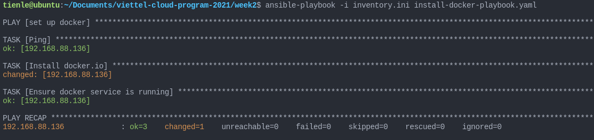
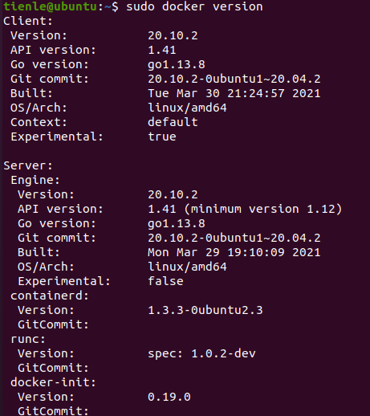
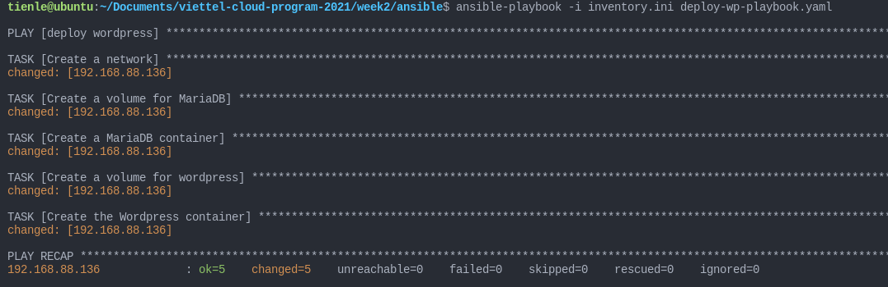
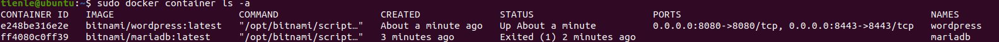
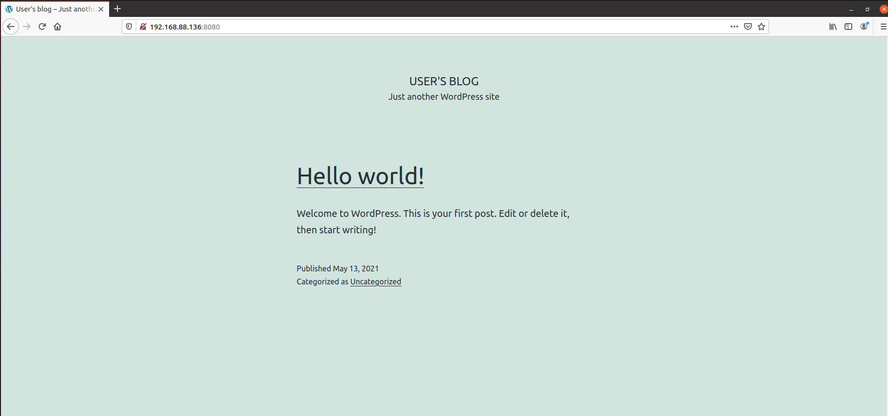
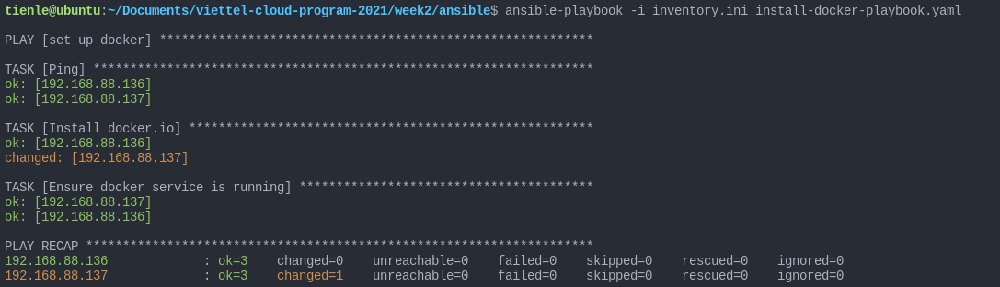
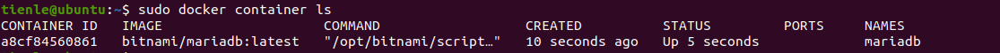
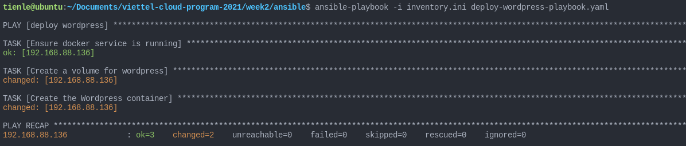
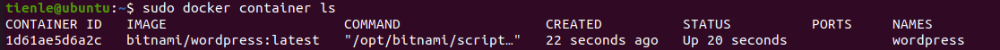
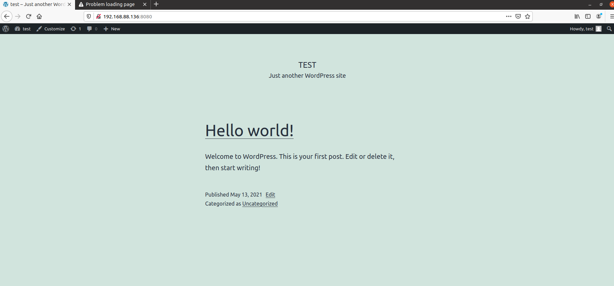

# Practice with Ansible to deploy Wordpress

## Set up Controller Machine

### 1. Ansible

Install command

```shell
$ sudo apt install ansible
```

Check version

```shell
$ sudo ansible --version
```
### 2. openssh-server on managed machines

Allow connect to the managed machines via ssh port 22

```shell
$ sudo apt install openssh-server
```

Check SSH service

```shell
$ sudo service ssh status
```

### IP Address

>Controller Machine: ```192.168.88.135```

>Managed Machine 1: ```192.168.88.136```

>Managed Machine 2: ```192.168.88.137```

## Practice 1: Using Ansible to set up docker and deploy WordPress

>Note: *This method use command module*

### Step 1: Create and configure important files

*Remember create a folder to store files*

Here is my folder [ansible](../week2/ansible/)

**Create 2 files:**

- ```ansible.cfg```
```yaml
[defaults]
host_key_checking = False
remote_user = tienle
```
- ```inventory.ini```
```ini
[wp]
192.168.88.136

[all:vars]
ansible_become_pass=1
ansible_ssh_pass=1
ansible_user=tienle
```

### Step 2: Create and configure ansible playbook to install docker on managed machine

**Create file [```install-docker-playbook.yaml```](./ansible/install-docker-playbook.yaml)**

```yaml
- name: set up docker
  hosts: all
  gather_facts: false
  tasks:
    - name: Ping
      ping:
      register: result
    - name: Install docker.io
      become: yes
      apt:
        name: docker.io
        state: present
    - name: Ensure docker service is running
      become: yes
      service:
        name: docker
        state: started

```

### Step 3: Run above playbook to install docker on managed machine

```shell
$ ansible-playbook -i inventory.ini install-docker-playbook.yaml
```

#### And this is result:



#### Now check our managed machine and it worked



### Step 4: Create and configure playbook to deploy WordPress (by command)


**Create file [```deploy-wp-playbook.yaml```](./ansible/deploy-wp-playbook.yaml)**

```yaml

- name: deploy wordpress
  hosts: wp
  gather_facts: false
  tasks:
    - name: Create a network
      become: yes
      command: docker network create wordpress-network
    - name: Create a volume for MariaDB
      become: yes
      command: docker volume create --name mariadb_data
    - name: Create a MariaDB container
      become: yes
      command: docker run -d --name mariadb --env ALLOW_EMPTY_PASSWORD=yes --env MARIADB_USER=bn_wordpress --env MARIADB_PASSWORD=bitnami --env MARIADB_DATABASE=bitnami_wordpress --network wordpress-network --volume mariadb_data:/bitnami/mariadb bitnami/mariadb:latest
    - name: Create a volume for wordpress
      become: yes
      command: docker volume create --name wordpress_data
    - name: Create the Wordpress container
      become: yes
      command: docker run -d --name wordpress -p 8080:8080 -p 8443:8443 --env ALLOW_EMPTY_PASSWORD=yes --env WORDPRESS_DATABASE_USER=bn_wordpress --env WORDPRESS_DATABASE_PASSWORD=bitnami --env WORDPRESS_DATABASE_NAME=bitnami_wordpress --network wordpress-network --volume wordpress_data:/bitnami/wordpress bitnami/wordpress:latest

```

### Step 5: Run above playbook to deploy WordPress on managed machine

**Run command**
```shell
$ ansible-playbook -i inventory.ini deploy-wp-playbook.yaml
```



**Now, check our managed machine**

- Container is running
  


- And this is our site



## Practice 2: Using Ansible to set up docker on VMs and deploy Wordpress on VM1, MariaDB on VM2


### Step 1: Still create and configure important files

**Create 2 files:**

- ```ansible.cfg``` (similar to Practice 1)
```yaml
[defaults]
host_key_checking = False
remote_user = tienle
```

- ```inventory.ini``` (define database host)
```ini
[wp]
192.168.88.136
[db]
192.168.88.137
[all:vars]
ansible_become_pass=1
ansible_ssh_pass=1
ansible_user=tienle
```
> Here i use ```all``` because two hosts have the same variables


### Step 2: Configure and run ansible playbook to install docker on managed machine

**Create file [```install-docker-playbook.yaml```](./ansible/install-docker-playbook.yaml)**

```yaml
- name: set up docker
  hosts: all
  gather_facts: false
  tasks:
    - name: Ping
      ping:
      register: result
    - name: Install docker.io
      become: yes
      apt:
        name: docker.io
        state: present
    - name: Ensure docker service is running
      become: yes
      service:
        name: docker
        state: started

```
**Now, run command:**

```shell
$ ansible-playbook -i inventory.ini install-docker-playbook.yaml
```



### Step 3: Configure and run ansible playbook to deploy MariaDB on Managed Machine 2


**Create file [```deploy-mariadb-playbook.yaml```](./ansible/deploy-mariadb-playbook.yaml)**

```yaml
- name: deploy mariadb
  hosts: db
  gather_facts: false
  tasks:
    - name: Ensure docker service is running
      become: yes
      service:
        name: docker
        state: started
    - name: Create a volume for MariaDB
      become: yes
      command: docker volume create --name mariadb_data
    - name: Create a MariaDB container
      become: yes
      command: docker run -d --name mariadb --env ALLOW_EMPTY_PASSWORD=yes --env MARIADB_USER=bn_wordpress --env MARIADB_PASSWORD=bitnami --env MARIADB_DATABASE=bitnami_wordpress --network host --volume mariadb_data:/bitnami/mariadb bitnami/mariadb:latest

```
**Now, run command:**

```shell
$ ansible-playbook -i inventory.ini deploy-mariadb.playbook.yaml
```

**Here is the result:**


**And container is running on Machine 2**




### Step 4: Configure and run ansible playbook to deploy WordPress on Managed Machine 1


**Create file [```deploy-wordpress-playbook.yaml```](./ansible/deploy-wordpress-playbook.yaml)**

```yaml
- name: deploy wordpress
  hosts: wp

  gather_facts: false
  tasks:
    - name: Ensure docker service is running
      become: yes
      service:
        name: docker
        state: started
    - name: Create a volume for wordpress
      become: yes
      command: docker volume create --name wordpress_data
    - name: Create the Wordpress container
      become: yes
      command: docker run -d --name wordpress -p 8080:8080 -p 8443:8443 --env ALLOW_EMPTY_PASSWORD=yes --env WORDPRESS_DATABASE_USER=bn_wordpress --env WORDPRESS_DATABASE_PASSWORD=bitnami --env WORDPRESS_DATABASE_NAME=bitnami_wordpress --network host --add-host mariadb:192.168.88.137 --volume wordpress_data:/bitnami/wordpress bitnami/wordpress:latest

```
**Now, run command:**

```shell
$ ansible-playbook -i inventory.ini deploy-wordpress.playbook.yaml
```

**Here is the result:**



**And container is running on Machine 1**




### Step 5: Open our site on Machine 1


