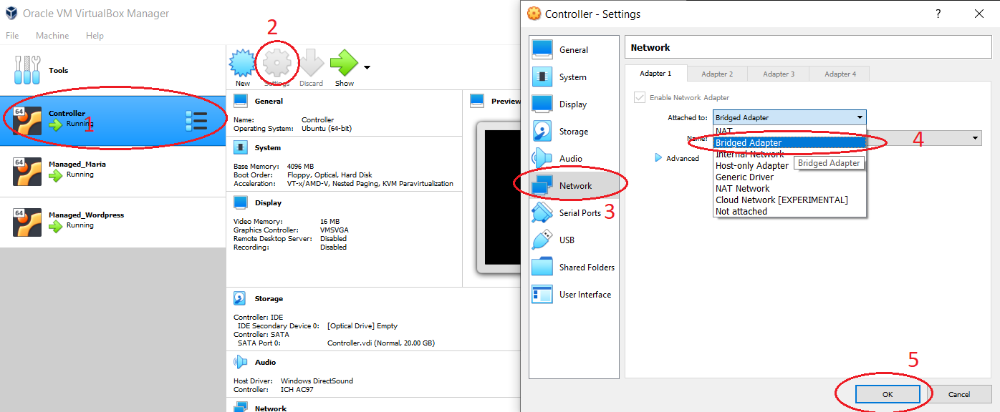
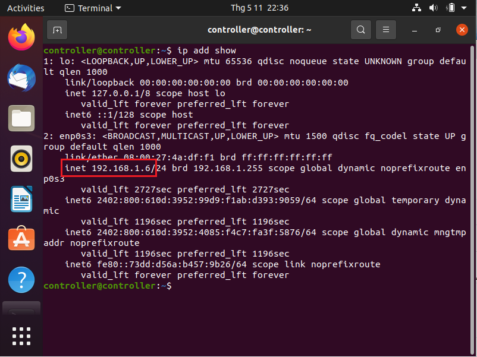
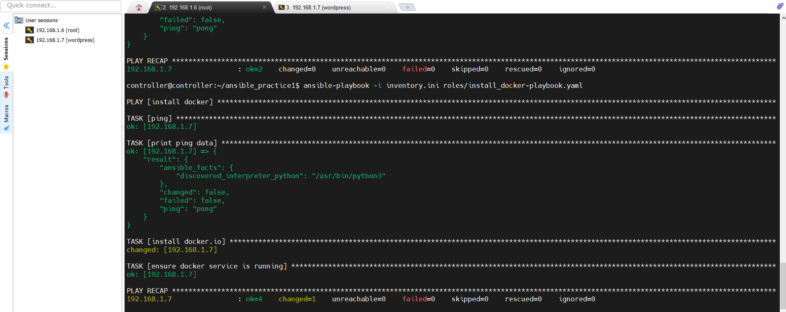
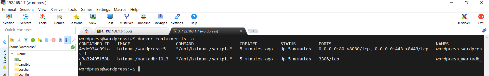
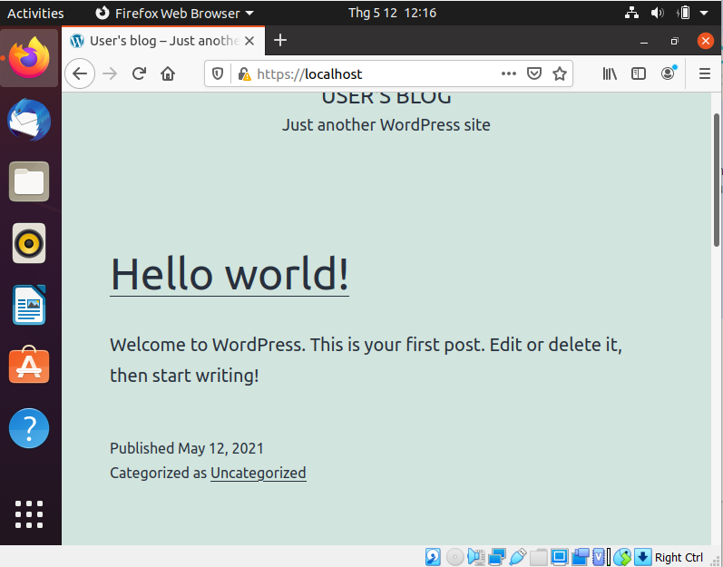
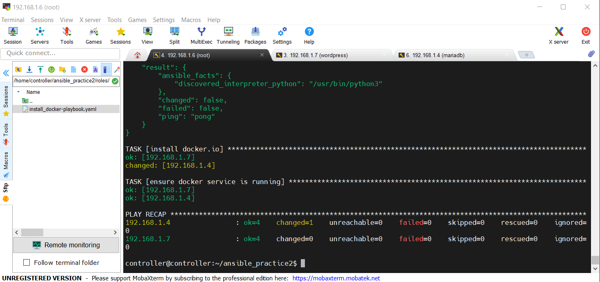
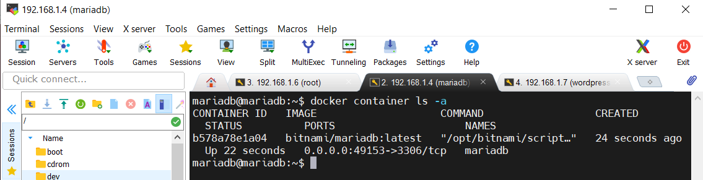
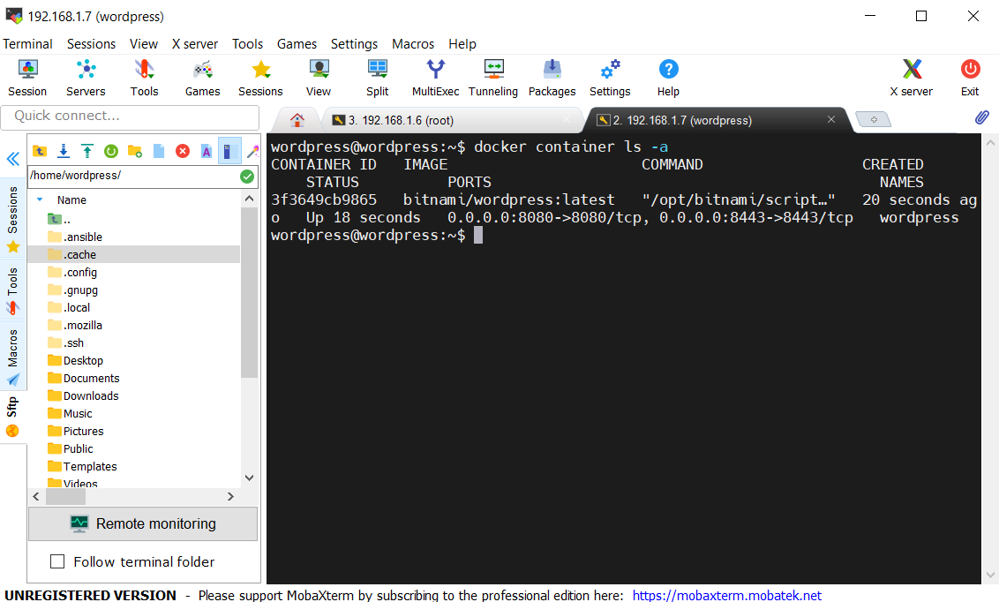

# Bài tập tuần 2

## Những thứ cần chuẩn bị trước :
### 1.  4 Ubuntu Virtual Machine ( máy chủ Ubuntu ảo ):

 1. Controller VM
 
 2. MariaDB VM
 
 3. Wordpress VM
 
 4. All-In VM 

### 2. Đổi adapter từ NAT sang Bridged Adapter

Với mỗi VM, ta thực hiện các bước như sau: 



> Bước 1 : Chọn VM 
 Bước 2: Chọn Settings
 Bước 3: Chọn Network ở thanh menu bên trái
 Bước 4: Tại phần "Attached to" chọn Bridged Adapter
 Bước 5: Nhấp OK để lưu


### 3. Lấy địa chỉ IP của máy chủ ảo

Chạy lệnh sau trên terminal : 

    $ ip add show



Kết quả trả về sẽ hiện thị IP của máy chủ đó ( ex : 192.168.1.6 )

### 4. Cài đặt *openssh-server*

    $ sudo apt install openssh-server

### 5. Cài đặt *sshpass*

    sudo apt-get install sshpass

### 6. Setup Ansible trên máy chủ Controller

Bước 1: Cài đặt *curl*

    $ sudo apt install curl

Bước 2: Cài đặt *python3*

    $ sudo apt-get install python3

Bước 3: Cài đặt *pip*

    $ sudo apt install python3-pip

Bước 4: Cài đặt *Ansible*

    $ sudo apt install ansible
    
# Thực hành

## Practice 1

Bài này, chúng ta thực hiện sử dụng Ansible để cài đặt Docker lên All-In VM và deploy Wordpress.

## Phần 1: Sử dụng Ansible để cài đặt Docker
  
  *Tạo project folder 'ansible_practice1' trên máy chủ Controller. Sau đó:* 

### 1. Khai báo file 'ansible.cfg':

    [defaults]
    host_key_checking = False
    remote_user = controller
### 2. Khai báo file 'inventory.ini':

    [wp]
    192.168.1.7
    [wp:vars]
    ansible_become_pass=wordpress
    ansible_ssh_pass=wordpress
    ansible_user=wordpress
    
### 3. Viết task cài đặt Docker:

Bước 1: Tạo thư mục roles, trong đó tạo file 'install_docker-playbook.yaml'

    - name : install docker
      hosts: wp
      gather_facts: false
    
      tasks:
      - name : ping
        ping:
        register: result
    
      - name : print ping data
        debug:
          var : result
    
      - name : install docker.io and python3 for Docker sdk
        become : yes
        apt: 
          name : docker.io, python3
          state: present
      
      - name : ensure docker service is running
        become : yes
        service: 
          name: docker
          state: started
       
      - name : add user to docker group
	    command:
	      cmd: sudo usermod -aG docker ${USER}
	     
	  - name : type the following command
	    command: 
	      cmd: su - ${USER}

Bước 2 : Run playbook:

    ansible-playbook -i inventory.ini roles/install_docker-playbook.yaml

Kết quả trả về khi thành công: 



## Phần 2: Sử dụng Ansible để deploy Wordpress và MariaDB

Bước 1: Viết file 'deploy_wordpress-playbook.yaml' :

    - name : install docker
      hosts: wp
      gather_facts: false
    
      tasks:
      - name : ping
        ping:
        register: result
    
      - name : print ping data
        debug:
          var : result
    
      - name : ensure docker service is running
        become : yes
        service: 
          name: docker
          state: started
      
      - name : install python3, pip
        become : yes
        apt: 
          name : python3, python3-pip 
          state: present
          
      - name: check install python3
        command:
          cmd: python3 --version
        register: result_py
          
      - name: print check python3
        debug:
          var : result_py
    
      - name: install docker_compose
        command: 
          cmd: pip3 install docker docker-compose
        register: result_install_compose_pkg
    
      - debug:
          var: result_install_compose_pkg
          
    
      - name: Tear down existing services
        get_url:
         url: "{{ docker_compose_url }}"
         dest: /home/wordpress/docker-compose.yml
        register : output
        
      - debug:
          var: output
        
      - name: Create and start services
        docker_compose:
          project_src: /home/wordpress
          state: present
        register: output
    
      - debug:
          var: output

Bước 2: Run playbook :

    ansible-playbook -i inventory.ini roles/deploy_wordpress-playbook.yaml

Bước 3 : Kiểm tra trên máy host :

    docker container ls -a



Truy cập https://localhost:8443 trên máy host để kiểm tra wordpress đã chạy hay chưa :




## Practice 2:
Bài này, chúng ta sẽ thực hành cài đặt docker lên 2 máy chủ host, deploy web và database trên 2 máy host khác nhau ( Mariadb VM và Wordpress VM )

### Phần 1 : Cài đặt Docker lên cả 2 máy chủ 

*Tạo project folder 'ansible_practice2' trên máy chủ Controller. Sau đó:* 

### 1. Khai báo file 'ansible.cfg':

    [defaults]
    host_key_checking = False
    remote_user = controller
    
### 2. Khai báo file 'inventory.ini':

    [wp]
    192.168.1.7
    [wp:vars]
    ansible_become_pass=wordpress
    ansible_ssh_pass=wordpress
    ansible_user=wordpress
    
    [db]
    192.168.1.4
    [db:vars]
    ansible_become_pass=mariadb
    ansible_ssh_pass=mariadb
    ansible_user=mariadb
    
### 3. Viết task cài đặt Docker:

Bước 1: Tạo thư mục roles, trong đó tạo file 'install_docker-playbook.yaml'

    - name : install docker
      hosts: wp
      gather_facts: false
    
      tasks:
      - name : ping
        ping:
        register: result
    
      - name : print ping data
        debug:
          var : result
    
      - name : install docker.io and python3 for docker sdk
        become : yes
        apt: 
          name : docker.io, python3
          state: present
      
      - name : ensure docker service is running
        become : yes
        service: , ,
          name: docker
          state: started
          
      - name : add user to docker group
		  command:
		   cmd: sudo usermod -aG docker ${USER}
		 
	  - name : type the following command
	 	  command: 
		   cmd: su - ${USER}

Bước 2 : Run playbook:

    ansible-playbook -i inventory.ini roles/install_docker-playbook.yaml

Kết quả trả về khi thành công: 



> Note: Trong trường hợp gặp phải lỗi "Could not get lock
> /var/lib/dpkq/lock-frontend ". Hãy chạy lần lượt các câu lệnh sau trên
> máy chủ host gặp lỗi : 
> ``` sudo killall apt apt-get 
> sudo rm /var/lib/apt/lists/lock 
> sudo rm /var/cache/apt/archives/lock 
> sudo rm /var/lib/dpkg/lock* 
> sudo dpkg --configure -a 
> sudo apt update 
> ```
> 
> *[Nguồn tham khảo](https://www.google.com/url?sa=t&rct=j&q=&esrc=s&source=web&cd=&ved=2ahUKEwjY-cTi1cPwAhUVa94KHWyTCXYQFjABegQIBBAD&url=https%3A%2F%2Faskubuntu.com%2Fquestions%2F1109982%2Fe-could-not-get-lock-var-lib-dpkg-lock-frontend-open-11-resource-temporari&usg=AOvVaw0KASzEAI_ZJICepZER06dF)*

## Phần 2: Sử dụng Ansible để deploy MariaDB

Phần này chúng ta sẽ deploy mariadb lên máy chủ Mariadb VM

### 1: Viết file 'deploy_mariadb-playbook.yaml' :

    - name : deploy mariadb
      hosts: db
      gather_facts: false
    
      tasks:
      - name : ping
        ping:
        register: result
    
      - name : print ping data
        debug:
          var : result
      
      - name : ensure docker service is running
        become : yes
        service: 
          name: docker
          state: started
          
      - name : create network
        docker_network:
          name: wordpress-network
          state: present
          
      - name : create docker volume
        docker_volume:
          volume_name: mariadb_data
          
      - name: create container and run
        docker_container:
          state: started
          name: mariadb
          published_ports: 3306
          networks:
            - name: wordpress-network
          volumes: mariadb_data:/bitnami/mariadb
          image: bitnami/mariadb:latest
          pull: true
          env:
            ALLOW_EMPTY_PASSWORD=yes
            MARIADB_USER=bn_wordpress
            MARIADB_PASSWORD=bitnami
            MARIADB_DATABASE=bitnami_wordpress
        register: output
        
      - debug:
          var : output

### 2. Run playbook :

    ansible-playbook -i inventory.ini roles/deploy_mariadb-playbook.yaml

### 3. Kiểm tra trên máy host :

    docker container ls -a



## Phần 3: Sử dụng Ansible để deploy Wordpress web

Phần này chúng ta sẽ deploy web lên máy chủ Wordpress VM

### 1: Viết file 'deploy_web-playbook.yaml' :

    - name : deploy web
      hosts: wp
      gather_facts: false
    
      tasks:
      - name : ping
        ping:
        register: result
    
      - name : print ping data
        debug:
          var : result
      
      - name : ensure docker service is running
        become : yes
        service: 
          name: docker
          state: started
          
      - name : create network
        docker_network:
          name: wordpress-network
          state: present
          
      - name : create docker volume
        docker_volume:
          volume_name: wordpress_data
          
      - name: create container and run
        docker_container:
          state: started
          name: wordpress
          published_ports:
            - 8080:8080
            - 8443:8443
          networks:
            - name: wordpress-network
          volumes: wordpress_data:/bitnami/wordpress
          image: bitnami/wordpress:latest
          pull: true
          env:
            ALLOW_EMPTY_PASSWORD=yes
            WORDPRESS_DATABASE_HOST=192.168.1.4
            WORDPRESS_DATABASE_USER=bn_wordpress
            WORDPRESS_DATABASE_PASSWORD=bitnami
            WORDPRESS_DATABASE_NAME=bitnami_wordpress
        register: output
        
      - debug:
          var : output

### 2. Run playbook :

    ansible-playbook -i inventory.ini roles/deploy_web-playbook.yaml

### 3. Kiểm tra trên máy host :

    docker container ls -a



Truy cập https://localhost:8443 trên máy host để kiểm tra wordpress đã chạy hay chưa :

