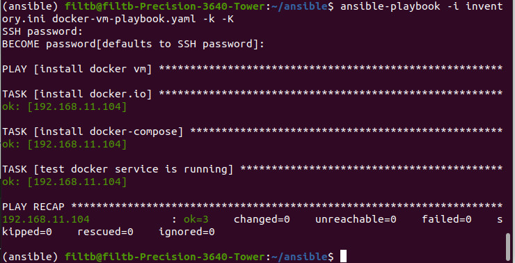
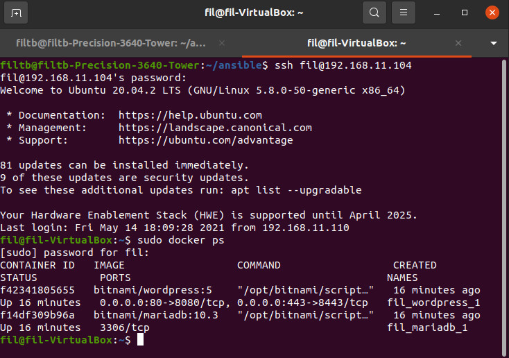
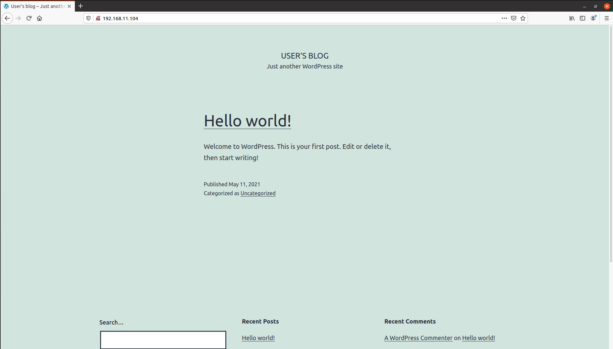
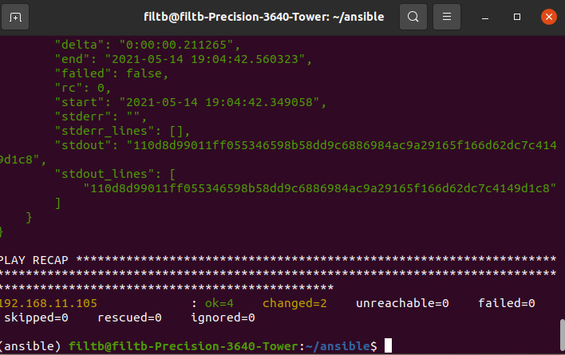
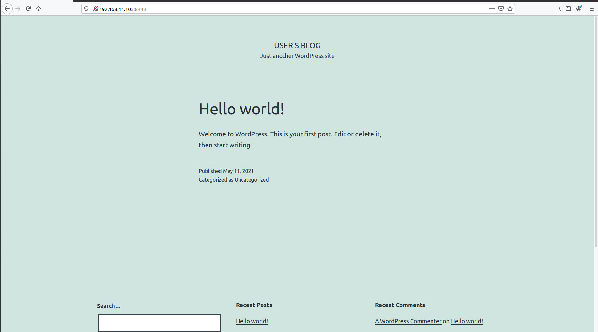

# Viettel - Week 2

* Automation
* Ansible
* Diving into Ansible

---

<!-- TOC -->

- [Viettel - Week 2](#viettel---week-2)
  - [Cài đặt Controller](#cài-đặt-controller)
  - [Practice 1](#practice-1)
    - [1. Sử dụng Ansible để cài đặt Docker trên VM_1](#1-sử-dụng-ansible-để-cài-đặt-docker-trên-vm_1)
    - [2. Sử dụng Ansible để deploy Wordpress trên VM_1](#2-sử-dụng-ansible-để-deploy-wordpress-trên-vm_1)
  - [Practice 2](#practice-2)
    - [1. Cài đặt tương tự Docker trên máy ảo 2 thông qua ```docker-vm-playbook.yaml```](#1-cài-đặt-tương-tự-docker-trên-máy-ảo-2-thông-qua-docker-vm-playbookyaml)
    - [2. Cài đặt MariaDB trên VM_1 [fil]](#2-cài-đặt-mariadb-trên-vm_1-fil)
    - [3. Cài đặt Wordpress trên VM_2 [filcl]](#3-cài-đặt-wordpress-trên-vm_2-filcl)
      - [3.4 Truy cập địa chỉ <https://192.168.11.105:8443> tại host](#34-truy-cập-địa-chỉ-https192168111058443-tại-host)

<!-- /TOC -->

---

## Cài đặt Controller

1. Cài đặt Python3

```
sudo apt install python3
```

2. Cài đặt môi trường virtualenv và cài đặt Ansible

```
python3 -m pip install virtualenv
python3 -m virtualenv ansible
source ansible/bin/activate
python -m pip install ansible
```


3. Cài đặt sshpass

```
sudo apt install -y sshpass
```

 4. Tạo file ansible.cfg và inventory.ini sử dụng Nano

**ansible.cfg**

```
[defaults]
host_key_checking = False
inventory = /home/ansible/inventory.ini
remote_user = filtb
```

Trước tiên chúng ta thiết lập và lấy ip máy ảo bằng cách:


và vào máy ảo để lấy IP
``` $ ifconfig ```

**inventory.ini**

```
[fil]
192.168.11.104

[fil_cl]
192.168.11.105

[all:vars]
ansible_ssh_user = fil
ansible_ssh_pass = 1
```

Test thử Ansible

```
ansible -i inventory.ini all -m ping
```


---

## Practice 1

### 1. Sử dụng Ansible để cài đặt Docker trên VM_1

1.1. Tạo file ```docker-vm-playbook.yaml```

```
- name: install docker vm
  hosts: fil
  gather_facts: false

  tasks:
  - name: install docker.io
    become: yes
    apt:
      name: docker.io
      state: present
  - name: install docker-compose
    become: yes
    apt:
      name: docker-compose
      state: present
  - name: test docker service is running
    become: yes
    service:
      name: docker
      state: started
```

 1.2. Run ```docker-vm-playbook.yaml```

```
ansible-playbook -i inventory.ini docker-vm-playbook.yaml -k -K
```



### 2. Sử dụng Ansible để deploy Wordpress trên VM_1

Tương tự 1. ta cũng khởi tạo
```wordpress-playbook.yaml``` và chạy file này

```
- name: deploy wordpress
  hosts: fil
  gather_facts: false

  tasks:
  
  - name: pull docker compose yml
    become: yes
    get_url:
      url: https://raw.githubusercontent.com/bitnami/bitnami-docker-wordpress/master/docker-compose.yml
      dest: /home/docker-compose.yml
  
  - name: docker compose up
    become: yes
    command: docker-compose up -d
```

Run playbook:

```
ansible-playbook -i inventory.ini deploy-wordpress-playbook.yaml -k -K
```


Để kiểm tra xem chúng ta đã tạo các image thành công, ta ssh vào VM_1 và kiểm tra với command:

```
ssh fil@192.168.11.104
sudo docker ps
```



3. Truy cập vào địa chỉ IP VM_1 tại host để xem kết quả



## Practice 2

Chúng ta tạo thêm 1 máy ảo tương tự và setting để lấy địa chỉ IP của máy ảo VM_2

### 1. Cài đặt tương tự Docker trên máy ảo 2 thông qua ```docker-vm-playbook.yaml```

Với thay đổi thông số ```hosts: fil_cl```

```
- name: install docker vm
  hosts: fil_cl
  gather_facts: false

  tasks:
  - name: install docker
    become: yes
    apt:
      name: docker
      state: present
  - name: install docker-compose
    become: yes
    apt:
      name: docker-compose
      state: present
  - name: test docker service is running
    become: yes
    service:
      name: docker
      state: started
```

Run

```
ansible-playbook -i inventory.ini docker-vm-playbook.yaml -k -K
```

### 2. Cài đặt MariaDB trên VM_1 [fil]

2.1 Tạo file install-mariadb.yaml

```
- name: Install MariaDb
  hosts: fil
  gather_facts: false

  tasks:
  - name: create volume for mariadb
    become: yes
    command: docker volume create --name mariadb_data
    register: debugCreateVolume
  - name: log run mariadb
    debug:
     var: debugCreateVolume
  - name:  run image mariadb
    become: yes
    command: docker run -d --name mariadb --env ALLOW_EMPTY_PASSWORD=yes --env MARIADB_USER=bn_wordpress --env MARIADB_PASSWORD=bitnami --env MARIADB_DATABASE=bitnami_wordpress --network host --volume mariadb_data:/bitnami/mariadb bitnami/mariadb:latest    
    register: debugRunMariadb
  - name: log run mariadb
    debug:
     var: debugRunMariadb
```


 2.2 Run

```
ansible-playbook -i inventory.ini install-mariadb.yaml -k -K
```

### 3. Cài đặt Wordpress trên VM_2 [filcl]

3.1 Tạo file install-wordpress.yaml

```
- name: Install WordPress fil_cl
  hosts: fil_cl
  gather_facts: false

  tasks:
  - name: create volume for wordpress
    become: yes
    command: docker volume create --name wordpress_data
    register: debugCreateVolume
  - name: log create volume web
    debug:
     var: debugCreateVolume
  - name:  run image wordpress
    become: yes
    command:   docker run -d --name wordpress   --env WORDPRESS_DATABASE_HOST=192.168.5.10  --env ALLOW_EMPTY_PASSWORD=yes   --env WORDPRESS_DATABASE_USER=bn_wordpress   --env WORDPRESS_DATABASE_PASSWORD=bitnami   --env WORDPRESS_DATABASE_NAME=bitnami_wordpress   --network host   --volume wordpress_data:/bitnami/wordpress   bitnami/wordpress:latest   
    register: debugRunWp
  - name: log run web
    debug:
     var: debugRunWp
```

3.2 Run

```
ansible-playbook -i inventory.ini install-wordpress.yaml -k -K
```



3.3 Kiểm tra lại các container trên 2 máy ảo bằng Ansible

```
- name: docker ps
  hosts: fil,fil_cl
  gather_facts: false

  tasks:
  - name: ping
    become: yes
    command: docker ps 
    register: result
  - name: print docker ps
    debug:
     var: result
```


#### 3.4 Truy cập địa chỉ <https://192.168.11.105:8443> tại host


