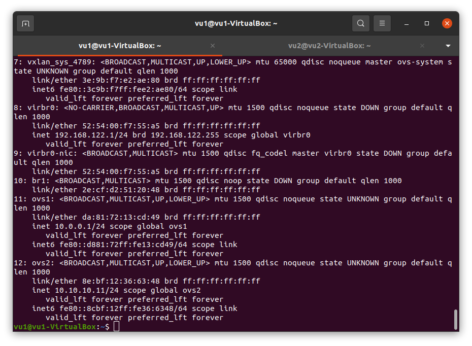
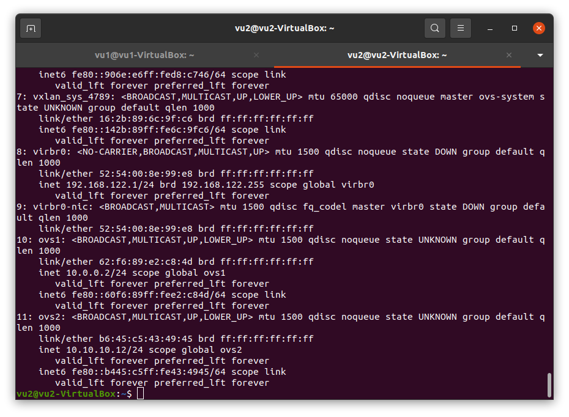

# Week 3: SDN- NFV Practice
## Mục tiêu bài: 
- 1. Tạo 2 máy ảo Linux và cài đặt Openvswitch
- 2. Sử dụng Openvswitch để cài đặt mạng Vxlan giữa 2 máy ảo 
- 3. Kiểm tra ping mạng Vxlan, sử dụng Tcpdump hoặc wireshark để  bắt traffic giữa 2 máy ảo .
- 4. Chỉ ra điểm mạnh, điểm yếu của việc sử dụng mạng Vxlan 
  

## VXLAN với Open vSwitch
 

\- Mô tả:  
- 2 host ( HOST 1 và HOST 2) cài hệ điều hành Ubuntu 20.04, cài sẵn các phần mềm Open vSwitch, KVM với QEMU, libvirt-bin.
- 2 host đều có card mạng ens38 nối chung vào 1 switch.

\- Cấu hình:  
- Tạo 2 vSwitch ovs1 và ovs2 trên cả 2 host.
- Cấu hình chế độ mạng bridge cho vSwitch ovs2 và card mạng ens38 trên cả 2 host.
- Trên HOST 1, tạo VM1 kết nối với vSwitch ovs1. Trên HOST 2 tạo VM2 kết nối với vSwitch ovs1.
- Địa chỉ của các switch và card mạng cấu hình như trong topo.


### Chuẩn bị môi trường
1. Cài đặt Openvswitch
  ```
  sudo apt upgrade
  
  sudo apt install openvswitch-switch
  ```
2. Cài đặt  KVM với QEMU, libvirt-bin.
  ```
  sudo apt upgrade

  sudo apt-get install qemu-kvm libvirt-daemon-system libvirt-clients bridge-utils
  ```

### Cài đặt và cấu hình
\- Trên HOST 1:  
- Tạo 2 vswitch ovs1 và ovs2:  
```
ovs-vsctl add-br ovs1
ovs-vsctl add-br ovs2
```

- Bật 2 vswitch lên:  
```
ip link set dev ovs1 up
ip link set dev ovs2 up
```

- Tạo chế mạng bridge cho vswitch ovs2 và card mạng ens38:  
```
ovs-vsctl add-port ovs2 ens38
ip a flush dev ens38
ip a add 10.10.10.11/24 dev ovs2
```

- Cấu hình IP cho vswitch ovs1:  
```
ip a add 10.0.0.1/24 dev ovs1
```

- Cấu hình VXLAN tunnel cho vswitch ovs1:  
```
ovs-vsctl add-port ovs1 vxlan1 -- set interface vxlan1 type=vxlan option:remote_ip=10.10.10.12
```

- Tạo mạng network-ovs1 với vswitch ovs1:  
Tạo file network-ovs1.xml với nội dung sau:  
```
<network>
  <name>network-ovs1</name>
  <forward mode='bridge'/>
  <bridge name='ovs1'/>
  <virtualport type='openvswitch' />
</network>
```

Thực hiện các command sau để tạo mạng và bắt đầu mạng:  
```
virsh net-define network-ovs1.xml
virsh net-start network-ovs1
virsh net-autostart network-ovs1
```

- Tạo máy ảo có tên VM1 và kết nối với mạng network-ovs1.  

\- Trên HOST 2:  
- Tạo 2 vswitch ovs1 và ovs2:  
```
ovs-vsctl add-br ovs1
ovs-vsctl add-br ovs2
```

- Bật 2 vswitch lên:  
```
ip link set dev ovs1 up
ip link set dev ovs2 up
```

- Tạo chế mạng bridge cho vswitch ovs2 và card mạng ens38:  
```
ovs-vsctl add-port ovs2 ens38
ip a flush dev ens38
ip a add 10.10.10.12/24 dev ovs2
```

- Cấu hình IP cho vswitch ovs1:  
```
ip a add 10.0.0.2/24 dev ovs1
```

- Cấu hình VXLAN tunnel cho vswitch ovs2:  
```
ovs-vsctl add-port ovs1 vxlan1 -- set interface vxlan1 type=vxlan option:remote_ip=10.10.10.11
```


- Tạo mạng network-ovs1 với vswitch ovs1:  
Tạo file network-ovs1.xml với nội dung sau:  
```
<network>
  <name>network-ovs1</name>
  <forward mode='bridge'/>
  <bridge name='ovs1'/>
  <virtualport type='openvswitch' />
</network>
```

Thực hiện các command sau để tạo mạng và bắt đầu mạng:  
```
virsh net-define network-ovs1.xml
virsh net-start network-ovs1
virsh net-autostart network-ovs1
```

- Tạo máy ảo có tên VM2 và kết nối với mạng network-ovs1.  


### Kết quả 
  - em vẫn chưa ping được giữa 2 máy ảo  
- 
- 


### Ưu điểm của Mạng Vxlan
1. Mở rộng khả năng phân chia mạng, theo đó VxLAN sử dụng 24bit cho VxLAN ID (với VLAN là 12 bit) --> Chúng ta có hơn 16 triệu VxLAN ID.
2. Giảm độ trễ truyền tải gói tin trong miền VxLAN.
Không sử dụng STP và cho phép enable ECMP (Equal-Cost MultiPath) --> Cho phép truyền tải gói tin trên nhiều path.
3. Tăng tính linh hoạt cho mạng lưới đáp ứng cho sự linh hoạt của Cloud Platform.
4. Mở ra khả năng tích hợp SDN (Software Defined Network) --> Cho phép xây dựng hạ 
 tầng mạng ảo hóa linh hoạt nhất.


### Ưu điểm của Mạng Vxlan
1. VXLAN thiếu “VXLAN lacks real “signaling protocols” thực và có thể ​​sẽ được cấu hình thông qua SDN. Yêu cầu một bộ điều khiển tập trung, điều này có thể cực kỳ khó mở rộng.
2. Yêu cầu a multicast-enabled Underlay
### Nguồn tham khảo
https://www.cisco.com/c/en/us/support/docs/lan-switching/vlan/212682-virtual-extensible-lan-and-ethernet-virt.html#anc9
https://github.com/hocchudong/thuctap012017/blob/master/XuanSon/Netowork%20Protocol/VXLAN-GRE%20Protocol.md#1
https://help.ubuntu.com/community/KVM/Installation

https://viblo.asia/p/vxlan-cong-nghe-ao-hoa-dc-1Je5EQLL5nL