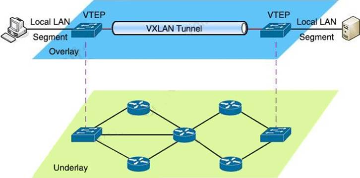
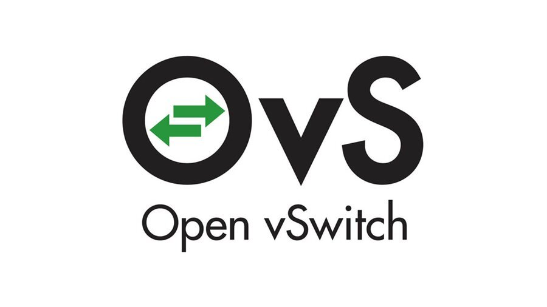
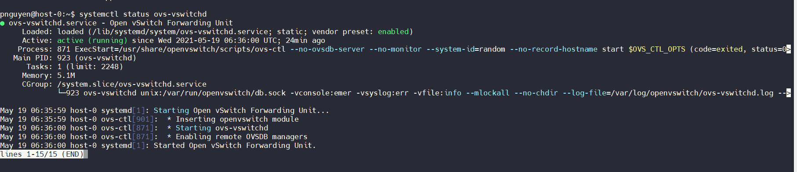
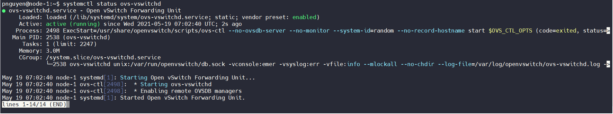
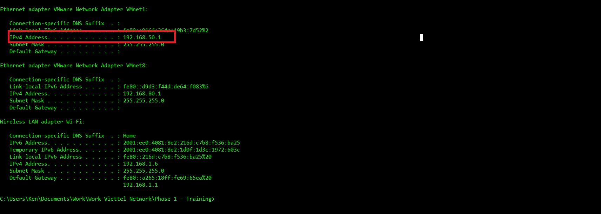
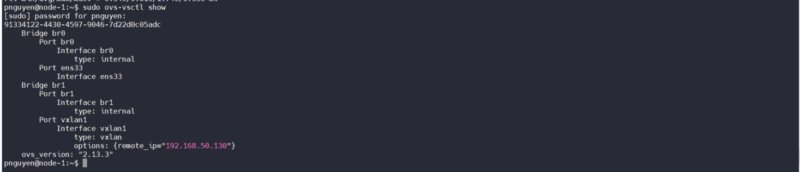
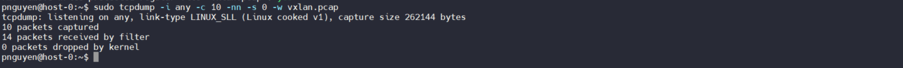
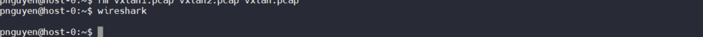
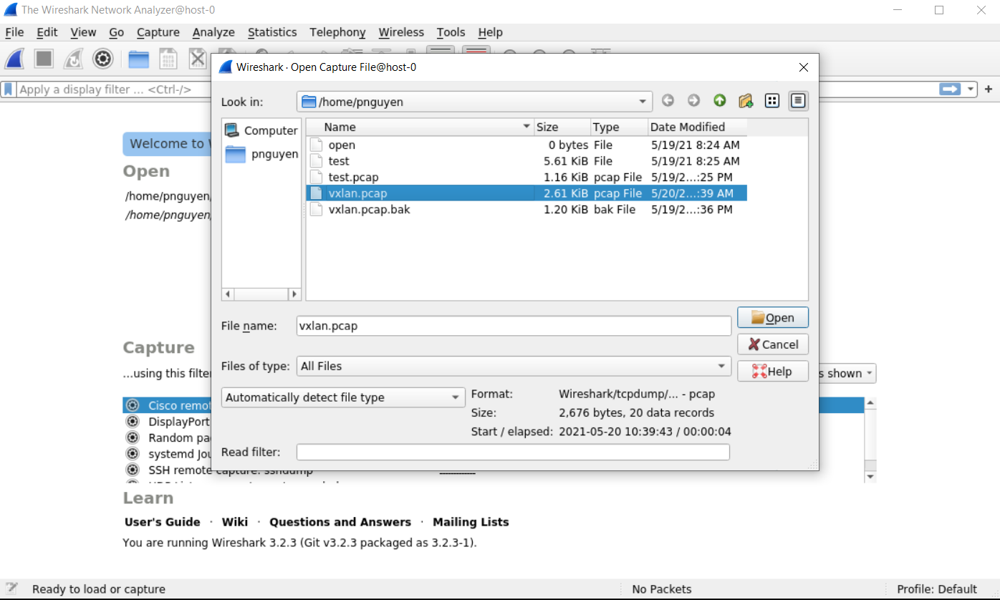
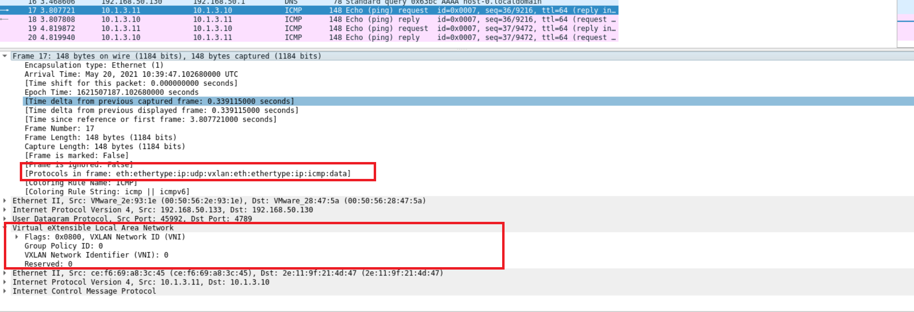

# WEEK-3 PRACTICE DOCUMENTATION
# Sec. 2: SOFTWARE DEFINED NETWORKING (SDN) w/ `OpenvSwitch`
---

## **Author:** *Julian (Phong) Ng.* 
**Date of issue**: *May 20th 2021*

> Welcome back! This is the documentation for my second training project at **Viettel Network**. Enjoy ur time :smile_cat:. Feel free to hit me up if any edition is needed!

---
# **Table of Contents:**

## [I. Overview](#**I.-OVERVIEW**)

## [II. Prerequisite](#**II.-PREREQUISITE**)

## [III. Step-by-step](#**II.-STEP-BY-STEP**)

- ### [A. Set Up Environment](#A.-SET-UP-ENVIRONMENT)

- ### [B. Network Configurations](#B.-Network-Configurations):

- ### [C. VXLAN Connectivity between 2 Nodes](#C.-VXLAN-CONNECTIVITY-BETWEEN-2-NODES)

## [IV. Q/A](#III.-Q/A)

## [V. References & Tutorials](#IV.-REFERENCES)


# **I. OVERVIEW**:
## **A. VXLAN**: `Virtual eXtensible Local Area Network`

- **Definition:** An `Overlay Network Virtualization` (*over Layer 3*) technology. An extension to `Virtual Local Area Network` (VLAN)

- **How it works?**
    - `Encapsulation`: VXLAN encapsulate Ethernet frame on Layer 2 into a UDP datagram & send it over Layer 3.
    - `Tunneling`: establish connection via `tunnel` between the sender & destination devices. Network traffic are encapsulated & forward through such route.

- **Terms**:
  - `VNI`: *VXLAN network identifier*
    - Uniquely identify the VXLAN network
    - Likewise `VLANID`, but with **24 bits**

  - `VTEP`: *VXLAN Tunnel Endpoint*
      - Stays on Hypervisor on host of VMs
      - Responsible for `encapsulating` & `decapsulating` Layer 2 traffic.


  
## **B. OpenvSwitch**:

- A `open-source` SDN-based solution under `Apache 2.0 License`.
- Implementing `virtual multiplayer switch` - also known as `soft-switch`.
- Support multiple Linux-based Virtualization technologies (E.g: `KVM`, `VirtualBox`, `Qemu`,etc) 



# **II. PREREQUISITE**:
## **A. Knowledge Requirements:**

- Basics on **Linux**, **Networking**.
  - [**VXLAN**](https://support.huawei.com/enterprise/en/doc/EDOC1100086966) - *Please try to understand some terminologies & basic workflow of this protocol* (*To be honest, my `networking` is awful* :stuck_out_tongue:)

- Basics on [**OpenvSwitch**](https://www.openvswitch.org/).
	- Recommended understand how to manage `Docker` resources (images, ) commands.

## **B. Infrastructure Requirements:** 
#### **Network Topology Diagram**
````
          
          
              HOST 0                                                                    HOST 1
                            
                      +--------------+                                   +--------------+ 
                      |     br1      |                                   |     br1      |                       
                      +--------------+   10.1.3.10                       +--------------+   10.1.3.11
                      |    vxlan1    |                                   |    vxlan1    |
                      +--------------+                                   +--------------+
                            |                                                  |
                            |                                                  |
                            |                                                  |
                            |                                                  | 
                      +--------------+                                  +---------------+
                      |     br0      |                                  |     br0       |
    +---------+       +--------------+                                  +---------------+       +---------+
    |  ens38  |       |    ens33     |----------------------------------|    ens33      |       |  ens38  |   
    +---------+       +--------------+                                  +---------------+       +---------+
  192.168.80.0/24      172.168.50.130                                    192.168.50.128       192.168.80.0/24


````

- **Operating System**: Ubuntu Server (**Ubuntu 20.04** in below practice: [Download Ubuntu Server](https://ubuntu.com/download/server)) 

- **Network**: 
 
    - `host-0`: 
      - **ens33**: *Host-only* - `192.168.80.130`
      - **ens38**: *NAT*        - `192.168.80.0/24`
    - `host-1`:
      - **ens33**: *Host-only* - `192.168.80.128`
      - **ens38**: *NAT*        - `192.168.80.0/24`

**Notes on `NICs`**
- `ens33` is **mainly used**.

- `ens38` (**NAT**) is for **Internet Connection** only. Can disable it after all dependencies/packages are installed

# **III. STEP-BY-STEP**:

## **A. SET UP ENVIRONMENT**:

- Update `apt`:
```
$ sudo apt update
$ sudo apt upgrade
```

- **Must-have** packages via `apt`: `net-tools`, `tcpdump`, `wireshark`
	- `net-tools`: *collection of programs for controlling the network subsystem of the Linux kernel*
	- `tcpdump`: *network packet analyzer*
	- `wireshark`: *network protocol analyzer*
```
$ sudo apt install -y net-tools tcpdump wireshark
```

- Installing `OpenVswitch` (*`virtual switch`*) via `apt`:
```
$ sudo apt install openvswitch-switch
```

- Starting `OpenSwitch`:
```
$ sudo ovs-vswitchd
```

- (*Recommended*) Disable `ens38` after all packages installed:
```
$ sudo ifconfig ens38 down
```

## **B. NETWORK CONFIGURATIONS**:

### Service Functionality & Version check

- Check status of `OpenvSwitch` service:

```
$ systemctl status ovs-vswitchd
```


> **Node 0**



> **Node 1**



- Check version of `OpenvSwitch` service:
```
$ sudo ovs-vsctl --version 
```

### `MUST-KNOW` Networking Diagonistic Commands:

- Check network interfaces:
```
$ sudo ifconfig
```

- Show `routing table`:
```
$ route -n
```

### **1. Host 0**:

- Adding 2 network bridges: `br0`, `br1`

```
$ sudo ovs-vsctl add-br br0
$ sudo ovs-vsctl add-br br1			
```

**Note**
> `br1` should be considered as a **dummy** interface.

- Attaching `ens33` to `br0`:
```
$ sudo ovs-vsctl add-port br0 ens33
```

- Disbale `ens33`

**Note**
 > *At this point, `br0` posseses **IP**, **netmask**, **MAC address** of `ens33`.*

```
$ sudo ifconfig ens33 0
```

- Configure IP for `br0`
```
$ sudo ifconfig br0 192.168.50.130 netmask 255.255.255.0
```

- (Optional) Modify `default gateway` - *Allocated by VMware for mother machine*

```
$ sudo route add default gw 192.168.50.1 br0
```



- Configure IP of `br1`:
```
$ sudo ifconfig br1 10.1.3.10 netmask 255.255.255.0
```

- Configure VXLAN tunnel for `br1`:

```
$ sudo ovs-vsctl add-port br1 vxlan1 -- set interface vxlan1 type=vxlan options:remote_ip=192.168.50.128
```

**Note**:
<dl>
    <dt>
      <b>remote_ip</b>
    </dt>
    <dd>
        <b>MUST</b> be address of other node, <code>host-0</code>.
    </dd>
</dl>	 

- Full `openvSwitch` configuration on `host-0`:

```
$ sudo ovs-vsctl show
```

**Note**
> Pardon me for the mismatch of `remote_ip` for `vxlan1`. This was changed due to `DHCP`.


### **2. HOST 1**:

- Adding 2 network bridges: `br0`, `br1`

```
$ sudo ovs-vsctl add-br br0
$ sudo ovs-vsctl add-br br1			
```

**Note**
> `br1` should be considered as a **dummy** interface

- Attaching `ens33` to `br0`:
```
$ sudo ovs-vsctl add-port br0 ens33
```

- Disbale `ens33`

**Note**
 > At this point, `br0` posseses **IP**, **netmask**, **MAC address** of `ens33`.

```
$ sudo ifconfig ens33 0
```

- Configure IP for `br0`
````
$ sudo ifconfig br0 192.168.50.128 netmask 255.255.255.0
````

- (Optional) Modify `default gateway` - *Allocated by VMware for mother machine*
```
$ sudo route add default gw 192.168.50.1 br0
```


- Configure IP of `br1`:
```
$ sudo ifconfig br1 10.1.3.11 netmask 255.255.255.0
```

- Configure VXLAN tunnel for `br1`:

```
$ sudo ovs-vsctl add-port br1 vxlan1 -- set interface vxlan1 type=vxlan options:remote_ip=192.168.50.130
```

**Note**:
<dl>
    <dt>
      <b>remote_ip</b>
    </dt>
    <dd>
        <b>MUST</b> be address of other node, <code>host-0</code>.
    </dd>
</dl>	

- Full `openvSwitch` configuration on `host-1`:

```
$ sudo ovs-vsctl show
```



## **C. `VXLAN` CONNECTIVITY BETWEEN 2 NODES**:

**Configuration Remark**
<dl>
    <dt>
      <b>host-0</b>
    </dt>
    <dd>
      Reply & Captures request from remote host `host-1`
    </dd>
    <dt>
      <b>host-1</b>
    </dt>
    <dd>
       Sends `icmp` echo requests
    </dd>
</dl>


- Check connection to other node via `VXLAN` with Ping:
	- **Host 0 ----> Host 1** 

        ````
          $ ping -I br1 10.1.3.11
        ````

	- **Host 1 ----> Host 0**

        ```
        $ ping -I br1 10.1.3.10
        ```

- Captures & Store data packets with `tcpdump`: *Perform these operations simultaneously as described below*
 	- (**Host 1**) Send an ICMP echo request packet:
        ```
        $ ping -I br1 10.1.3.11
        ```

 	- (**Host 0**) Captures & write data packets to `vxlan.pcap`: 
        ```
        $ sudo tcpdump -i any -c 10 -nn -s 0 -w vxlan.pcap
        ```
**Options**:
<dl>
    <dt>
      <b>-i</b>
    </dt>
    <dd>
       Selecting interface
    </dd>
    <dt>
      <b>-c</b>
    </dt>
    <dd>
       Restrict the size of the output file to a specific number
    </dd>
    <dt>
      <b>-nn</b>
    </dt>
    <dd>
       Prevent hostname and port resolution (speed up process)
    </dd>
    <dt>
      <b>-w</b>
    </dt>
    <dd>
       Write to file
    </dd>
</dl>



- (**Host 0**) Decapsulate & Analyze packets with `wireshark`:
	- Start `wireshark` from `Terminal`:
  ```
  $ wireshark
  ```
  
	
	
  -  Open `vxlan.pcap` & view detail analysis of packets: 

> Open file on `wireshark` GUI



**Note**
> Interactive GUI of `wireshark` would be automatically starts with above command. (Required: **Using MobaXterm**)

- **Packet is successfully encapuslated with `VXLAN` header**



## **IV. Q/A**:
``
#### What are *advantages* & *disadvantages* of using `VXLA` network in a Datacenter?
``
### Advantages:

- **Scalibility**: Solving constraints in terms of L2 identitifier quantity. In fact, VLAN provides only 4095 possible segments at maximum but VXLAN can reach up to 16 millions with 24bit VNI.

- **Isolation & Security**: `VXLAN` employs `VNI` to ensure the isolation of traffic. Each segment, definied by `VNI`, is an isolated environment, which expects to enhance the network traffic security.

- **Multi-tenancy**: `Segmentation` & `Isolation` of `VXLAN` enables multi-tentant model. Multiple entities can share the same infrastructure, and this leads to more efficient resources usage.  

- **VM Mobility**: VM migration is now independent of physical network configuration. Those machines can be moved from a subnet on a host to another host with another subnet while its IP remains unchanged.

- **Hardware Support**: Increasing become a standard. Supported by multiple modern switching devices.

### Disadvantages:
- **Increase in Packet Size & Performance Reduction:** with the tunneling tech of `VXLAN`, up to 50 extra bytes are added to a single packet. Increase in terms of bytes comes with more adding & removing operations to be executed on headers, which results in more workload for CPU.
- **Management & Configuration Complexity**: Appending a layer to system. As virtual & physical networks are independent, each of them is managed, provisioned in differently manners. 

## **V. REFERENCES & TUTORIALS**:
- [Configuring VXLAN & GRE Tunnel on openvswitch](http://networkstatic.net/configuring-vxlan-and-gre-tunnels-on-openvswitch/)

- [VXLAN w/ OpenvSwitch](https://github.com/hocchudong/thuctap012017/blob/master/XuanSon/Netowork%20Protocol/VXLAN-GRE%20Protocol.md)

- [VXLan – What Is it & Quick Tutorial](https://www.pcwdld.com/vxlan)

- Other Github Repos