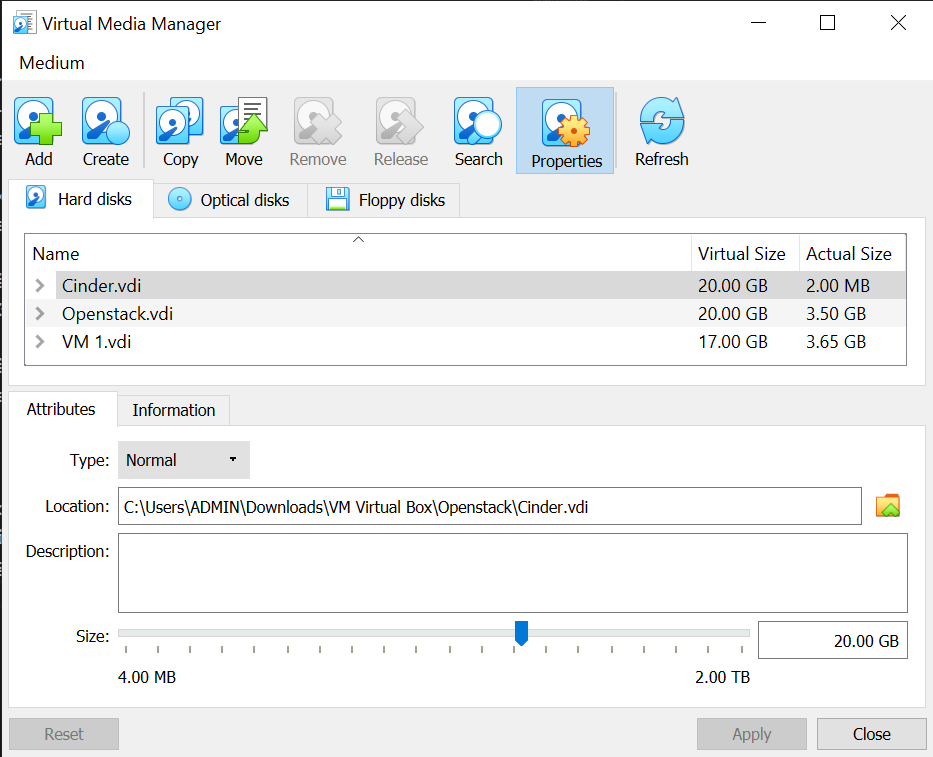
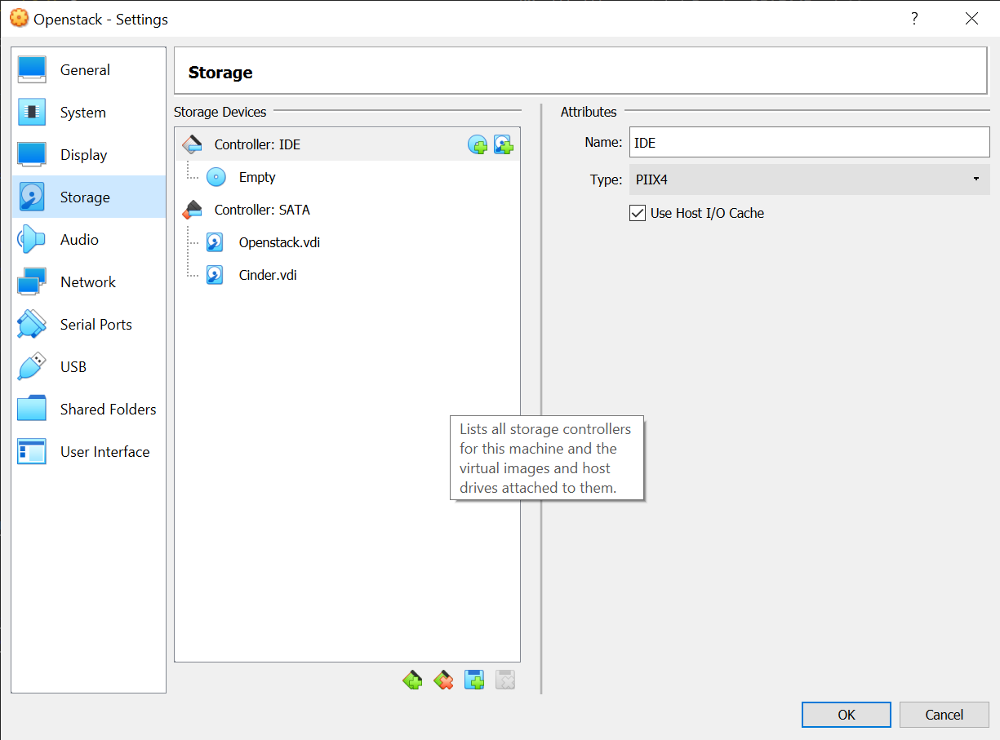
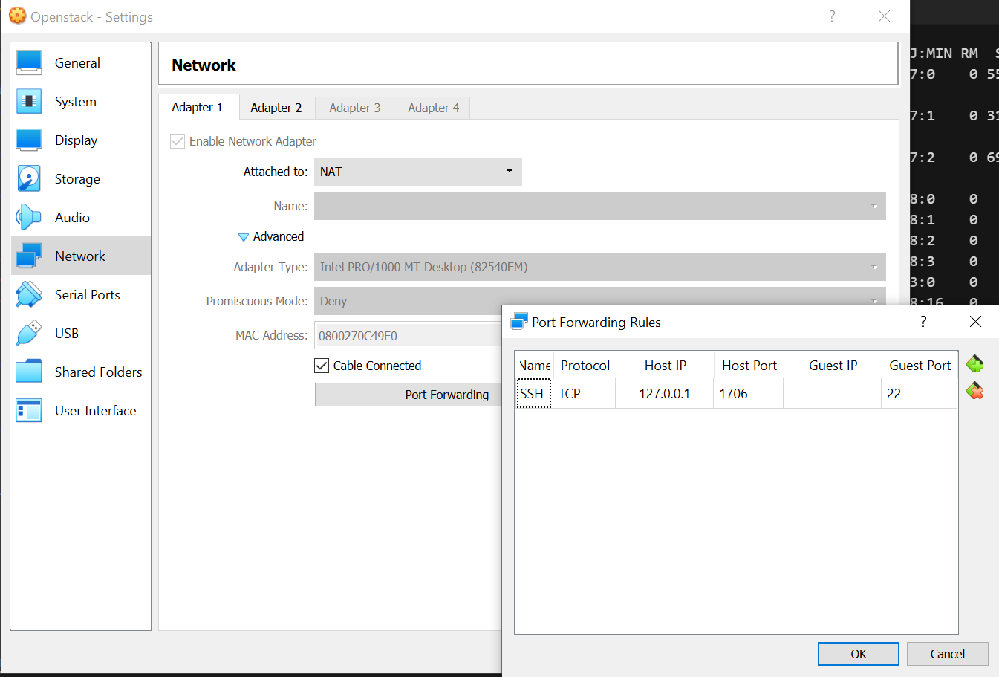
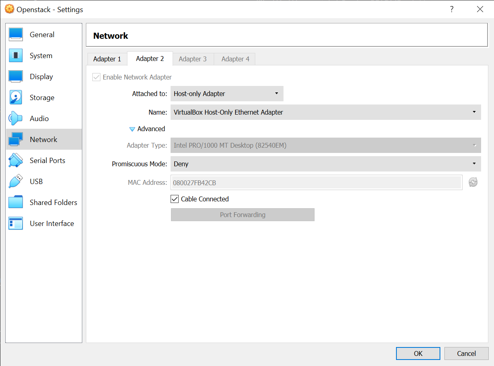
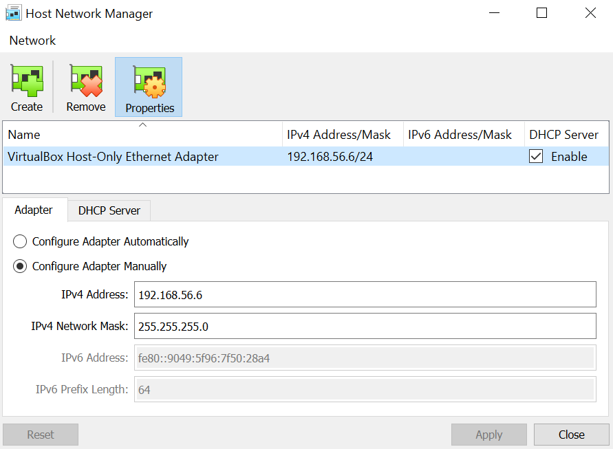
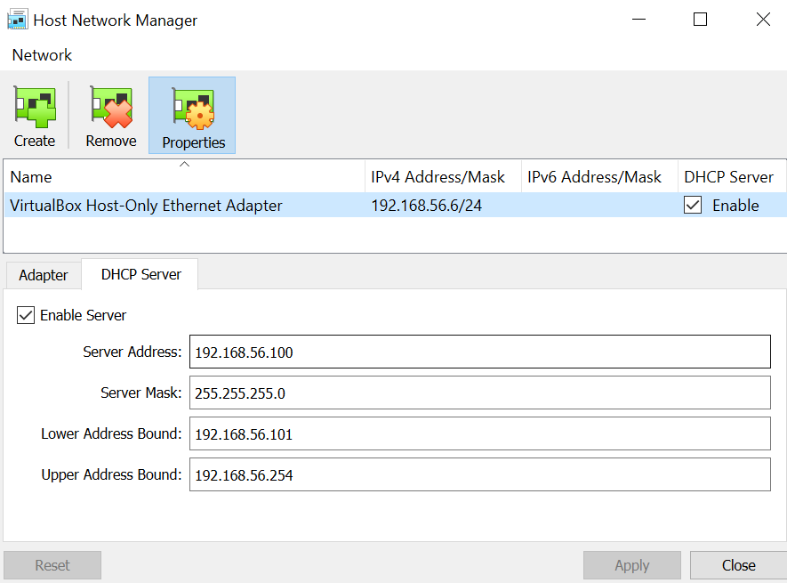
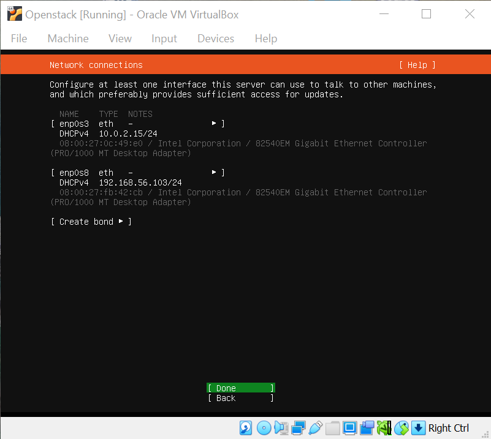
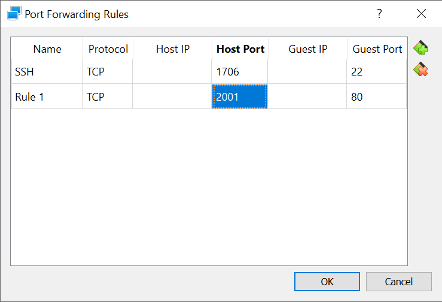
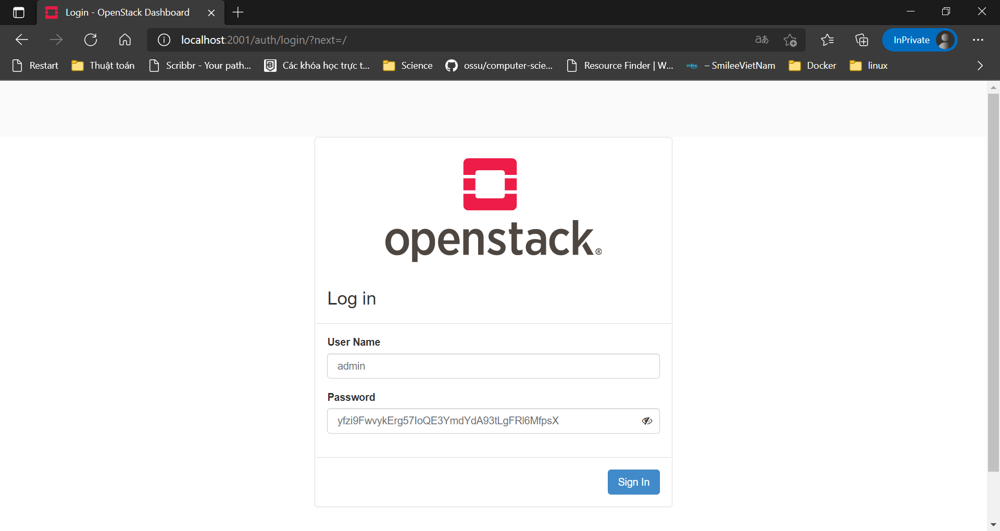
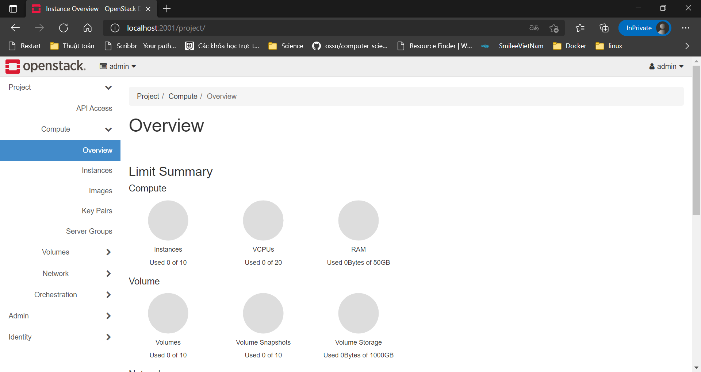

# Week 3 - Part 2

## Mục lục

- [Week 3 - Part 2](#week-3---part-2)
  - [Mục lục](#mục-lục)
  - [I. Overview](#i-overview)
    - [1. Openstack](#1-openstack)
      - [a) Openstack là gì?](#a-openstack-là-gì)
      - [b) Các thành phần của OpenStack](#b-các-thành-phần-của-openstack)
      - [c) Openstack Kolla](#c-openstack-kolla)
  - [II. Practicing](#ii-practicing)
    - [1. Requirement](#1-requirement)
      - [a) Kiến thức](#a-kiến-thức)
      - [b) Cấu hình](#b-cấu-hình)
        - [Disks](#disks)
        - [Networks](#networks)
    - [2. Install](#2-install)
      - [a) Install dependencies](#a-install-dependencies)
      - [b) Install Kolla-ansible](#b-install-kolla-ansible)
      - [c) Kolla passwords](#c-kolla-passwords)
      - [d) Kolla globals.yml config](#d-kolla-globalsyml-config)
      - [e) Deployment](#e-deployment)
    - [2. Using Openstack](#2-using-openstack)
      - [a) Install Openstack CLI](#a-install-openstack-cli)
    - [2. Testing](#2-testing)
  - [References](#references)

## I. Overview

### 1. Openstack

#### a) Openstack là gì?

OpenStack là một hệ điều hành đám mây (Cloud Computing) kiểm soát các nhóm tài nguyên tính toán, lưu trữ và kết nối mạng lớn trong toàn bộ trung tâm dữ liệu, tất cả được quản lý và cung cấp thông qua API với các cơ chế xác thực phổ biến.

Openstack cung cấp bảng điều khiển sẵn có, cung cấp cho quản trị viên quyền kiểm soát tạo ra các quyền thứ cấp cho người dùng nhằm mục đích cung cấp tài nguyên thông qua giao diện web.

Ngoài chức năng cơ sở hạ tầng tiêu chuẩn, các thành phần bổ sung cung cấp khả năng phối hợp, quản lý lỗi và quản lý dịch vụ giữa các dịch vụ khác để đảm bảo tính sẵn sàng cao của các ứng dụng người dùng.


#### b) Các thành phần của OpenStack

- **OpenStack Dashboard-Horizon** :
  - Cung cấp giao diện cho người dùng, tương tác cơ bản với OpenStack.
  - Tương tác với APIs của các dịch vụ.
  - Không đấy đủ chức năng để điều khiển OpenStack.
- **OpenStack Idenity-Keystone**
  - Dịch vụ xác thực và ủy quyền trong OpenStack.
  - Quản lý, sửa, xóa tài khoản.....
  - Hỗ trợ và có thể kếp hợp với LDAP, PAM, SQL...
- **OpenStack Compute-Nova**
  - Lập lịch cho các máy ảo. Tạo, sửa, xóa máy ảo...
  - Quản lý vòng đời máy ảo.
  - Tương đương với EC2 của AWS.
  - Hỗ trợ nhiều Hypervisor: KVM, VMWare, Hyper-V...
  - Hỗ trợ nhiều backend storage: iCSL, SAN.........
- **OpenStack Image Service-Glance**
  - Lưu trữ, truy vấn các disk image.
  - Hỗ trợ nhiều định dạng của Hypervisor: vmdk,vhd,pcow....
  - Làm việc với các storage backend: Filesystem, Swift, Amazon S3.
- **OpenStack Object Storage-Swift**
  - Đọc và ghi các đối tượng thông qua http.
  - Tương tự dịch vụ S3 của AWS( Lưu trữ File).
  - Dữ liệu trong Swift có khả nâng tạo các bản sao.
  - Có thể triển khai thành dịch vụ độc lập để lưu trữ.
  - Tính phân tán, khả năng chống chịu lỗi.
- **OpenStack Network-Neutron**
  - Cung cấp dịch vụ về mạng.
  - Thay thế nova-network để hướng tới SDN trong OpenStack.
  - Có nhiều dịch vụ cao cấp: FWaas, LBaaS, VPNaaS.
  - Có cơ chế Plugin để làm việc với các hãng và giải pháp về - network khác.
- **OpenStack Block Storage-Cinder**
  - Cấp các Block Storage gắn vào máy ảo.
  - Cung cấp các volume(ổ đĩa) gắn vào máy ảo.
  - Có thể khởi tạo các máy từ Volume.
  - Có các Plugin để kết nối với các Storage của hãng khác.
  - Có thể sao lưu, mở rộng các volume.
- **OpenStack Block Orchestration-Heat**
  - Dùng triển khai các ứng dụng dựa vào template được dựng sẵn.
  - Tự động tính toán và sử dụng các tài nguyên.
  - Là tab "stack" ở trong Horizon.
- **OpenStack Block Telemetry-Ceilometer**
  - Đáp ứng tính năng "Pay as you go" của Cloud Computing.
  - Dùng để thống kê các tài nguyên mà người dùng sử dụng.
  - Giám sát mức độ sử dụng tài nguyên.
  - Tích hợp trong Horizon với quyền Admin.
- **OpenStack Database Service-Trove**
  - Dịch vụ về cơ sở dữ liệu, có trên phiên bản OpenStack - Icehouse.
  - Cung cấp các Database ko cần thông qua người quản trị.
  - Có khả năng tự động backup và đảm bảo an toàn.
  - Hỗ trợ SQL và NoSQL.


#### c) Openstack Kolla

Openstack Kolla là Project hay công cụ sử dụng để triển khai, vận hành Openstack. Với ý tưởng của Project Kolla là triển khai Openstack trong môi trường Container, tự động triển khai Openstack bằng Kolla Ansible. Qua đó chỉ với 1 vài thao tác, chúng ta đã có môi trường Openstack để sử dụng.


## II. Practicing

### 1. Requirement

#### a) Kiến thức

- Kiến thức cơ bản về `Ansible`
- Kiến thức cơ bản về `Docker`
- Kiến thức cơ bản về `virtual enviroment` của python

#### b) Cấu hình

|         | Requirements | My Config |
|---------|--------------|-----------|
| CPU     | 4 cores      | 2 cores   |
| Ram     | 8 GB         | 4 GB      |
| Disks   | 2 Disks      | 2 Disks   |
| Network | 2 NICs       | 2 NICs    |

Dù cấu hình yêu cầu là 8 GB nhưng máy mình có hạn nên mình sẽ config lại còn 4 GB 😁😁

`OS` ở đây mình sẽ dùng là Ubuntu ngoài ra các bạn có thể dùng Debian hay CentOS

##### Disks

Đầu tiên mình sẽ cấu hình disks. Lý do mình cần thêm 1 disk thứ 2 là để cho Cinder của OpenStack lưu trữ vào. Nên mình sẽ tạo 1 ổ đĩa khoảng 20GB.



Sau đó ta sẽ mount vào VM.



Ta kiểm tra ổ đĩa đã mount thành công hay chưa bằng câu lệnh `lsblk`

```bash
NAME                      MAJ:MIN RM  SIZE RO TYPE MOUNTPOINT
loop0                       7:0    0 55.4M  1 loop /snap/core18/1944
loop1                       7:1    0 31.1M  1 loop /snap/snapd/10707
loop2                       7:2    0 69.9M  1 loop /snap/lxd/19188
sda                         8:0    0   20G  0 disk
├─sda1                      8:1    0    1M  0 part
├─sda2                      8:2    0    1G  0 part /boot
└─sda3                      8:3    0   19G  0 part
  └─ubuntu--vg-ubuntu--lv 253:0    0   19G  0 lvm  /
sdb                         8:16   0   20G  0 disk
sr0                        11:0    1 1024M  0 rom
```

Ổ đĩa đã được mount thành công với tên `sdb` có size là 20GB. Còn ổ `sda` là ổ lưu trữ hệ điều hành Ubuntu

##### Networks

Như đã nói ở trên ta sẽ có 2 NICs. Đầu tiên ta sẽ để adapter 1 là mạng `NAT` và tạo port forwarding tới SSH port của VM.



Khi muốn connect tới VM qua SSH ta chỉ cần truy vấn đến port `1706` của localhost hiện tại. NAT sẽ tự động config connect đến máy ảo.

Mạng tiếp theo sẽ là `Host only` ở adapter 2. Và ta sẽ connect đến mạng host only đã tạo.



Nếu chưa có ta có thể tạo 1 mạng host only của virtual box.
`File -> Host Network Manager`





Khi cài đặt, Ubuntu sẽ tự nhận 2 interface network



Và kiểm tra bằng câu lệnh `ifconfig`

```bash
enp0s3: flags=4163<UP,BROADCAST,RUNNING,MULTICAST>  mtu 1500
        inet 10.0.2.15  netmask 255.255.255.0  broadcast 10.0.2.255
        inet6 fe80::a00:27ff:fe0c:49e0  prefixlen 64  scopeid 0x20<link>
        ether 08:00:27:0c:49:e0  txqueuelen 1000  (Ethernet)
        RX packets 79405  bytes 105426523 (105.4 MB)
        RX errors 0  dropped 0  overruns 0  frame 0
        TX packets 15161  bytes 1422042 (1.4 MB)
        TX errors 0  dropped 0 overruns 0  carrier 0  collisions 0

enp0s8: flags=4163<UP,BROADCAST,RUNNING,MULTICAST>  mtu 1500
        inet 192.168.56.103  netmask 255.255.255.0  broadcast 192.168.56.255
        inet6 fe80::a00:27ff:fefb:42cb  prefixlen 64  scopeid 0x20<link>
        ether 08:00:27:fb:42:cb  txqueuelen 1000  (Ethernet)
        RX packets 12  bytes 3665 (3.6 KB)
        RX errors 0  dropped 0  overruns 0  frame 0
        TX packets 22  bytes 2928 (2.9 KB)
        TX errors 0  dropped 0 overruns 0  carrier 0  collisions 0

lo: flags=73<UP,LOOPBACK,RUNNING>  mtu 65536
        inet 127.0.0.1  netmask 255.0.0.0
        inet6 ::1  prefixlen 128  scopeid 0x10<host>
        loop  txqueuelen 1000  (Local Loopback)
        RX packets 128  bytes 10592 (10.5 KB)
        RX errors 0  dropped 0  overruns 0  frame 0
        TX packets 128  bytes 10592 (10.5 KB)
        TX errors 0  dropped 0 overruns 0  carrier 0  collisions 0
```

Lưu ý: nếu Ubuntu không nhận interface của Host-only hay NAT thì ta có thể config bằng `Netplan` (với Ubuntu >= 17)

Ở đây sẽ có 2 `Interface network`:

- enp0s3: Của NAT có ip là 10.0.2.15/24 (Địa chỉ giao tiếp với OpenStack)
- enp0s8: Của Host-only có ip là 192.168.56.103/24 (Dải mạng cung cấp ip cho các VM tạo bởi OpenStack)

### 2. Install

#### a) Install dependencies

Trước tiên ta sẽ cài đặt các packages dependencies.

```bash
sudo apt update
sudo apt install python3-dev libffi-dev gcc libssl-dev
```

Tiếp theo ta sẽ tạo 1 môi trường ảo cho python ở thư mục hiện tại và đặt tên là `openstackenv` đồng thời sẽ active môi trường đó.

Lưu ý: bạn có thể cài đặt trực tiếp mà không cần môi trường ảo. Xem thêm ở trong link References

```bash
sudo apt install python3-venv
python3 -m venv ./openstackenv
source ./openstackenv/bin/activate
```

Ta sẽ cần đảm bảo `pip` ở lastes-version.

```bash
pip install -U pip
```

Ta sẽ cần cài đặt ansible qua `pip`. Kolla-ansible yêu cầu ansible version từ 2.9 trở lên.

```bash
pip install 'ansible==2.9'
```

#### b) Install Kolla-ansible

Tiếp theo ta sẽ cài đặt Kolla-ansible thông qua `pip`.

```bash
pip install kolla-ansible
```

Tạo thư mục /etc/kolla

```bash
sudo mkdir -p /etc/kolla
sudo chown $USER:$USER /etc/kolla
```

Copy các file globals.yml và passwords.yml vào thư mục /etc/kolla

```bash
cp -r ./openstackenv/share/kolla-ansible/etc_examples/kolla/* /etc/kolla
```

Copy 2 inventory file all-in-one và multinode tới thư mục hiện tại.

```bash
cp ./openstackenv/share/kolla-ansible/ansible/inventory/* .
```

Lưu ý: Ở đây mình sẽ cài đặt dùng file Inventory all-in-one (Cài đặt các services của Openstack trên cùng 1 host). Hoặc bạn có thể dùng multinode và sẽ cần phải config lại file Inventory.

#### c) Kolla passwords

Password của openstack sẽ được lưu ở trong file /etc/kolla/password.yml . File lúc đầu sẽ trống rỗng, do đó bạn sẽ phải generate password cho Kolla.

```bash
kolla-genpwd
```

#### d) Kolla globals.yml config

Thiết lập phân vùng LVM dành cho Cinder ở ổ đĩa vừa mount `sdb`

```bash
sudo pvcreate /dev/sdb                  ------- Create Physical Volume
sudo vgcreate cinder-volumes /dev/sdb   ------ Create Volume Group
```

Kết quả:

```bash
Physical volume "/dev/sdb" successfully created.
Volume group "cinder-volumes" successfully created
```

File globals.yml mà ta vừa copy sẽ là file config cho Kolla.
Ở đây ta sẽ cấu hình như sau

```bash
kolla_base_distro: "ubuntu"
kolla_install_type: "source"

network_interface: enp0s3
neutron_external_interface: enp0s8
kolla_internal_vip_address: 10.0.2.15

nova_compute_virt_type: "qemu"

enable_haproxy: "no"

enable_cinder: "yes"
enable_cinder_backup: "no"
enable_cinder_backend_lvm: "yes"
```

- `kolla_base_distro`: Hệ điều hành triển khai. Vì mình đang dùng Ubuntu nên sẽ đặt như trên
- `kolla_install_type`: Mã nguồn sử dụng khi triển khai Openstack, có 2 loại:
  - source
  - binary
- `network_interface`: interface của địa chỉ ip `10.0.2.15` giao tiếp với Openstack
- `neutron_external_interface`: interface cung cấp ip cho các VM được tạo sau này
- `kolla_internal_vip_address`: địa chỉ ip giao tiếp với các thành phần của Openstack (là ip của network interface)
- `enable_haproxy`: Nếu triển khai Openstack All In One thì thiết lập là "no"
- `enable_cinder`: Mình sẽ sử dụng Cinder LVM làm share storage cho Openstack nên đặt là True
- `enable_cinder_backup`: True nếu sử dụng tính năng Backup Cinder
- `enable_cinder_backend_lvm`: True nếu sử dụng Backend LVm cho Cinder
- `nova_compute_virt_type`: vì mình dùng VM ảo hoá để cài đặt Openstack nên sẽ đặt là qemu

#### e) Deployment

Khởi tạo môi trường dành cho Openstack Kolla

```bash
kolla-ansible -i ./all-in-one bootstrap-servers
```

Lưu ý: File all-in-one vừa được copy đến thư mục hiện tại

Kết quả:

```bash
PLAY RECAP *******************************************************************************************************
localhost                  : ok=38   changed=19   unreachable=0    failed=0    skipped=32   rescued=0    ignored=0

```

Kiểm tra thiết lập Kolla Ansible

```bash
kolla-ansible -i ./all-in-one prechecks
```

Kết quả:

```bash
PLAY RECAP *******************************************************************************************************
localhost                  : ok=74   changed=2    unreachable=0    failed=0    skipped=57   rescued=0    ignored=0
```

Tải các Image Openstack

```bash
kolla-ansible -i ./all-in-one pull
```

Kết quả:

```bash
PLAY RECAP *******************************************************************************************************
localhost                  : ok=36   changed=18   unreachable=0    failed=0    skipped=10   rescued=0    ignored=0

```

Deploy openstack

```bash
kolla-ansible -i ./all-in-one deploy
```

Kết quả:

```bash
PLAY RECAP *******************************************************************************************************
localhost                  : ok=278  changed=149  unreachable=0    failed=0    skipped=132  rescued=0    ignored=0

```

### 2. Using Openstack

#### a) Install Openstack CLI

```bash
pip install python-openstackclient python-glanceclient python-neutronclient
```

OpenStack yêu cầu openrc file (lưu trữ  thông tin về user admin). Để tạo file ta chạy các câu lệnh

```bash
kolla-ansible post-deploy        
. /etc/kolla/admin-openrc.sh
```

Lúc này file `admin-openrc.sh` sẽ được lưu trong thư mục kolla.

Kiểm tra dịch vụ

```bash
source /etc/kolla/admin-openrc.sh
openstack token issue
```

Kết quả:

```bash

+------------+-------------------------------------------------------------------------------+
| Field      | Value                                                                         |
+------------+-------------------------------------------------------------------------------+
| expires    | 2021-05-29T11:34:21+0000                                                      |
| id         | gAAAAABgsNU90Y6vS                                                             |
| project_id | 12d3d7ce121241e38f86c8184799ddde                                              |
| user_id    | 4b9a37f8a1124edb87cbe5a4a9b27922                                              |
+------------+-------------------------------------------------------------------------------+
```

### 2. Testing

Lấy mật khẩu tài khoản Admin

```bash
cat /etc/kolla/passwords.yml | grep keystone_admin
```

Kết quả:

```bash
keystone_admin_password: yfzi9FwvykErg57IoQE3YmdYdA93tLgFRl6MfpsX
```

Vậy mật khẩu đăng nhập vào sẽ là:

```bash
admin / yfzi9FwvykErg57IoQE3YmdYdA93tLgFRl6MfpsX
```

Để truy cập vào ta cần thêm port forwading cho port 80



Lúc này ta sẽ truy cập từ máy bên ngoài vào địa chỉ
`http://localhost:2001` và đăng nhập.



Kết quả:



------------

## References

[Tìm hiểu về OpenStack](https://www.ngoisaoso.vn/blog/Tim-hieu-ve-OpenStack-3620.html)

[Hướng dẫn cài đặt Openstack Train all-in-one bằng Kolla Ansible](https://news.cloud365.vn/openstack-kolla-phan-1-huong-dan-cai-dat-openstack-train-all-in-one-bang-kolla-ansible/)

[Netplan configuration](https://askubuntu.com/questions/984445/netplan-configuration-on-ubuntu-17-04-virtual-machine)

[Kolla-ansible Quick start](https://docs.openstack.org/project-deploy-guide/kolla-ansible/latest/quickstart.html)

[How to Configure LVM in Linux](https://linoxide.com/lvm-configuration-linux/)
