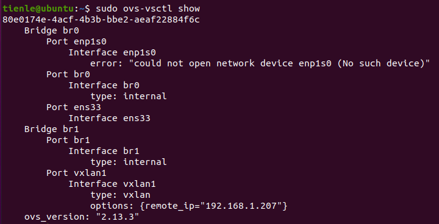
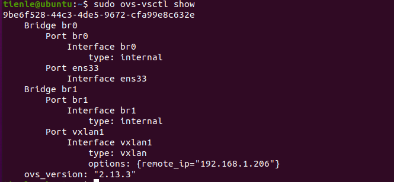
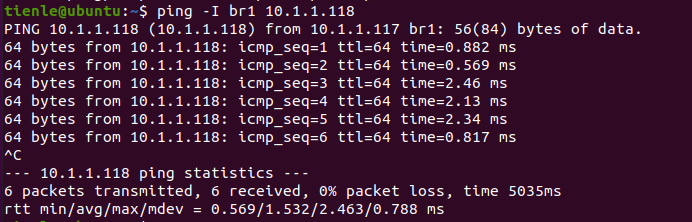
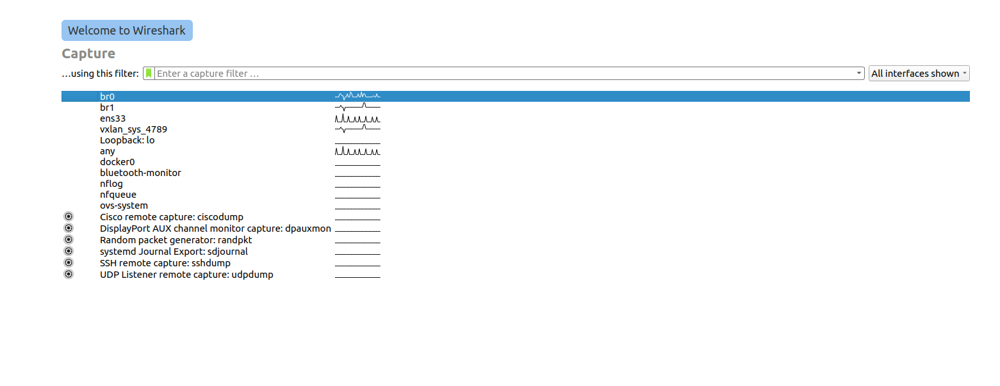
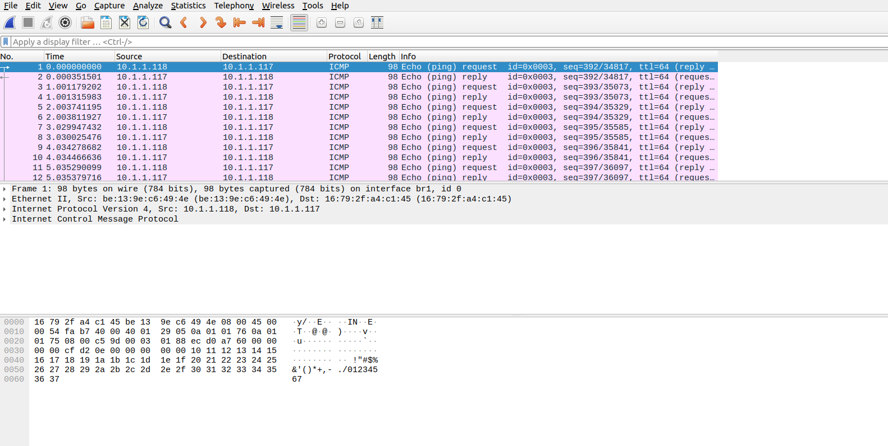

# Practice with openvswitch to create vxlan

## Set up

#### First, update and upgrade apt

```shell
$ sudo apt update
$ sudo apt update
```

### 1. Openvswitch

```shell
sudo apt install openvswitch-switch openvswitch-common
```

### 2. Wireshark

```shell
$ sudo apt install wireshark
$ sudo dpkg-reconfigure wireshark-common
```

#### if wireshark show "permission denied" you can try 1 of 2 or both

```shell
$ sudo gpasswd -a $USER wireshark
$ sudo chmod +x /usr/bin/dumpcap
```

## 

 
## Configure br0 and br1 on VM1

- ```br0```: tunnel endpoint
- ```br1```: tunnel interface


```shell
# configure br0
$ sudo ovs-vsctl add-br br0
$ sudo ifconfig br0 up
$ sudo ifconfig add-port br0 ens33
$ sudo ifconfig ens33 0
$ sudo dhclient br0

# configure br1
$ sudo ifconfig br1 10.1.1.117/24
$ sudo ovs-vsctl add-port br1 vxlan1 -- set interface vxlan1 type=vxlan options:remote_ip=192.168.1.207
```

**Check bridges**

```shell
$ sudo ovs-vsctl show
```




## Configure br0 and br1 on VM2

- ```br0```: tunnel endpoint
- ```br1```: tunnel interface


```shell
# configure br0
$ sudo ovs-vsctl add-br br0
$ sudo ifconfig br0 up
$ sudo ifconfig add-port br0 ens33
$ sudo ifconfig ens33 0
$ sudo dhclient br0

# configure br1
$ sudo ifconfig br1 10.1.1.118/24
$ sudo ovs-vsctl add-port br1 vxlan1 -- set interface vxlan1 type=vxlan options:remote_ip=192.168.1.206
```

**Check bridges**

```shell
$ sudo ovs-vsctl show
```



## Test Ping

Ping from VM1 to VM2
```shell
$ ping -I br1 10.1.1.118
```



## Use Wireshark to capture



