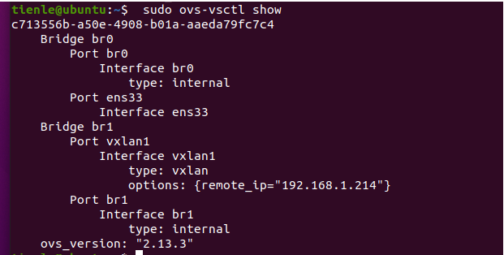
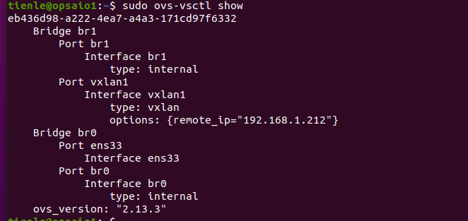
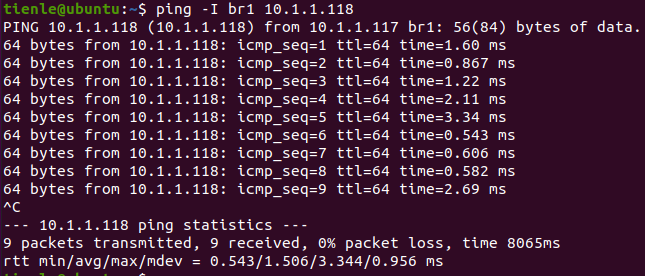

# Practice with openvswitch to create vxlan

## Set up

### Environment:
- 2 VMs: Ubuntu 20.04
  - IP VM1: 196.168.1.212
  - IP VM1: 196.168.1.214
- Network: 192.168.1.114
- Software: Openvswitch

#### First, update and upgrade apt

```shell
$ sudo apt update
$ sudo apt update
```

### 1. Openvswitch

```shell
sudo apt install openvswitch-switch openvswitch-common
```

### 2. Wireshark

```shell
$ sudo apt install wireshark
$ sudo dpkg-reconfigure wireshark-common
```

#### if wireshark show "permission denied" you can try 1 of 2 or both

```shell
$ sudo gpasswd -a $USER wireshark
$ sudo chmod +x /usr/bin/dumpcap
```

## Topo
```
+----------------+                                     +----------------+
|      br1       |                                     |      br1       |
|  10.1.1.117/24 |                                     |  10.1.1.118/24 |
+----------------+                                     +----------------+
|     vxlan1     |                                     |     vxlan1     |
+----------------+                                     +----------------+
        |                                                      |
        |                                                      |
        |                                                      |
+-----------------+                                   +------------------+
|       br0       |                                   |        br0       |
|  192.168.1.212  |                                   |  192.168.1.214   |
+-----------------+                                   +------------------+
        |                                                  |
        ----------------------------------------------------
```

 
## Configure br0 and br1 on VM1

- ```br0```: tunnel endpoint
- ```br1```: tunnel interface


```shell
# configure br0
$ sudo ovs-vsctl add-br br0
$ sudo ifconfig br0 up
$ sudo ovs-vsctl add-port br0 ens33
$ sudo ifconfig ens33 0
$ sudo dhclient br0

# configure br1
$ sudo ovs-vsctl add-br br1
$ sudo ifconfig br1 10.1.1.117/24
$ sudo ovs-vsctl add-port br1 vxlan1 -- set interface vxlan1 type=vxlan options:remote_ip=192.168.1.214
```

**Check bridges**

```shell
$ sudo ovs-vsctl show
```




## Configure br0 and br1 on VM2

- ```br0```: tunnel endpoint
- ```br1```: tunnel interface


```shell
# configure br0
$ sudo ovs-vsctl add-br br0
$ sudo ifconfig br0 up
$ sudo ovs-vsctl add-port br0 ens33
$ sudo ifconfig ens33 0
$ sudo dhclient br0

# configure br1
$ sudo ovs-vsctl add-br br1
$ sudo ifconfig br1 10.1.1.118/24
$ sudo ovs-vsctl add-port br1 vxlan1 -- set interface vxlan1 type=vxlan options:remote_ip=192.168.1.212
```

**Check bridges**

```shell
$ sudo ovs-vsctl show
```



## Test Ping

Ping from VM1 to VM2
```shell
$ ping -I br1 10.1.1.118
```



## Use Wireshark to capture

**Open Wireshark on VM2 while ping from VM1 to VM2**


## Advantages and Disadvantages of using VXLANs

### Advantages

- Expands the number of virtual networks that can be allocated: 2^24^ compared to vlan's 2^12^
- Vxlan works on L3 so it can take advantage of L3 network: avoid loop, use ECMP to increase efficiency compared to STP in L2
- Transparency: provide transparent virtual network with underlay network infrastructure
- Isolation: separates virtual networks from each other, reducing BUM traffic 

### Disvantages

- Packets are packed with more layers, the size increases causing network performance reduction: consuming more processing resources, reducing transmission bandwidth
- More complicated configuration than VLAN
- Troubleshoot is more difficult due to transparency
- Difficult to integrate with traditional network devices that do not support VXLAN 