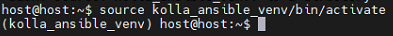
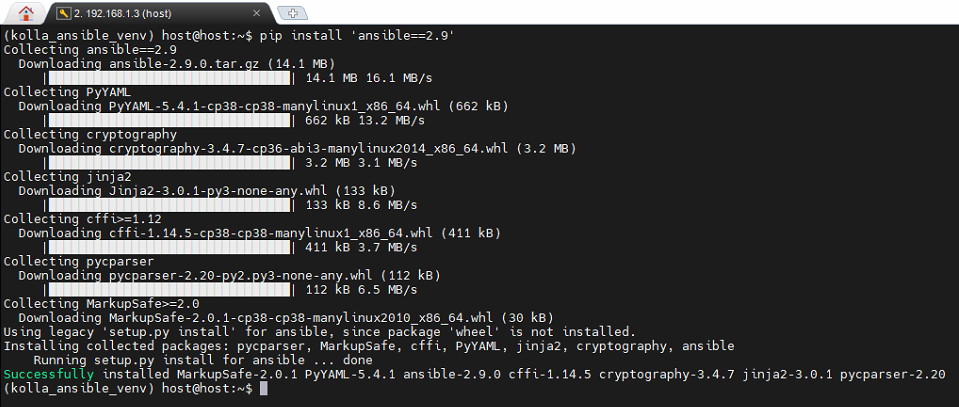
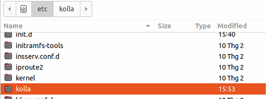
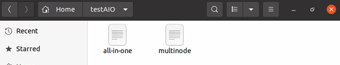
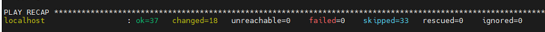
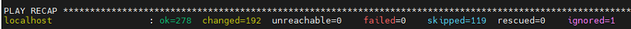

#  Bài tập tuần 3: OpenStack

##  Những thứ cần chuẩn bị : 
Ubuntu Virtual Machine ( máy chủ ảo Ubuntu ):

 - Name: Host Kolla
 
 - Account: host
 
 - Network: 
	 - enp0s3 : 192.168.1.3
 
	 - enp0s8 : 192.168.1.4
 
# Practice 
## Bước 1: Cài đặt Python build dependencies:
```
sudo apt install python3-dev libffi-dev gcc libssl-dev
```
### Bước 2: Tạo môi trường ảo với `python3-venv`
Tải pakage *python3-venv*:
```
sudo apt install python3-venv
```
Tạo môi trường ảo:

    python3 -m venv kolla_ansible_venv

Kích hoạt môi trường ảo:

    source kolla_ansible_venv/bin/activate
 Sau khi kích hoạt, bạn sẽ được đưa vào môi trường ảo:
 
 
 
>  Để vào được môi trường ảo những lần sau bạn chỉ cần chạy câu lệnh
> kích hoạt bên trên

### Bước 3: Chắc chắn đã cài version cuối của pakage `pip`
```
pip install -U pip
```
### Bước 4: Cài đặt `ansible version 2.9`
```
pip install 'ansible==2.9'
```



### Bước 5: Cài đặt `Kolla-ansible`
```
pip install kolla-ansible
```
### Bước 6: Tạo thư mục `/etc/kolla`
```
sudo mkdir -p /etc/kolla
sudo chown $USER:$USER /etc/kolla
```
### Bước 7: Sao chép file `globals.yml` and `passwords.yml` đến thư mục `/etc/kolla`

    cp -r kolla_ansible_venv/share/kolla-ansible/etc_examples/kolla/* /etc/kolla



### Bước 8: Tạo folder project `testAIO`

    mkdir /home/host/testAIO
### Bước 9: Sao chép file inventory  `all-in-one` và `multinode` vào thư mục project

    cp kolla_ansible_venv/share/kolla-ansible/ansible/inventory/* /home/host/testAIO



### Bước 10: Config file `ansible.cfg`
Tạo folder /etc/ansible:

    sudo mkdir /etc/ansible
Tạo file ansible.cfg:
```
config="[defaults]\nhost_key_checking=False\npipelining=True\nforks=100"
sudo bash -c "echo -e $config >> /etc/ansible/ansible.cfg"
```
### Bước 11: Tạo file chứa mật khẩu cho `Kolla`

    kolla-genpwd
### Bước 12: Cấu hình file `globals.yml` trong `/etc/kolla`
```
    kolla_base_distro: "ubuntu"
    kolla_install_type: "source"
    
    network_interface: enp0s3
    neutron_external_interface: enp0s8
        
    enable_haproxy: "no"

    kolla_internal_vip_address: "192.168.1.3"
```

> Note: ip gắn cho `kolla_internal_vip_address` là ip của `enp0s3`

### Bước 13: Khởi tạo môi trường dành cho Openstack Kolla
```
cd /home/host/testAIO
kolla-ansible -i all-in-one bootstrap-servers
```



### Bước 14:  Kiểm tra thiết lập Kolla Ansible
```
kolla-ansible -i all-in-one prechecks
```


### Bước 15:  Cài đặt Openstack
```
kolla-ansible -i all-in-one deploy
```



### Bước 16: Thiết lập File Environment Openstack
```
kolla-ansible -i all-in-one post-deploy
```


# Chào mừng bạn đến với OpenStack
