# Setup OpenStack AIO inside VM with Kolla

## Content

- [Setup OpenStack AIO inside VM with Kolla](#setup-openstack-aio-inside-vm-with-kolla)
  - [Content](#content)
  - [I. Yêu cầu](#i-yêu-cầu)
  - [II. Cài đặt](#ii-cài-đặt)
  - [III. Cài đặt và cấu hình Openstack Train bằng Kolla Ansible](#iii-cài-đặt-và-cấu-hình-openstack-train-bằng-kolla-ansible)
  - [IV. DEBUG](#iv-debug)
  - [Nguồn tham khảo](#nguồn-tham-khảo)

---

## I. Yêu cầu

- Nắm kiến thức cơ bản về

  - [Ansible]([(https://devdocs.io/ansible~2.11/))
  - [Docker]([(https://docs.docker.com/))

- Cấu hình
  - Chuẩn bị máy ảo với hệ điều hành CentOS 7 hoặc Ubuntu
  - CPU: 4 Core
  - RAM: 8 GB
  - Disk: 2 ổ
    - OS (sda): 40 GB
    - Data VM (sdb): 30 GB
  - Network: 2 interface
    - Internal Network: Ở đây mình dùng Host-only dải 192.168.56.0/24 *(enp0s9*)
    - External Network: Ở đây mình dùng Bridge dải 192.168.11.0/24 *(enp0s8)*

    *Lưu ý: để dùng được Host-only chúng ta phải tạo Host-only Network trước tại phần File của máy ảo*

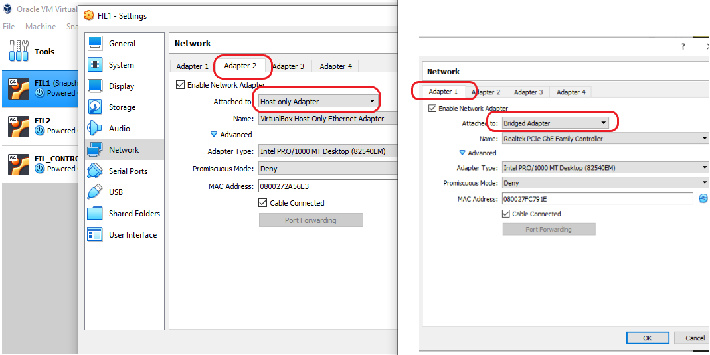

**OpenStack**

Openstack Kolla là Project hay công cụ sử dụng để triển khai, vận hành Openstack. Kolla được phát hành từ phiên bản Kilo và chính thức trở thành Project Openstack tại phiên bản Liberty.


---

## II. Cài đặt

**1. Update hệ điều hành và tắt Firewall nếu cần**

```
sudo apt update
sudo apt upgrade

systemctl stop firewalld
systemctl disable firewalld

init 6 
```

**2. Cài các thư viện cần thiết**

```
sudo apt install python3-dev libffi-dev gcc libssl-dev
```

**3. Khởi tạo môi trường ảo và cài đặt các gói cần thiết**

Ở đây để làm việc độc lập và tránh ảnh hưởng tới môi trường chính của máy, ngoài ra có thể xoá và tạo mới khi có lỗi. Chúng ta sử dụng virtual environment

- Cài đặt và activate môi trường
  
 ```
sudo apt install python3-venv

python3 -m venv $HOME/kolla-openstack
source $HOME/kolla-openstack/bin/activate
```

- Cài đặt gói pip

```
pip install -U pip
```

- Cài đặt Ansible, Kolla Ansible yêu cầu bản 2.9 hoặc 2.10

```
pip install 'ansible<3.0'
```

- Tạo file ansible configuration

```
vim $HOME/ansible.cfg
```

    ---
    [defaults]
    host_key_checking=False
    pipelining=True
    forks=100
---

## III. Cài đặt và cấu hình Openstack Train bằng Kolla Ansible

**1. Cài đặt Kolla Ansible**

- Cài đặt Kolla Ansible

```
pip install kolla-ansible
```

- Tạo /etc/kolla directory

```
sudo mkdir -p /etc/kolla
sudo chown $USER:$USER /etc/kolla
```

- Copy globals.yml và passwords.yml tới đường dẫn /etc/kolla
  
```
cp $HOME/kolla-openstack/share/kolla-ansible/etc_examples/kolla/* /etc/kolla/
```

```
cp $HOME/kolla-openstack/share/kolla-ansible/ansible/inventory/all-in-one .
```

- Test thử

```
Ansible -i all-in-one all -m ping
```

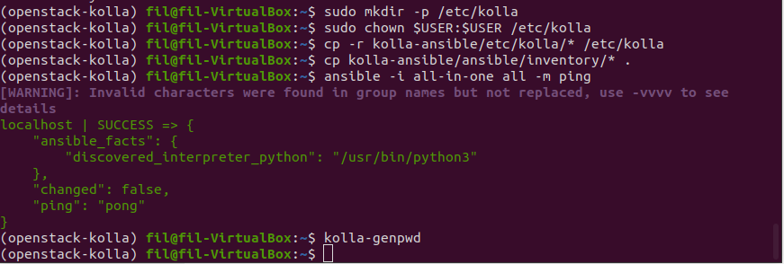

---

**2. Cài đặt openstack**

- Thiết lập phần vùng LVM dành cho Cinder

```
pvcreate /dev/vdb
vgcreate cinder-volumes /dev/vdb
```

- Tạo File chứa mật khẩu mặc định

```
kolla-genpwd
```

Hoặc

```
cd kolla-ansible/tools
./generate_passwords.py
```

- Cấu hình tuỳ chọn triển khai Kolla-Ansible

```
nano /etc/kolla/globals.yml

---
kolla_base_distro: "ubuntu"
kolla_install_type: "source"
openstack_release: "train"
kolla_internal_vip_address: 192.168.56.101
network_interface: enp0s9
neutron_external_interface: enp0s8
nova_compute_virt_type: "qemu"
enable_haproxy: "no"
enable_cinder: "yes"
enable_cinder_backup: "no"
enable_cinder_backend_lvm: "yes"
```

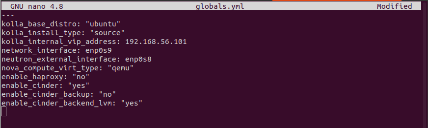

- **Lưu ý:**
  - kolla_install_type: Mã nguồn sử dụng khi triển khai Openstack, có 2 loại:
    - Cài từ Source Code: source
    - Cài từ File binary: binary
  - openstack_release: Phiên bản cài đặt

---

**3. Deployment**

**NOTE:** *Nếu các bước trên đã thực hiện thành công và không có lỗi. Chúng ta nên snapshot lại từ bước này để có thể chỉnh sửa và làm lại nếu có nhiều lỗi. Thường từ bước này nếu lỗi, bạn nên xem lại file cấu hình global.yml và thay đổi các thông số phù hợp.*

- Khởi tạo môi trường dành cho Openstack Kolla

```
kolla-ansible -i all-in-one bootstrap-servers
```

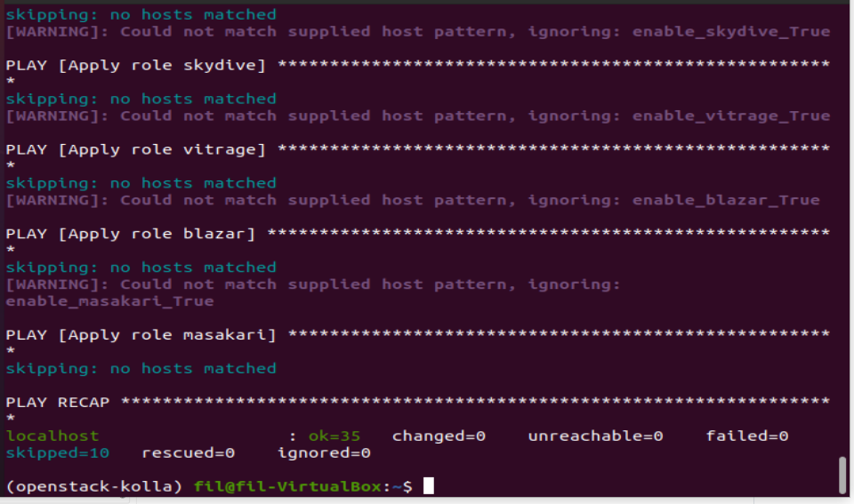

- Kiểm tra thiết lập Kolla Ansible

```
kolla-ansible -i all-in-one prechecks
```

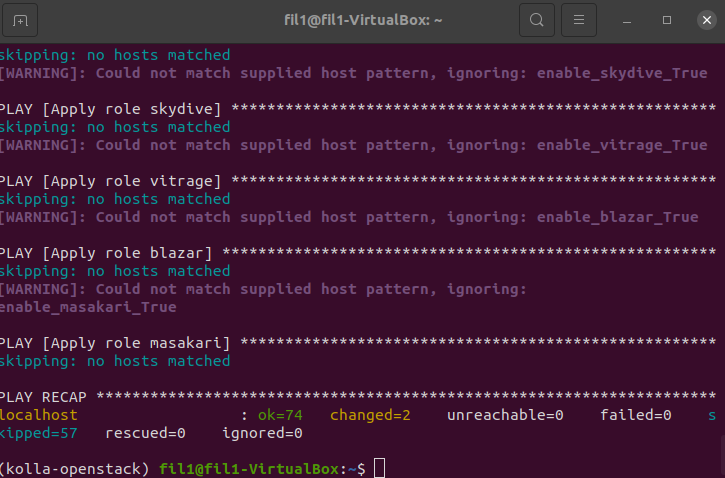

- Tải các Image Openstack

```
kolla-ansible -i all-in-one pull
```

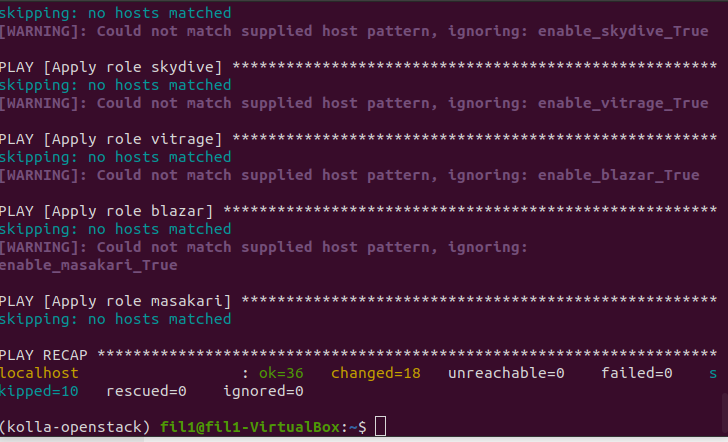

- Cài đặt Openstack

*2 Bước này có vẻ tốn hơi nhiều time :') rất hồi hộp vì sợ fail...sau n lần thử*

```
kolla-ansible -i all-in-one deploy
```

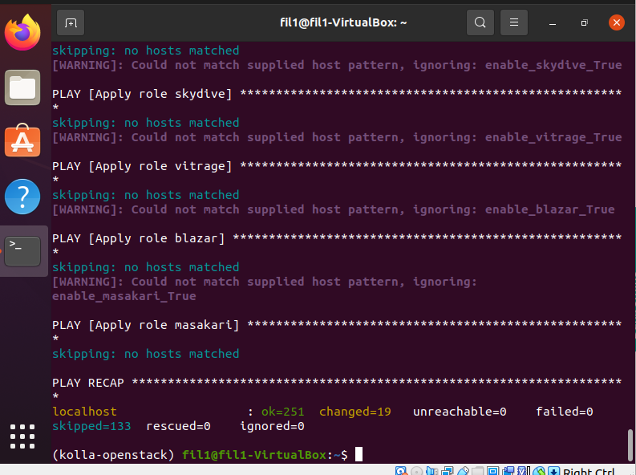

*Bước này nếu lúc làm bạn SSH có thể bị mất kết nối giữa chừng, nên chạy các câu lệnh này trực tiếp trong VM*

- Thiết lập File Environment Openstack

```
kolla-ansible -i all-in-one post-deploy
```

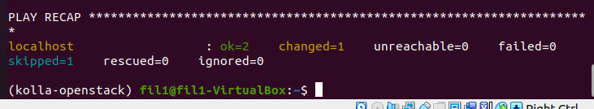

---

**4. Cài đặt Openstack Client**

- Truy cập môi trường và cài đặt gói Openstack Client

```
pip install python-openstackclient python-glanceclient python-neutronclient
source /etc/kolla/admin-openrc.sh
```

Kiểm tra dịch vụ

```
openstack token issue
```
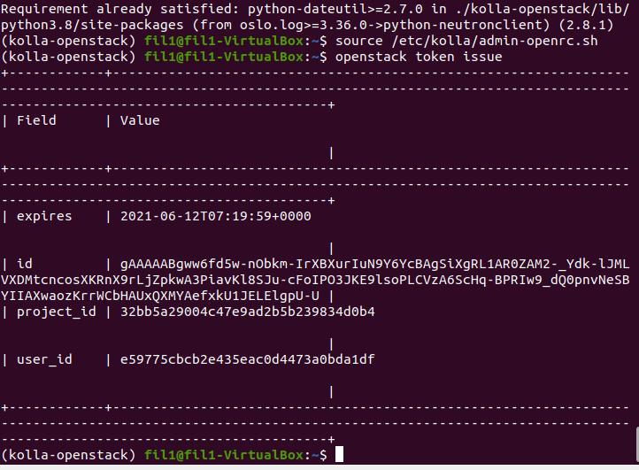

---

**5. Đăng nhập vào Horizon**

- Lấy mật khẩu tài khoản Admin

```
cat /etc/kolla/passwords.yml | grep keystone_admin
```

- Kết quả

```
keystone_admin_password: O388svwRruD7uXA9s6Ls6nmVUfu90bpm60RJPlHS
```

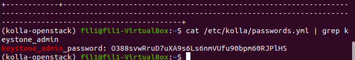

- Truy cập địa chỉ: <http://192.168.56.101/auth/login/?next=/>. Nhập các thông tin đăng nhập: *Admin / O388svwRruD7uXA9s6Ls6nmVUfu90bpm60RJPlHS*

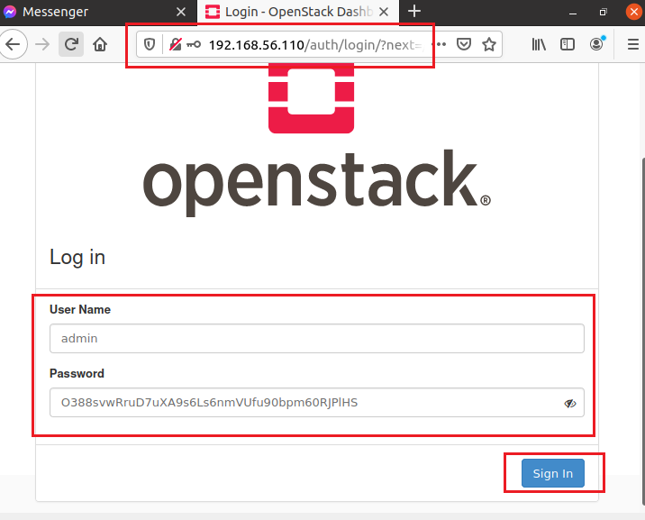

Nhập thông tin và *Log in* vào:

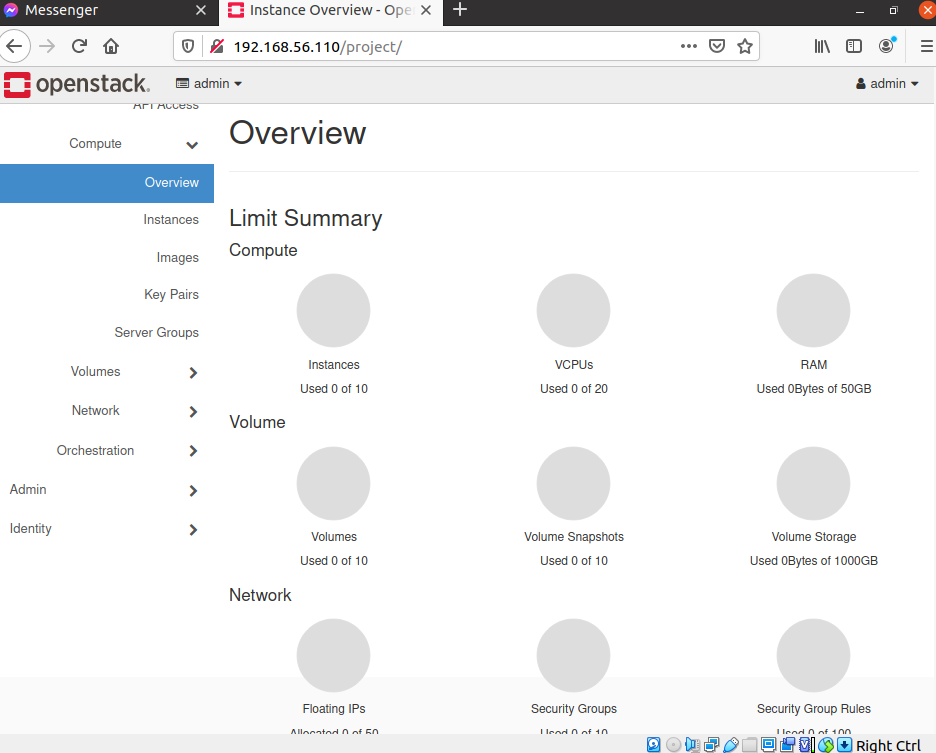

---

## IV. DEBUG

*Các lỗi này mặc dù nhỏ nhưng đã tốn gần như 80% thời gian để debug :(*

- Lỗi sai tên group-volume
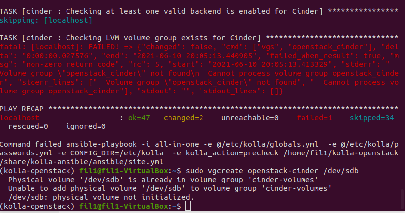

Lỗi này nguyên nhân là do trong file global.yml bạn đặt nhầm tên LVM volume group. Nên sửa lại thành volume-cinder. Ở đây cũng có thể là do chưa tạo group cinder.

- Lỗi python-pip
  
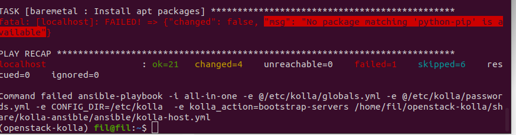

Bạn nên xem thử lại đã *pip install -U pip* lúc đầu hay chưa. Nếu không được thì quay lại phần cấu hình.

- Lỗi a password is required

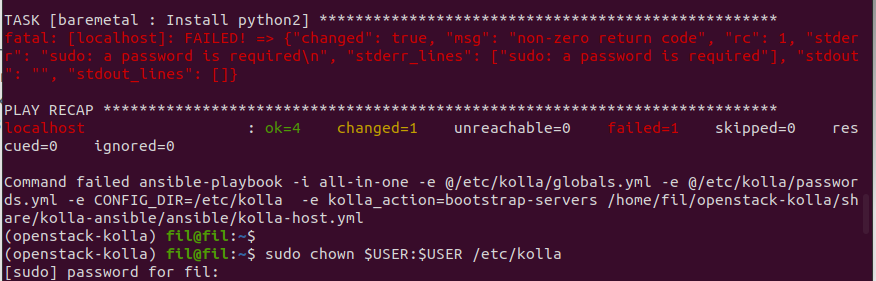

Lỗi này thường do lúc bạn quay lại set-up thì phải genpwd lại password

- Lỗi mất kết nối lúc Deploy

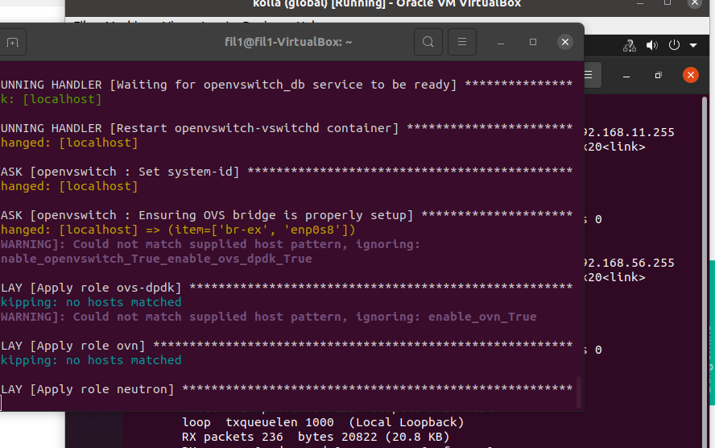

Lỗi này thường bị khi SSH vào, trong lúc deploy thì tốt nhất không nên SSH *(Theo ý kiến cá nhân).*

---

## Nguồn tham khảo

- [OpenStack Docs - All-In-One Single VM](https://docs.openstack.org/kolla-ansible/latest/user/quickstart.html)
- [Quick Start - Kolla Ansible](https://docs.openstack.org/devstack/pike/guides/single-vm.html)
- [Deploy-all-in-one-openstack-with-kolla-ansible](https://kifarunix.com/deploy-all-in-one-openstack-with-kolla-ansible-on-ubuntu-18-04/)
- <https://docs.openstack.org/kolla-ansible/latest/>