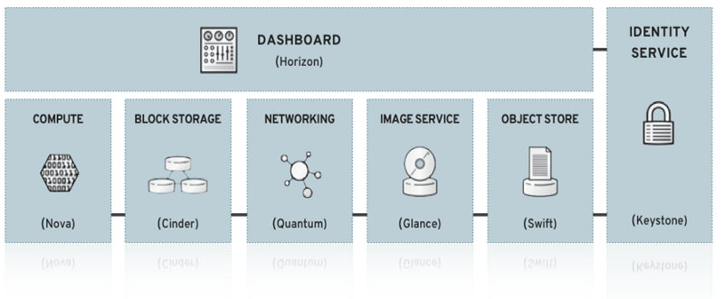
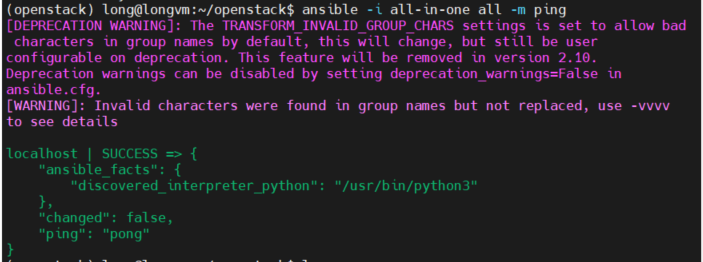
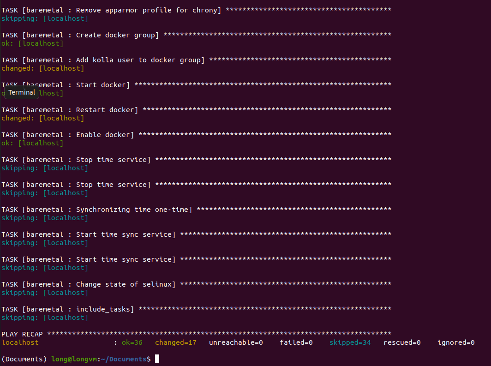
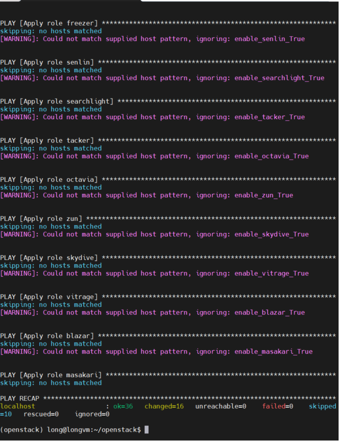
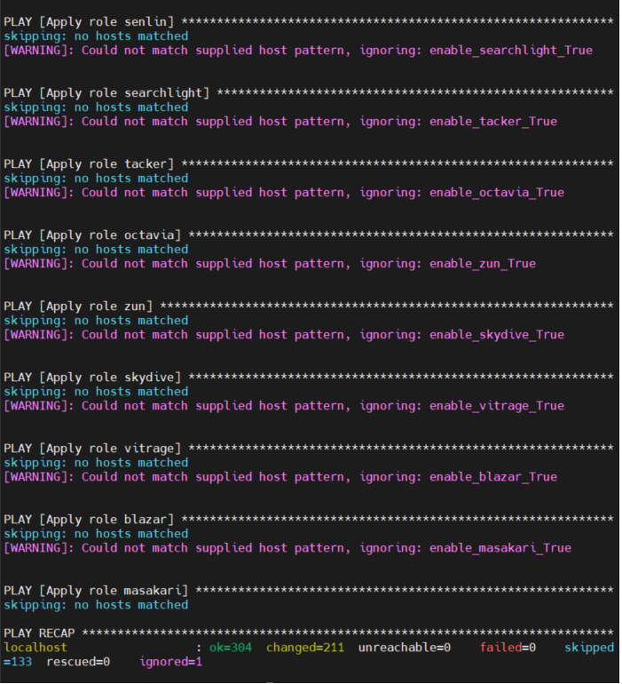
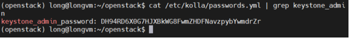

# Setup Openstack with Kolla.

# I. Overview
## A. Open stack

``` The best cloud-computing open-source project aimed at providing an IaaS.```


- Controls large pools of compute, storage, and networking resources throughout a datacenter, managed through a dashboard or via the OpenStack API.
- A dashboard is also available, giving administrators control while empowering their users to provision resources through a web interface.
- Begun in 2010 as a joint project of Rackspace and NASA.
- **Openstack - Distributions**:


- **OpenStack - Core components**:

- **Keystone – Identity Service**: Authen & Autho for OpenStack service, provide endpoints for OpenStack service.

- **Nova - Compute service**: Manage VM in OpenStack enviroment, initialize, schedule, stop VM.

- **Neutron - Networking service**: Previous version named Quantum now is Neutron. Manage network service.

- **Glance - Image Service**: Storage and access disk images of VM users and cloud service.

- **Swift - Object Storage Service**: Provide storage solution and collect unstructured data via RESTful API.

- **Cinder - Block Storage Service**: provide block storage (volume) to run VM (instance).

- **Horizon - Dashboard Service**: Provide UI web for end-user and cloud administrator interactive with Openstack service.

## B. Kolla-Ansible.

- Kolla is one of large projects by OpenStack to to provide production-ready containers and deployment tools for operating OpenStack clouds.
- Kolla provide many images (openstack services and complementary components ) to docker containers, ansible playbook, Kubenetes template to deploy OpenStack.
- Idea:
    - Many services like Keystone, glance, horizon, neutron,.. running in containers.
    - Instance created running in node compute like normal install.
- Anvantage:
    - Deploy OpenStack easily
    - Easy to scale, upgrade
    - Isolate services => easy to deployment, upgrading, scaling,..

# II. Setup
## A. Setup hardware
- You need to setup an VMware machine with bellow configuration:
- OS: Ubuntu Server 20.0.4
- Hypervisor: VirtualBox or VMware Workstation

| Specifications | Minimal | Personal |
| ----------- | ----------- | ------------ |
| Main memory      | 8GB       | 4GB |
| Diskspace   | 100GB        | 40GB (20GB / space)  |
| CPU| 4 Core| 2 Core|
|Network| 2 NIC| 2 NIC|

`Note`
- NICs: you need to have 2 NICs in your VM
    - First NIC in NAT (MNGT+ API + Internal network)
    - Second NIC in Brigde Network (External network)
- Disk: you need to have 2 space storage in VM by add more disk when setting your VM. Each of them has 20GB memory.
    - `sda`: 20GB
    - `sdb`: 20GB (use for cinder component)

## B. Setup enviroment
- In this lab I use python virtual env to setup . If you don't know about python virtual env => check this link [python3 venv](https://docs.python.org/3/library/venv.html).

`Note`: Before install
- Make sure you have `disable` your `firewall` and `SELinux`
- Config synchronous time-zone [follow this tutorial](https://linuxconfig.org/ubuntu-20-04-ntp-server)

Ok now => Let's go :D 
### 1. Update and install python build dependencies:
```
$ sudo apt update
$ sudo apt install python3-dev libffi-dev gcc libssl-dev
```
### 2. Install dependencies using a virtual enviroment
```
$ sudo apt install python3-venv
```
- Create a virtual enviroment and activate it:
```
$ python3 -m venv /path/to/venv
$ source /path/to/venv/bin/activate
```  
- Ensure the latest version of pip is installed:
```
$ pip install -U pip
```
- Install Ansible. Kolla Ansible requires at least Ansible 2.9 and supports up to 2.10.
```
$ pip install 'ansible<3.0'
```
### 3. Install Kolla-ansible:
```
$ pip install kolla-ansible
```
### 4. Install Openstack CLI:
```
$ pip install python-openstackclient python-glanceclient python-neutronclient
```

## C. Configure Kolla-ansible & Ansible
### 1. Kolla
- Create **etc/kolla** directory.
```
$ sudo mkdir -p /etc/kolla
$ sudo chown $USER:$USER /etc/kolla
```
- Copy **globals.yml** and **passwords.yml** to **/etc/kolla directory**.
```
$ cp -r /path/to/venv/share/kolla-ansible/etc_examples/kolla/* /etc/kolla
```
- Copy **all-in-one** and **multinode** inventory files to the current directory.
```
$ cp /path/to/venv/share/kolla-ansible/ansible/inventory/* .
```
### 2. Configure Ansible
- For best results, Ansible configuration should be tuned for your environment.
- You can create file **ansible.cfg** and modify this file in the same content bellow:
```
[defaults]
host_key_checking=False
pipelining=True
forks=100
```
- copy **ansible.cfg** to **/etc/ansible/**
```
$ sudo cp -r /path/to/your/ansible cfg file/ansible.cfg /etc/ansible
```
=> you can test your config by run command bellow:
```
$ ansible -i all-in-one all -m ping
```
=> Expect: 


## D. Setup deploy Openstack 

### 1. Create LVM space for Cinder:
```
$ pvcreate /dev/sdb
$ vgcreate cinder-volumes /dev/sdb
```
### 2. Create file contain default password:
```
$ kolla-genpwd
```
`Note` :
- This step will create file **/etc/kolla/passwords.yml**.
- This file contain service password in OpenStack(Nova, Cinder, Neutron, Keystone, Glance …..)

### 3. Configure to deploy OpenStack:
- Go to **/etc/kolla/globals.yml** and config follow this config:
```
$ sudo nano /etc/kolla/globals.yml
```
- Add bellow script to **globals.yml** file:
```
kolla_base_distro: "ubuntu"
kolla_install_type: "source"

kolla_internal_vip_address: ens33
network_interface: ens33
neutron_external_interface: ens34
nova_compute_virt_type: "qemu"
enable_haproxy: "no"
enable_cinder: "yes"
enable_cinder_backup: "no"
enable_cinder_backend_lvm: "yes"
```


### 4. Deploy OpenStack
#### 4.1 - Initial enviroment for OpenStack Kolla
```
$ kolla-ansible -i all-in-one bootstrap-servers
```
Output:


#### 4.2 - Precheck Kolla-ansible

```
$ kolla-ansible -i all-in-one prechecks
```


#### 4.3 - Pull images OpenStack
```
$ kolla-ansible -i all-in-one pull
```


#### 4.4 - Install OpenStack
```
$ kolla-ansible -i all-in-one deploy
```
Expect: 


#### 4.5 - Post deploy
```
$ kolla-ansible -i all-in-one post-deploy
```

# III. Result
## 1. Checking OpenStack
- Open virtual env **/etc/kolla/admin-opensrc.sh**
```
$ source /etc/kolla/admin-opensrc.sh
```
- Generate token:
```
$ openstack tokken issue
```


=> ***Now you successfully install OpenStack***

## 2. Access `Horizon`
### 2.1 - Get `password` for `admin` username.
```
$ cat /etc/kolla/passwords.yml | grep keystone_admin
```



### 2.3 - Access Horizon
- Access to `http://192.168.159.132/` with 
```
user_name: admin
password: your keystone_admin_password 
```


**REFERENCE** :

[1]  
[https://github.com/khanhnt99/thuctap012017/blob/master/XuanSon/OpenStack/Introduction%20Cloud%20Computing%20and%20OpenStack/Introduction%20Cloud%20Computing%20and%20OpenStack.md]().

[2]
[https://github.com/khanhnt99/ghichep-OpenStack/tree/master/13-Kolla]()

[3]
[https://news.cloud365.vn/openstack-kolla-phan-1-huong-dan-cai-dat-openstack-train-all-in-one-bang-kolla-ansible/]()

[4]
[https://docs.openstack.org/kolla-ansible/latest/user/quickstart.html#install-kolla-ansible-for-deployment-or-evaluation]()
