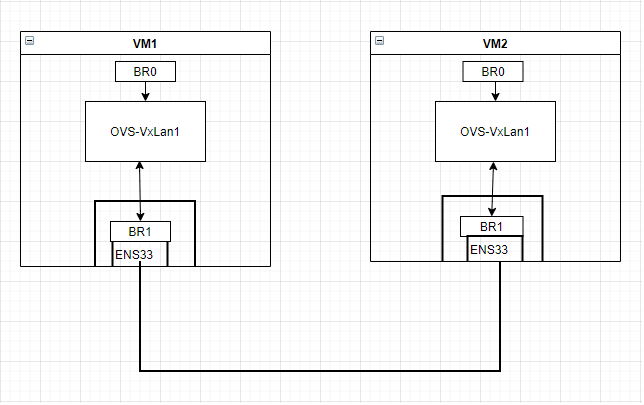
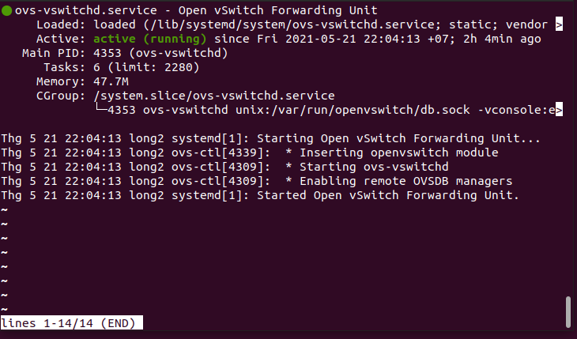
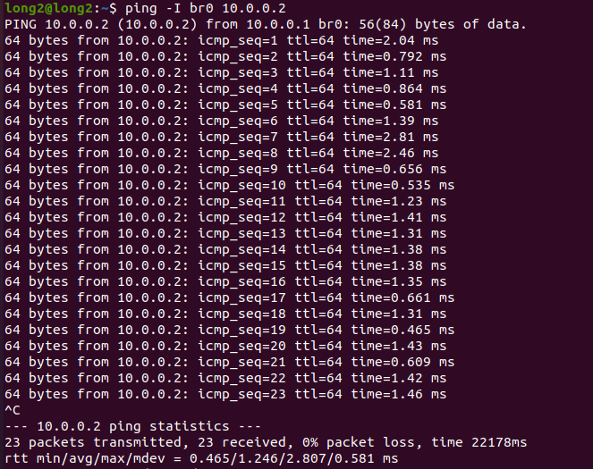
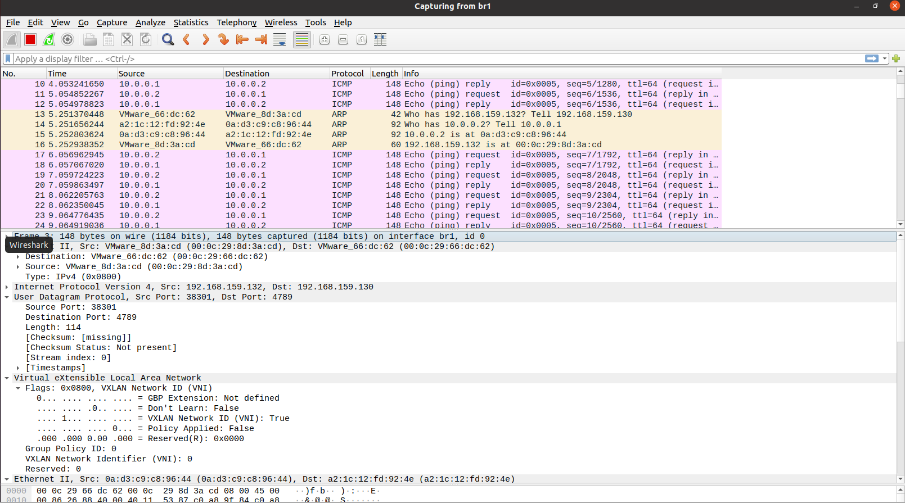
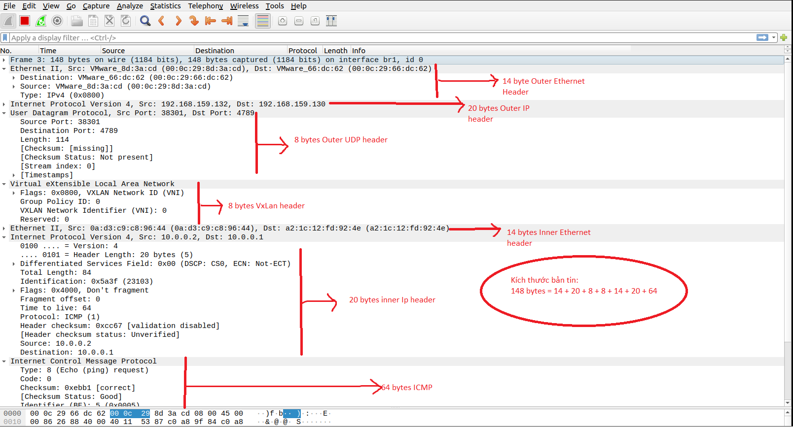

# Lab VXLAN với Open vSwitch
## 1. Cấu hình
- Topology:
  - Host 1: 192.168.159.130
    - vswitch br0: 10.0.0.1
    - vswitch br1: 192.168.159.130
 
  - Host 2: 192.168.159.132
    - vswitch br0: 10.0.0.2
    - vswitch br1: 192.168.159.132
  


- Mô tả:

  - Dưới đây mình sẽ thực hiện 1 bài lab sử dụng vmware để chạy 2 máy ảo host1, host2 đóng vai trò như các node vật lí trong thực tế.

  - Trên 2 host này, sẽ được cài hệ điều hành Ubuntu Server 16.04, cài sẵn các phần mềm Open vSwitch.. 2 host này đều sủ dụng card mạng ens33 ( coi như là card mạng vật lý).

  - Dùng wireshark để bắt và phân tích gói tin VXLAN
 
- Cấu hình:

  - Tạo 2 vSwitch br0 và br1 trên cả 2 host.

  - Cấu hình chế độ mạng bridge cho vSwitch br1 và card mạng ens33 trên cả 2 host.

- Mục tiêu bài lab:

  - Kiểm tra kết nối giữa VM1 và VM2.
  - Kiếm tra gói tin VXLAN và so sánh với lý thuyết.

- Thực hiện:
  - Đầu tiên cài đặt Open vSwitch và các packet cần thiết trên cả 2 Host:
 ```
 $ sudo apt-get install openvswitch-switch
 $ sudo apt-get install wireshark
 $ sudo apt-get install net-tools
 ```
  - Kiểm tra status của OvS:
  ```
  $ systemctl status ovs-vswitchd
  ```

 
- Tạo 2 vswitch br0 và br1 trên cả 2 host:
 
 ```
 $ sudo ovs-vsctl add-br br0
 $ sudo ovs-vsctl add-br br1
 ```

- Bật 2 vswitch trên cả 2 host

 ```
 $ sudo ip link set dev br0 up
 $ sudo ip link set dev br1 up
 ```

- Trên **Host1** tạo chế độ mạng bridge cho vswitch br1 và card mạng ens33:
 
 ```
 $ sudo ovs-vsctl add-port br1 ens33 
 $ sudo ifconfig ens33 0 
 $ sudo ifconfig br1 192.168.159.130/24
 ```
- Trên **Host2** tạo chế độ mạng bridge cho vswitch br1 và card mạng ens33:
 
 ```
 $ sudo ovs-vsctl add-port br1 ens33 
 $ sudo ifconfig ens33 0 
 $ sudo ifconfig br1 192.168.159.132/24
 ```
 
- Add lại route trên cả 2 host:
 
 ```
 route add default gw 192.168.159.1 br1
 ```
 
- Cấu hình IP cho br0 trên host 1:
 
 ```
  $ sudo ifconfig br0 10.0.0.1/24
 ```
- Cấu hình IP cho br0 trên host 2:
 
 ```
 $ sudo ifconfig br0 10.0.0.2/24
 ```
 
Cấu hình VXLAN tunnel cho vswitch br0 trên host 1:
 
 ```
 $ sudo ovs-vsctl add-port br0 vxlan1 -- set interface vxlan1 type=vxlan option:remote_ip=192.168.159.132
 ```
- Cấu hình VXLAN tunnel cho vswitch br0 trên host 2:
 
 ```
 $ sudo ovs-vsctl add-port br0 vxlan1 -- set interface vxlan1 type=vxlan option:remote_ip=192.168.159.130
 ```
 
- Show config vừa cấu hình:
 
 ```
 $ sudo ovs-vsctl show
 ```

## 2.Thử nghiệm

### 2.1 Test ping giữa 2 VM:

- Ping từ VM1 => VM2:
```
$ ping -I br0 10.0.0.2
```


- Ping từ VM2 => VM1:
```
$ ping -I br0 10.0.0.1
```


### 2.2 Sử dụng Wireshark bắt gói tin ICMP và phân tích:

- Setup wireshark chạy dưới dạng root user để bắt gói tin dễ dàng hơn:
    ```
    $ sudo chmod 4711 `which dumpcap`
    ```
- Trên VM1 mở Wireshark và chọn Interface dump là **br1**.
- Từ VM2 thực hiện **ping** tới br0 của VM1.
- Trên wireshark ở VM1 sẽ bắt được các gói tin như sau:



- Phân tích gói tin:



- Ta có thể đối chiếu với VXLAN frame format tại [đây](https://github.com/hocchudong/thuctap012017/blob/master/TamNT/Virtualization/docs/4.Tim_hieu_VXLAN.md#1.3.3).

=> ***Kết luận*** : Có thể thấy rằng layer 2 frame (chứa thông tin ICMP/IP giữa hai br0 VM1 10.0.0.1 và br0 VM2 10.0.0.2) được đóng gói hoàn toàn trong bản tin VXLAN của các địa chỉ ngoài của 2 HOST: 192.168.159.130 và 192.168.159.132.


## 3. Phân tích ưu - nhược điểm của VxLan:
- Ưu điểm:
    -	Hỗ trợ nhiều khách hàng trên cùng 1 hệ thống: VXLAN Fabric hỗ trợ nhiều khách hàng trên cả Lớp 2 (mỗi VNID định danh cho 1 khách hàng khác nhau) và Lớp 3 (sử dụng VRF khác nhau cho mỗi khách hàng khác nhau.
    -	Tính di động: VXLAN cung cấp khả năng triển khai các mạng Layer 2 overlay trên các mạng Layer 3 sẵn có, cung cấp tính linh hoạt và di động khi thiết kế các mạng Layer 2.
    -	Tăng số lượng segments lớp 2: Các thiết kế dựa trên Vlan bị giới hạn tối đa 4.096 phân đoạn Lớp 2 do sử dụng Vlan ID 12 bit. VXLAN giới thiệu một VNID 24 bit về mặt lý thuyết hỗ trợ tới 16 triệu segments.
    -	Multi-path Layer 2: các mạng lớp 2 chỉ hỗ trợ 1 tuyến đường hoạt động vì STP sẽ Block các đường dự phòng để tránh loop. VXLAN hoạt động dựa trên các mạng Lớp 3 cung cấp nhiều tuyến đường tới đích mà không phụ thuộc vào STP.
    - Giảm trễ truyền tải gói tin.

- Nhược điểm:
    - Tăng kích thước của gói tin (50 byte được thêm vào ) => tốn lưu lượng băng thông, giảm hiệu suất do khối lượng công việc CPU phải xử lý nhiều.

*REFERENCE:*
- [Tìm hiểu về VX-LAN](https://github.com/hocchudong/thuctap012017/blob/master/TamNT/Virtualization/docs/4.Tim_hieu_VXLAN.md#1.3.3).
- [1] - [https://costiser.ro/2016/07/07/overlay-tunneling-with-openvswitch-gre-vxlan-geneve-greoipsec/#.V8f_pKJquPW]()
- [2] - [https://blog.scottlowe.org/2013/05/07/using-gre-tunnels-with-open-vswitch/]()
