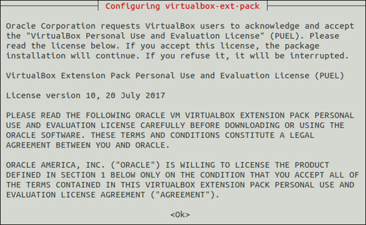
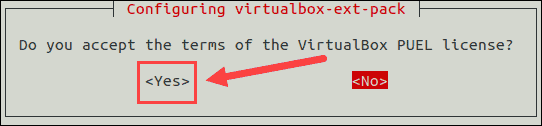
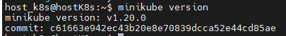
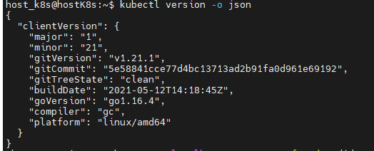
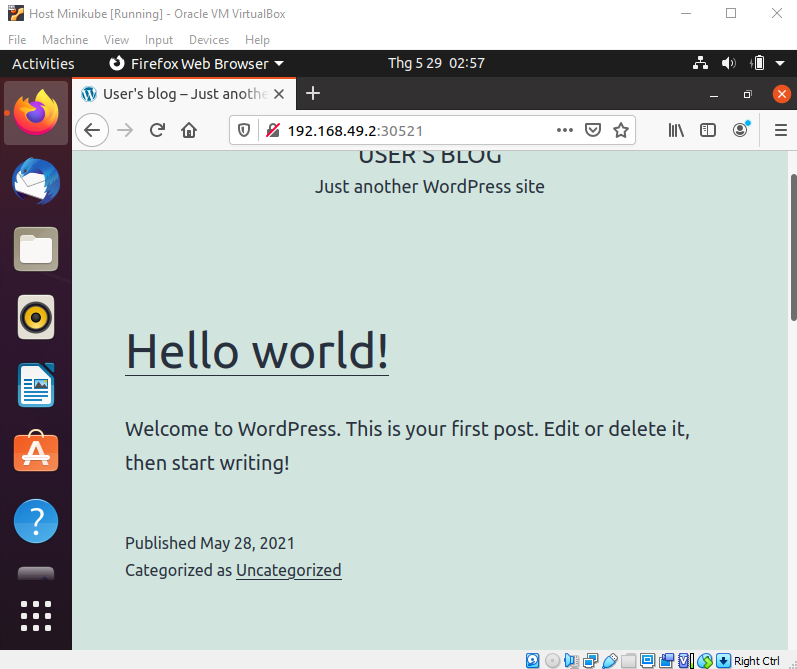

#  Bài tập tuần 4: Kubernets

##  Những thứ cần chuẩn bị : 
Ubuntu Virtual Machine ( máy chủ ảo Ubuntu ):

 - Name: Host Kubernet
 
 - Account: host
 
 
# Practice 
## Phần 1: Cài đặt Minikube
### Bước 1: Cài đặt các gói cần thiết `curl`,`apt-transport-https` và `docker.io`
```
sudo apt-get install curl apt-transport-https docker.io
```
### Bước 2: Cài đặt `VirtualBox Hypervisor`
Chúng ta cần cài máy chủ ảo để bạn có thể cài đặt single node cluster với Minikube. Ở đây chúng ta chọn VirtualBox
```
sudo apt install virtualbox virtualbox-ext-pack
```
Khi license xuất hiện trên màn hình, nhấn **Tab** sau đó **Enter** để tiếp tục



Sau đó màn hình mới xuất hiện và hỏi có đồng ý với license hay không, chúng ta chọn **Yes**



### Bước 3: Cài đặt `Minikube`
```
wget https://storage.googleapis.com/minikube/releases/latest/minikube-linux-amd64
```
### Bước 4: Sao chép file download đến folder `/usr/local/bin/minikube`
```
sudo cp minikube-linux-amd64 /usr/local/bin/minikube
```
### Bước 6: Thay đổi quyền

    sudo chmod 755 /usr/local/bin/minikube

### Bước 7: Kiểm tra version `Minikube` đảm báo cài đặt thành công

    minikube version



### Bước 8: Cài đặt `Kubectl`
Để deploy và quản lý clusters, chúng ta cần sử dụng **kubectl** - Command line tool cho **Kubernetes**

    curl -LO https://storage.googleapis.com/kubernetes-release/release/`curl -s https://storage.googleapis.com/kubernetes-release/release/stable.txt`/bin/linux/amd64/kubectl
    chmod +x ./kubectl
    sudo mv ./kubectl /usr/local/bin/kubectl

### Bước 9: Kiểm tra version `Kubectl`

    kubectl version -o json



### Bước 10: Khởi chạy Minikube

    minikube start --driver=docker

## Phần 2 : Deploy MariaDB và Wordpress
### Bước 1: Tạo folder project : 

    mkdir minikube_test_deploy
    cd minikube_test_deploy

### Bước 2 : Tạo file `PersistentVolumes`

 - **Mariadb:**
 
 Tạo file :
```
touch mariadbPV.yaml
------------------------------
apiVersion: v1
kind: PersistentVolume
metadata:
  name: mariadb-pv
spec:
  storageClassName: manual
  capacity:
    storage: 2Gi
  accessModes:
    - ReadWriteOnce
  hostPath:
    path: "/mnt/data"
```
 - **Wordpress:**
 
 Tạo file :
```
touch wordpressPV.yaml
------------------------------
apiVersion: v1
kind: PersistentVolume
metadata:
  name: wordpress-pv
spec:
  storageClassName: manual
  capacity:
    storage: 2Gi
  accessModes:
    - ReadWriteOnce
  hostPath:
    path: "/mnt/data"
```
### Bước 3: Tao file `PersistentVolumeClaims`

 - **Mariadb:**
 
 Tạo file :
```
touch mariadbPVC.yaml
------------------------------
apiVersion: v1
kind: PersistentVolumeClaim
metadata:
  name: mariadb-pvc
spec:
  storageClassName: manual
  accessModes:
    - ReadWriteOnce
  resources:
    requests:
      storage: 2Gi
```
 - **Wordpress:**
 
 Tạo file :
```
touch wordpressPVC.yaml
------------------------------
apiVersion: v1
kind: PersistentVolumeClaim
metadata:
  name: wordpress-pvc
spec:
  storageClassName: manual
  accessModes:
    - ReadWriteOnce
  resources:
    requests:
      storage: 2Gi
```
### Bước 4: Tạo file `Deploy`
- **Mariadb:**
 
 Tạo file :
```
touch deploy-mariadb.yaml
------------------------------
apiVersion: v1
kind: Service
metadata:
  name: mariadb
  labels:
    app: wordpress
spec:
  ports:
    - port: 3306
  selector:
    app: wordpress
    tier: mariadbbitnami
  clusterIP: None
---  
apiVersion: apps/v1
kind: Deployment
metadata:
  name: mariadb
  labels:
    app: wordpress
spec:
  selector:
    matchLabels:
      app: wordpress
      tier: mariadbbitnami
  strategy:
    type: Recreate
  template:
    metadata:
      labels:
        app: wordpress
        tier: mariadbbitnami
    spec:
      initContainers:
      - name: volume-permissions
        image: busybox
        command: ['sh', '-c', 'chmod -R g+rwX /bitnami']
        volumeMounts:
        - mountPath: /bitnami
          name: mariadb-data
      containers:
      - image: bitnami/mariadb:latest
        name: mariadbbitnami
        env:
        - name: MARIADB_USER
          value: bn_wordpress
        - name: MARIADB_PASSWORD
          value: bitnami
        - name: MARIADB_DATABASE
          value: bitnami_wordpress
        - name: ALLOW_EMPTY_PASSWORD
          value: "yes"
        ports:
        - containerPort: 3306
          name: mariadbbitnami
        volumeMounts:
        - name: mariadb-data
          mountPath: /bitnami
      volumes:
      - name: mariadb-data
        persistentVolumeClaim:
          claimName: mariadb-pvc
```
 - **Wordpress:**
 
 Tạo file :
```
touch deploy-wordpress.yaml
------------------------------
apiVersion: v1
kind: Service
metadata:
  name: wordpress
  labels:
    app: wordpress
spec:
  selector: 
    app: wordpress
  type: NodePort
  ports:
  - protocol: TCP
    port: 8080
    targetPort: 8080
    nodePort: 30521
---
apiVersion: apps/v1
kind: Deployment
metadata:
  name: wordpress
  labels:
    app: wordpress
spec:
  selector:
    matchLabels:
      app: wordpress
  strategy:
    type: Recreate
  template:
    metadata:
      labels:
        app: wordpress
    spec:
      containers:
      - image: bitnami/wordpress:latest
        name: wordpress
        env:
        - name: WORDPRESS_DATABASE_USER
          value: bn_wordpress
        - name: WORDPRESS_DATABASE_PASSWORD
          value: bitnami
        - name: WORDPRESS_DATABASE_NAME
          value: bitnami_wordpress
        ports:
        - containerPort: 8080
          name: wordpress
        volumeMounts:
        - name: wordpress-data
          mountPath: /bitnami
      volumes:
      - name: wordpress-data
        persistentVolumeClaim:
          claimName: wordpress-pvc
```
### Bước 5: Deploy MariaDB

    kubectl apply -f mariadbPV.yaml
    kubectl apply -f mariadbPVC.yaml
    kubectl apply -f deploy-mariadb.yaml

### Bước 6: Deploy Wordpress

    kubectl apply -f wordpressPV.yaml
    kubectl apply -f wordpressPVC.yaml
    kubectl apply -f deploy-wordpress.yaml
### Bước 7: Kiểm tra pods

    kubectl get pods -o wide

### Bước 8: Lấy link Wordpress

    minikube service wordpress --url

Kiếm tra kết quả :



# Chào mừng bạn đến với Minikube
