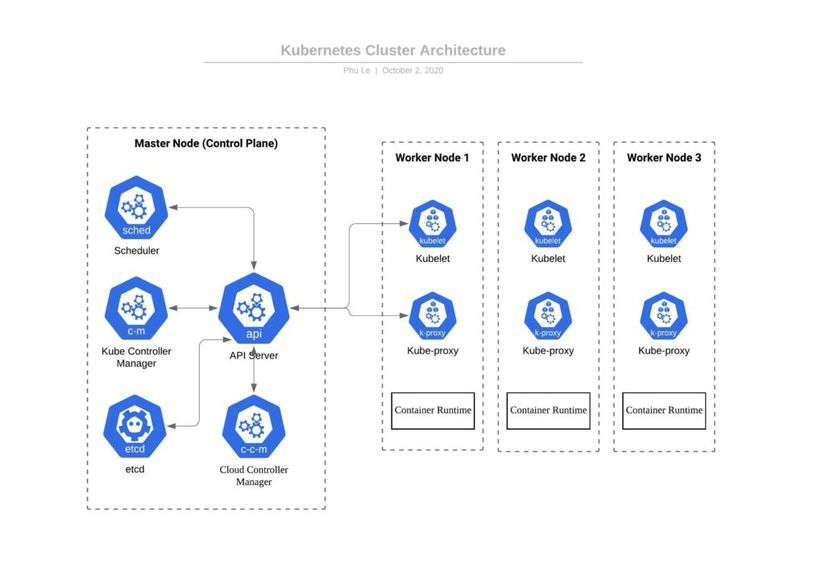
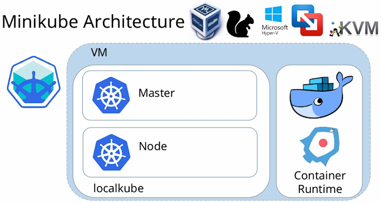
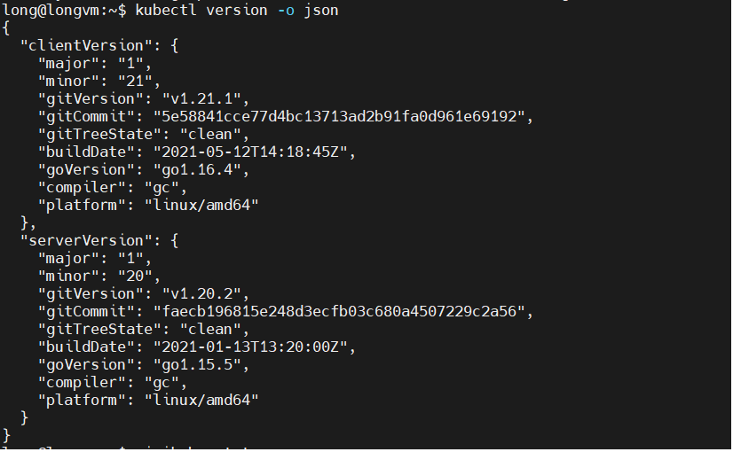
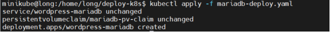
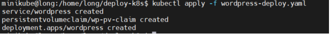
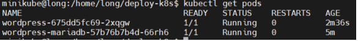
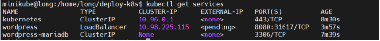
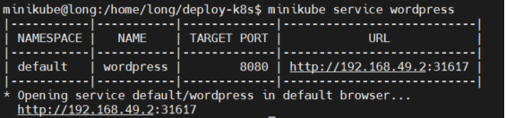
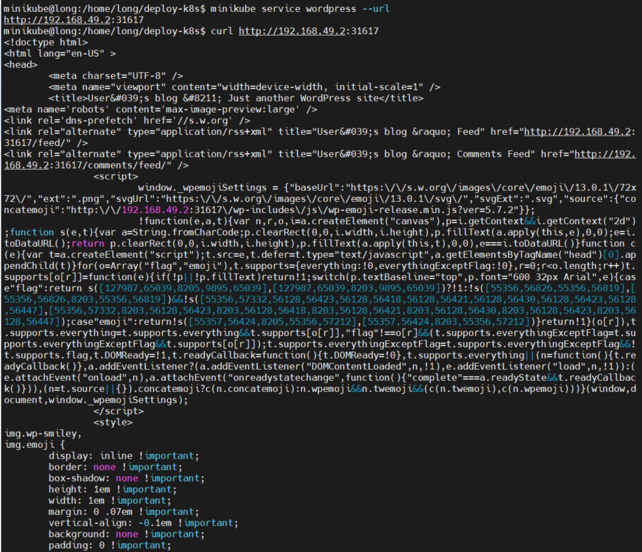

# Deploy Wordpress in Minikube

## A. Overview

### 1. Kubenetes


``
Kubernetes is a portable, extensible, open-source platform for managing containerized workloads and services, that facilitates both declarative configuration and automation.
``
- The name Kubernetes originates from Greek, meaning helmsman or pilot. K8s as an abbreviation results from counting the eight letters between the "K" and the "s".

- Google open-sourced the Kubernetes project in 2014.

- Core component in `K8S`:

    - `Cluster` :  A collection of Physical or VMs brought together by K8S and using a shared network to communicate between each server.
    - `Pods` : Pods are the smallest deployable units of computing that you can create and manage in Kubernetes.A Pod (as in a pod of whales or pea pod) is a group of one or more containers.
    - `kubectl`: CLI of `k8s`.
- Master node (Control plane):
    - `Control plane` :  The control plane's components make global decisions about the cluster (for example, scheduling), as well as detecting and responding to cluster events (for example, starting up a new pod when a deployment's replicas field is unsatisfied).
    - `etcd`: Consistent and highly-available key value store used as Kubernetes' backing store for all cluster data.
    - `kube-scheduler`: Control plane component that watches for newly created Pods with no assigned node, and selects a node for them to run on.
    - `kube controller manager`: Control Plane component that runs controller processes.
    - `cloud-controller-manager`: [you can read hear](https://kubernetes.io/docs/concepts/overview/components/#cloud-controller-manager).
    - `Kube API server`: help user interact with K8S API, It's like frontend of K8S control plane.
- Worker Node:
    - `Worker node `: Receives work instructions from master, Accepting & running workloads using local and external resources, Network & Traffic related works.
    - `kubelet`: An agent that runs on each node in the cluster. It makes sure that containers are running in a Pod.
    - `kube-proxy`: kube-proxy is a network proxy that runs on each node in your cluster, implementing part of the Kubernetes Service concept. `kube-proxy` maintains network rules on nodes.
    - `container runtime`: the software that is responsible for running containers.

*Read more about K8S in https://kubernetes.io/docs/home/*

### 2. Minikube


- Minikube is local Kubernetes, focusing on making it easy to learn and develop for Kubernetes. You can run a `k8s cluster` in your local machine.
- Minikube architecture:




## B. Setup and Install

- In this tutorial I use `ubuntu server 20.0.4` with 2GB RAM , 2 cores and 20GB disk

### 1. Install `kubectl` & `minikube`

- Install some essential package:
```
$ sudo apt-get update
$ sudo apt-get install curl docker.io
```
- Install `kubectl`:
```
$ curl -LO "https://dl.k8s.io/release/$(curl -L -s https://dl.k8s.io/release/stable.txt)/bin/linux/amd64/kubectl"

$ sudo install -o root -g root -m 0755 kubectl /usr/local/bin/kubectl
```
- Checking version `kubectl`:

```
$ kubectl version -o json
```


- Install `minikube`:

```
$ curl -LO https://storage.googleapis.com/minikube/releases/latest/minikube-linux-amd64

$ sudo install minikube-linux-amd64 /usr/local/bin/minikube

$ sudo chmod 755 /usr/local/bin/minikube
```
- Add user `minikube`:

```
$ sudo adduser minikube
```

- Add `minikube` to group `docker` & `sudo` :
```
$ sudo usermod -aG sudo minikube

$ sudo usermod -aG docker minikube
$ newgrp docker
```

- change user to user `minikube`:
```
$ su minikube
```

- Ensure `minikube` installed and Check `minikube` version:
```
$ minikube status
$ minikube version
```

- Start `minikube` cluster with `driver` is `docker` and make docker is default driver:

```
$ minikube start --driver=docker
$ minikube config set driver docker
```

### 2. Deploy `wordpress` and `mariadb`

- Create file `mariadb-deploy.yaml`:
```
---
apiVersion: v1
kind: Service
metadata:
  name: wordpress-mariadb
  labels:
    app: wordpress-kube
spec:
  selector:
    app: wordpress-kube
    tier: mariadb
  ports:
    - port: 3306
  clusterIP: None
---
apiVersion: v1
kind: PersistentVolumeClaim
metadata:
  name: mariadb-pv-claim
  labels:
    app: wordpress-kube
spec:
  accessModes:
    - ReadWriteOnce
  resources:
    requests:
      storage: 2Gi
---
apiVersion: apps/v1
kind: Deployment
metadata:
  name: wordpress-mariadb
  labels:
    app: wordpress-kube
spec:
  selector:
    matchLabels:
      app: wordpress-kube
      tier: mariadb
  strategy:
    type: Recreate
  template:
    metadata:
      labels:
        app: wordpress-kube
        tier: mariadb
    spec:
      containers:
      - name: mariadb
        image: bitnami/mariadb:latest
        env:
        - name: ALLOW_EMPTY_PASSWORD
          value: "yes"
        - name: MARIADB_USER
          value: bn_wordpress
        - name: MARIADB_DATABASE
          value: bitnami_wordpress
        - name: MARIADB_PASSWORD
          value: bitnami
        ports:
        - containerPort: 3306
        volumeMounts:
        - name: mariadb-persistent-storage
          mountPath: /var/lib/mariadb
      volumes:
      - name: mariadb-persistent-storage
        persistentVolumeClaim:
          claimName: mariadb-pv-claim
```

- Create `wordpress-deploy.yaml`:

```
apiVersion: v1
kind: Service
metadata:
  name: wordpress
  labels:
    app: wordpress-kube
spec:
  selector:
    app: wordpress-kube
    tier: frontend
  ports:
    - port: 8080
  type: LoadBalancer
---
apiVersion: v1
kind: PersistentVolumeClaim
metadata:
  name: wp-pv-claim
  labels:
    app: wordpress-kube
spec:
  accessModes:
    - ReadWriteOnce
  resources:
    requests:
      storage: 2Gi
---
apiVersion: apps/v1
kind: Deployment
metadata:
  name: wordpress
  labels:
    app: wordpress-kube
spec:
  selector:
    matchLabels:
      app: wordpress-kube
      tier: frontend
  strategy:
    type: Recreate
  template:
    metadata:
      labels:
        app: wordpress-kube
        tier: frontend
    spec:
      containers:
      - name: wordpress
        image: bitnami/wordpress:latest
        env:
          - name: ALLOW_EMPTY_PASSWORD
            value: "yes"
          - name: WORDPRESS_DATABASE_USER
            value: bn_wordpress
          - name: WORDPRESS_DATABASE_NAME
            value: bitnami_wordpress
          - name: WORDPRESS_DATABASE_PASSWORD
            value: bitnami
          - name: WORDPRESS_DATABASE_HOST
            value: wordpress-mariadb
        ports:
        - containerPort: 80
          name: wordpress
        volumeMounts:
        - name: wordpress-persistent-storage
          mountPath: /var/www/html
      volumes:
      - name: wordpress-persistent-storage
        persistentVolumeClaim:
          claimName: wp-pv-claim
```
- Deploy with `kubectl`:

```
$ kubectl apply -f mariadb-deploy.yaml
```



```
$ kubectl apply -f wordpress-deploy.yaml
```



### 3. Verify `Pods` - `Service` - `PVC`

- Check Pods:
```
$ kubectl get pods
```


- Check `PVC` :
```
$ kubectl get pvc
```


- Check service :

```
$ kubectl get services
```


- Check `minikube` service:

```
$ minikube service wordpress
```



=> Deploy wordpress app success !!
=> Now you can go to `http://192.168.49.2:31617` check your app.
- I deploy in `ubuntu` server so now i curl to app address make sure it's running:

```
$ curl http://192.168.49.2:31617
```




## REFERENCE

[1] - [https://kubernetes.io/docs/tutorials/stateful-application/mysql-wordpress-persistent-volume/#create-persistentvolumeclaims-and-persistentvolumes]()

[2] - [https://kubernetes.io/docs/reference/kubectl/cheatsheet/]()

[3] - [https://minikube.sigs.k8s.io/docs/start/]()

[4] - [https://kubernetes.io/docs/home/]()

[5] - [Supported by PhongNguyen](https://github.com/meobilivang)
