# Week 5

## Mục lục

## I. Overview

### 1. CI/CD

#### a) CI là gì?

Continuous Integration (CI) là quá trình tích hợp liên tục mã nguồn mới vào trong repository (nơi lưu trữ mã nguồn tập trung). Người dùng có thể dễ dàng phát hiện các vấn đề nếu có. Việc kiểm tra các lỗi trong mã nguồn giúp cho nhà phát triển có thể khắc phục lỗi sớm hơn. Việc kiểm thử mức đơn vị (Unit test – một loại kiểm thử phần mềm trong đó các đơn vị hay thành phần riêng lẻ của phần mềm được kiểm thử) đóng vai trò rất quan trọng cho việc kiểm tra mã nguồn trước khi tích hợp vào repository. Cách tốt nhất là xây dựng một máy chủ (server) chuyên thực hiện các tác vụ kiểm thử này để quá trình phát triển diễn ra song song cùng với quá trình kiểm thử. Continuous Integration (CI) không giúp loại bỏ các lỗi tồn tại trong mã nguồn, mà nó chỉ giúp nhà phát triển dể dàng tìm ra và loại bỏ sớm các lỗi.

Nếu có nhiều nhà phát triển cùng làm việc trên một dự án phần mềm, tình trạng mã nguồn bị xung đột (conflict) sẽ thường xuyên diễn ra, khó khăn trong việc phát hiện các lỗi còn tồn tại trong mã nguồn cũng như khắc phục chúng. Việc này dẫn đến quá trình triển khai, phát hành phần mềm diễn ra chậm hơn. Với việc áp dụng Continuous Integration (CI), nhà phát triển có thể tạo ra các tính năng mới để tích hợp phần mềm của mình nhanh hơn.


#### b) CD là gì?

CD là bước tiếp theo sau CI. CD là từ viết tắt của Continuous Deployment (triển khai liên tục) hoặc Continuous Delivery (phân phối liên tục).

Đối với CD trong triển khai liên tục (Continuous Deployment) thì chúng có quan hệ rất mật thiết với CI. CD này có thể giúp cho quá trình triển khai ứng dụng được diễn ra trong bất cứ thời điểm nào. Thậm chí là tự động tạo ra một phiên bản mới trên môi trường production. Với điều kiện là nếu bản xây dựng có thể vượt qua được tất cả các nút trước đó. Với phương pháp này, nếu xảy ra lỗi trong quá trình xây dựng thì nhà phát triển sẽ dễ dàng xác định được lỗi xảy ra ở đâu. Từ đó có biện pháp sửa lỗi một cách hiệu quả hơn.

Còn đối với CD trong Continuous Delivery thì tương tự như Continuous Deployment. Dự án của bạn có thể triển khai ở bất cứ thời điểm nào. Tuy nhiên điều này không hoàn toàn có nghĩa là ứng dụng có thể được triển khai một cách an toàn nhất tại môi trường production. Vì thông thường trong cấu hình ứng dụng giữa môi trường production và test sẽ có sự khác biệt. Do vậy mà CD sẽ dừng lại và không thể thực hiện triển khai lên môi trường production mà chỉ triển khai trên môi trường test hoặc staging.

Về cơ bản thì môi trường staging là môi trường giống với production, nên đã làm Continous Delivery được thì cũng làm Continous Deployment được. Tuy nhiên, thực tế lại không dễ dàng như vậy. Lý do thứ nhất là chúng ta có thể deploy tự động lên staging, nhưng liệu chúng ta có dám deploy tự động với production, cho dù là mọi cấu hình đều giống nhau thì thực tế staging và production server vẫn là hai server riêng biệt, và vì thế không thể đảm bảo mọi thứ chạy đúng trên staging sẽ chạy đúng trên production, thế nên deploy lên production thường phải làm thủ công để chắc chắn là các bước build, test được thực hiện chính xác. Lý do thứ hai đơn giản hơn, đó là rất khó để test tự động hoàn toàn, và bởi vậy khó mà tự động deploy được.

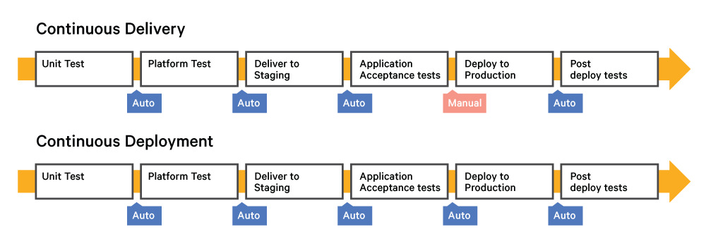

#### c) Mối quan hệ giữa CI và CD

CI/CD là một phương pháp thường xuyên cung cấp ứng dụng cho khách hàng bằng cách đưa tự động hóa vào các giai đoạn phát triển ứng dụng. Các khái niệm chính được gán cho CI/CD là tích hợp liên tục, phân phối liên tục và triển khai liên tục. CI/CD là một giải pháp cho các vấn đề tích hợp code mới có thể gây ra cho các nhóm phát triển và hoạt động.

Cụ thể, CI CD giới thiệu tính năng tự động hóa liên tục và giám sát liên tục trong suốt vòng đời của ứng dụng. Từ giai đoạn tích hợp và thử nghiệm đến phân phối và triển khai. Tổng hợp lại, các phương pháp kết nối này thường được gọi là "đường dẫn CICD". Chúng được hỗ trợ bởi các nhóm phát triển và hoạt động làm việc cùng nhau theo cách nhanh nhẹn với phương pháp tiếp cận DevOps hoặc SRE.

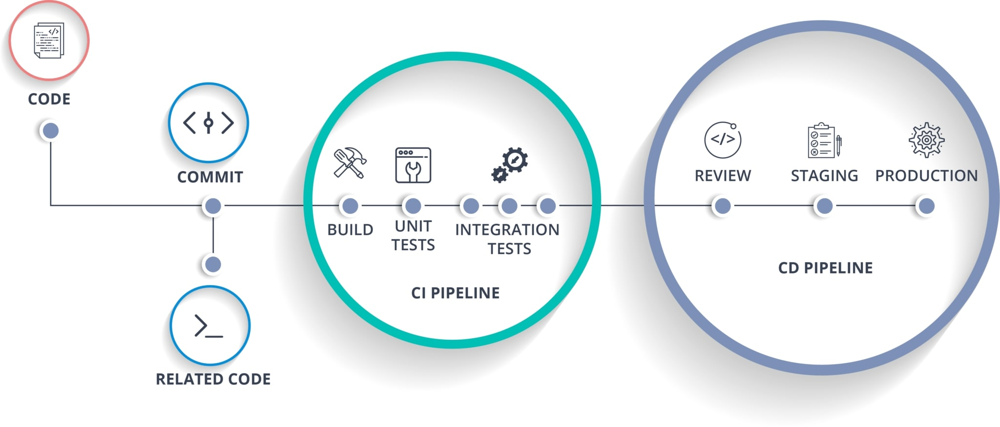

### 2. Jenkins

#### b) Jenkins là gì?

Jenkins là một công cụ mã nguồn mở, hỗ trợ CI và CD một cách linh hoạt. Công cụ này hỗ trợ việc xây dựng và kiểm thử phần mềm một cách liên tục và giám sát quá trình thực thi cũng như trạng thái của các tiến trình xử lý. Công cụ này giúp cho nhà phát triển dễ dàng tạo ra phần mềm với tính ổn định nhất có thể.

Sau khi hoàn tất quá trình phát triển, phần mềm cần phải trải qua các giai đoạn kiểm thử tại môi trường kiểm thử (staging – môi trường gần giống với môi trường thực tế khi đến tay người dùng) trước khi đến tay người dùng. Quá trình triển khai trên các môi trường có thể sẽ mất rất nhiều công đoạn, thời gian cho việc triển khai, cấu hình server, thiết lập cơ chế log,… Hầu hết các tác vụ này cần được tự động hóa để giảm thiểu chi phí trong quá trình triển khai đối với môi trường có tới hàng trăm thiết bị đầu cuối. Vì vậy, một công cụ hỗ trợ tự động hóa trong việc xây dựng, kiểm thử hệ thống trong môi trường staging và triển khai lên môi trường production.


Hudson từng là một công cụ mã nguồn mở nổi tiếng trong quá trình CI, được phát triển bởi Sun Microsystems. Và vào tháng 4/2009, Oracle đã mua lại công ty Sun Microsystems với mức giá 7,4 tỷ USD và đặt nền móng cho dự án mang tên Jenkins. Và tính tới thời điểm hiện tại, Jenkins đã trở thành một trong
những công cụ phổ biến nhất trên thị trường hiện nay.

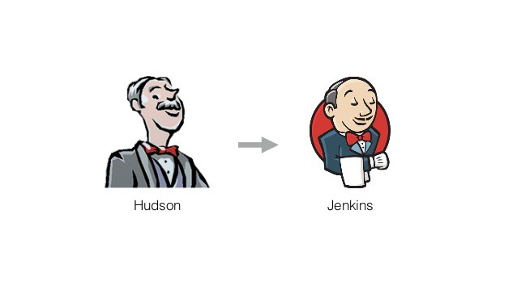

#### c) Jenkins Pipeline và Jenkins file

Jenkins Pipeline là một bộ plugin hỗ trợ việc triển khai và tích hợp CD theo kiểu pipeline (bao gồm tập hợp quy trình với các tác vụ liên quan với nhau và được thực hiện một cách tuần tự theo thứ tự đã quy định). Jenkins Pipeline được khai báo trên một tập tin được gọi là Jenkinsfile.

Jenkinsfile là phần “lõi” của Jenkins Pipeline, được viết dựa trên cú pháp của DSL (Domain Specific Language) với ngôn ngữ chính là: Groovy DSL. Tập tin này chứa danh sách các công việc mà pipeline sẽ thực hiện, được lưu trữ trên server Jenkins hoặc trên repository.

Jenkinsfile này sẽ thực hiện các tác vụ sau:

- Thiết lập các biến môi trường.
- Pull code từ git repo được chỉ định.
- Thiết lập Jenkins workspace.
- Thực thi đoạn script được chỉ định.
- Sau khi thực hiện xong các tác vụ, “dọn dẹp” workspace.

Lưu ý:

- Tập tin Jenkinsfile cần được đặt ở thư mục root của repository khi lưu trữ trên git/Bitbucket.

- Tính năng pipeline có thể sẽ không tích hợp sẵn trên Jenkins trong một số trường hợp. Bạn có thể cài đặt thêm tính năng này trong tính năng Manage Jenkins.

Các thành phần trong Jenkinsfiles: xem thêm ở phần link tham khảo.

## II. Practicing

### 1. Requirement

#### a) Docker

Là thành phần quan trọng không thể thiếu vì đây sẽ là môi trường Jenkins build và test application.

Lưu ý bạn phải để docker chạy mà không cần dùng lệnh `sudo`

1. Add the `docker` group if it doesn't already exist

    ```console
    sudo groupadd docker
    ```

2. Add the connected user `$USER` to the docker group

    Optionally change the username to match your preferred user.

    ```console
    sudo gpasswd -a $USER docker
    ```

3. Restart the `docker` daemon

    ```console
    sudo service docker restart
    ```

    If you are on Ubuntu 14.04-15.10, use `docker.io` instead:

    ```console
    sudo service docker.io restart
    ```

4. Grant acccess for docker.shock

    ```console
    sudo chmod 666 /var/run/docker.sock
    ```

#### b) Jenkins

Để cài đặt Jenkins ta có thể cài đặt trực tiếp trên Ubuntu hoặc qua Docker và cũng có thể cài đặt trên K8s. Để đơn giản  nhất mình sẽ cài trên Docker. Minh sẽ cài phiên bản Jenkins của bitnami đã config hầu hết mọi thứ để thuận tiện.

Tạo network

```console
docker network create jenkins-network
```

Tạo volumes cho Jenkins và chạy application

```console
docker volume create --name jenkins_data
docker run -d -p 80:8080 --name jenkins \
  --network jenkins-network \
  --volume jenkins_data:/bitnami/jenkins \
  --volume "$HOME":/home \
  --volume /var/run/docker.sock:/var/run/docker.sock --privileged \
  --volume $(which docker):/usr/bin/docker --privileged \
  bitnami/jenkins:latest
```

Vì Jenkins sẽ dùng docker để build và chạy test nên mình sẽ kết nối docker của host vào container cho Jenkins sử dụng.

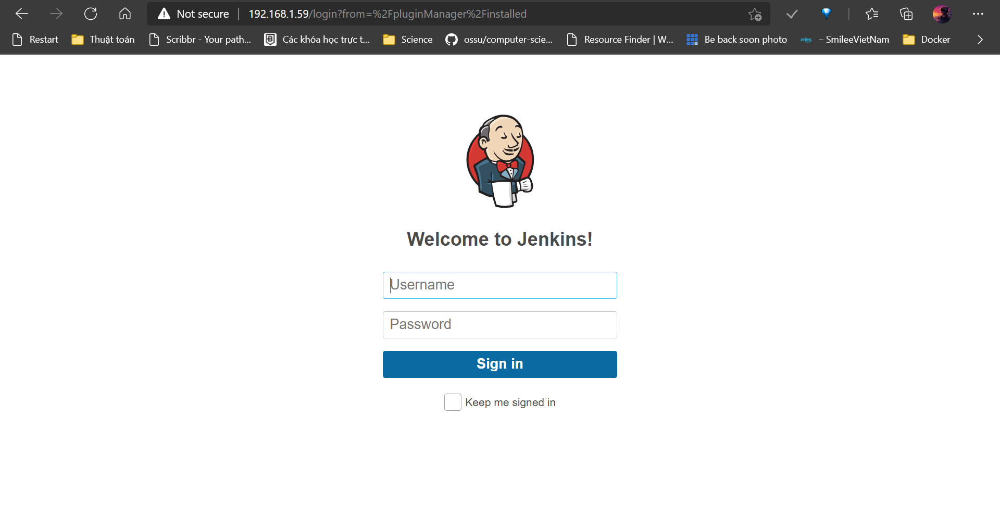

Lúc này khi truy cập vào ta sẽ đăng nhập vào Jenkins (Để cài đặt username với password xem kỹ hơn ở Bitnami-Jenkins)

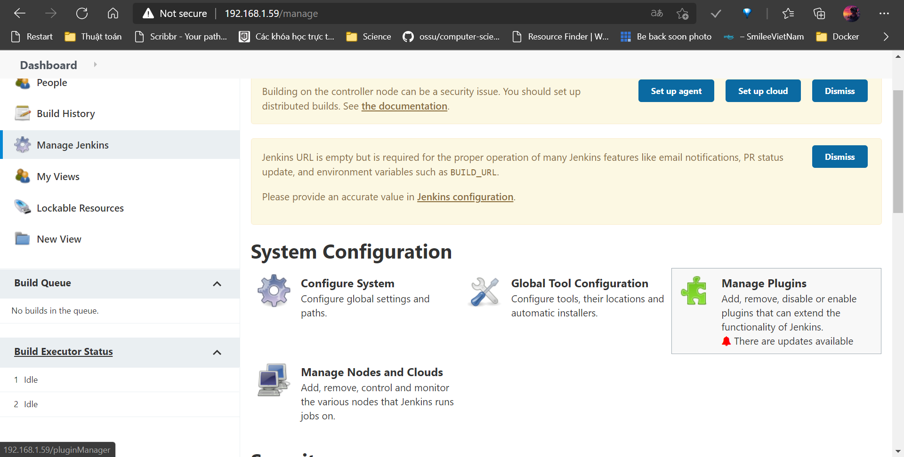

### 2. CI

Ta sẽ vào phần manage plugins để cài thêm 1 số plugins cần thiết.

- Blue Ocean: Giao diện quản lý mới của Jenkins

- Multibranch Scan Webhook Trigger: Plugin scan các nhánh của project.

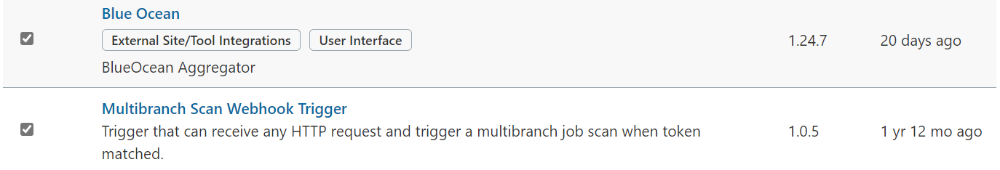

Ở đây mình sẽ dùng project landingPageDemo (link ở phần tham khảo) của mình để chạy Jenkins. Trong project mình đã tạo ra 1 nhánh `demoTest` và trong thư mục root của nhánh mình để `Jenkinsfile`.

Jenkinsfile

```groovy
pipeline {
    agent {
        docker {
            image 'maven:3.8.1-openjdk-11'
            args '-v /root/.m2:/root/.m2'
        }
    }
    stages {
        stage('Build') {
            steps {
                sh 'mvn -B -DskipTests clean install'
            }
        }
        stage('Test') {
            steps {
                sh 'mvn test'
            }
            post {
                always {
                    junit 'target/surefire-reports/*.xml'
                }
            }
        }
    }
}
```

Trong file mình sẽ tạo môi trường build và test project là ở docker dùng image `maven:3.8.1-openjdk-11`. Sau đó mình sẽ build project. Ta chỉ build, không test vì sau đấy jenkins sẽ chạy câu lệnh maven để test project. Lúc này maven sẽ chạy các unit test ở trong project mà mình đã code.

Tiếp theo ta sẽ tạo new item ở trong Jenkins


Đặt tên cho item và chọn kiểu multibranch pipeline

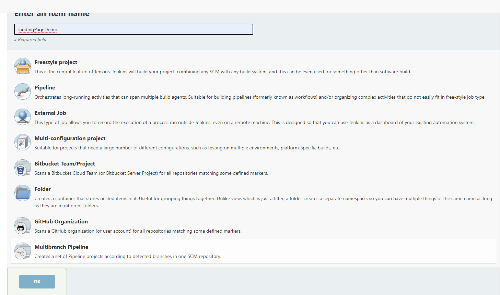

Phần Branch Sources mình sẽ chọn từ github và paste link của repository vào.

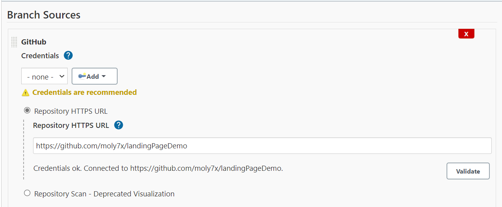

Ở phần Scan ta sẽ có 2 lựa chọn

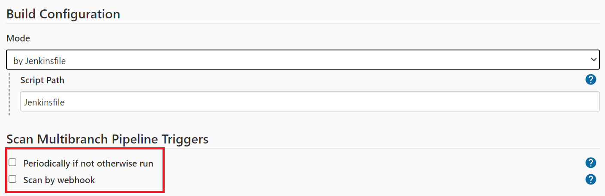

- Periodically scan: scan theo chu kỳ (1 phút, 10 phút v.v). Khi scan thấy có commit mới thì tự động build và test

- Scan by webhook: Kết nối trực tiếp với GitHub, khi có commit mới sẽ tự động build và chạy test.
  
Mình sẽ chọn periodically scan với chu kỳ 1 phút scan 1 lần.

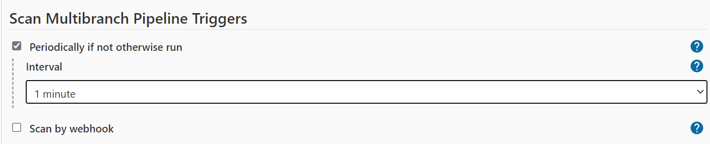

Tiếp theo mình sẽ mở giao diện blue ocean

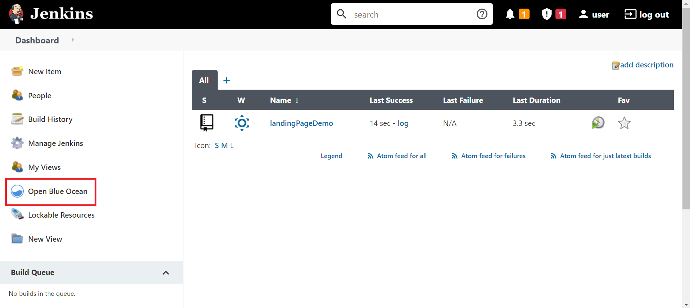

Lúc này Jenkins đã tự động nhận diện dược file JenkinsFile và chạy.

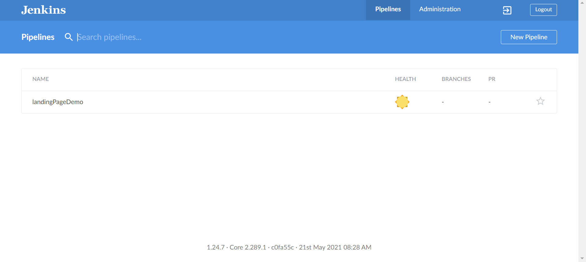

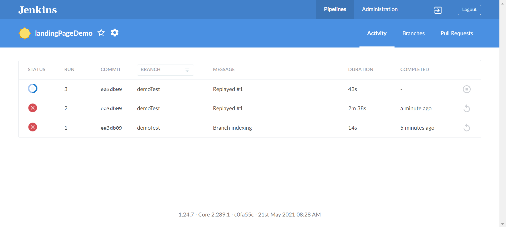

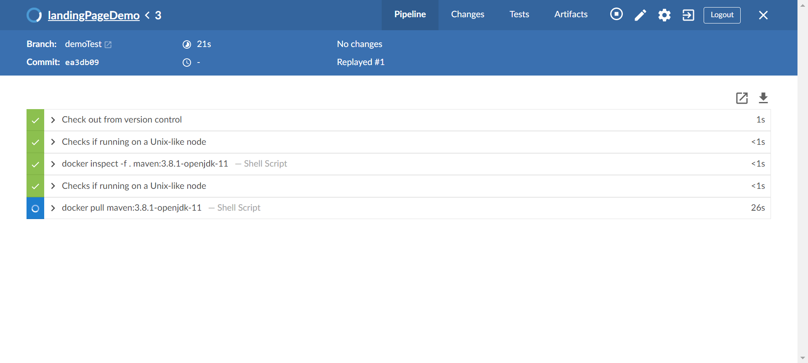

Jenkins sẽ tạo môi trường build và test trong docker.

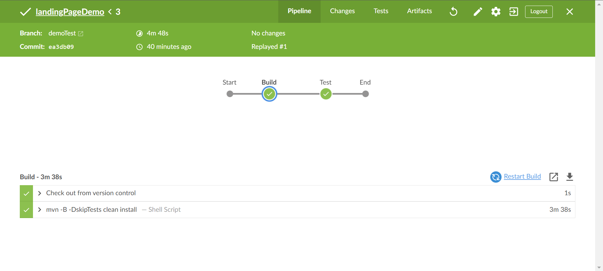

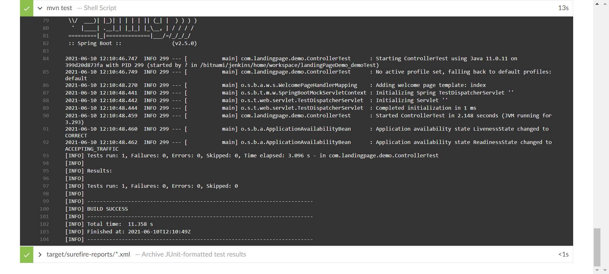

Nếu mình sửa lại test thành sai và commit lại. Jenkins sẽ tự động scan, build và chạy lại test.

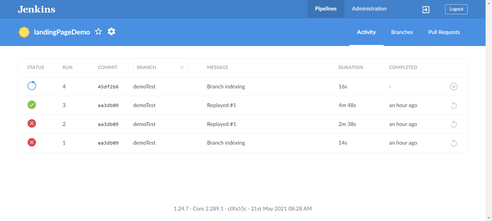

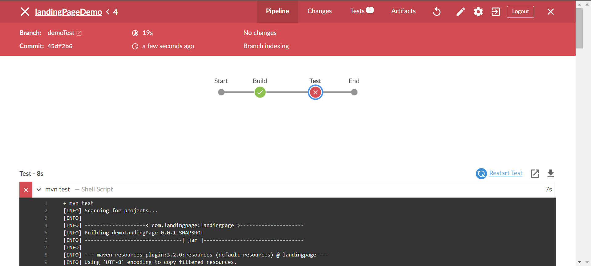

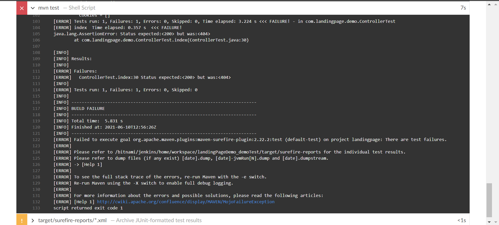

Lúc này Jenkins sẽ báo có test bị lỗi.

------------

## References

[[1] CI CD là gì? Những lợi ích của CI CD mang lại](http://laptrinhvacongnghe.com/ci-cd-la-gi/)

[[2] CI, CD và ... DevOps ???](https://viblo.asia/p/ci-cd-va-devops-07LKXYXDZV4)

[[3] Tổng quan Jenkins và Continuous Integration (CI)](https://tel4vn.edu.vn/tong-quan-jenkins-va-continuous-integration-ci/)

[[4] Khái niệm về Jenkins Pipeline](https://tel4vn.edu.vn/khai-niem-ve-jenkins-pipeline-cho-nguoi-moi-bat-dau/)

[[5] Structure of a Jenkins Pipeline](https://dzone.com/articles/structure-of-jenkins-pipeline)

[[6] How to fix docker](https://www.digitalocean.com/community/questions/how-to-fix-docker-got-permission-denied-while-trying-to-connect-to-the-docker-daemon-socket)

[[7] Bitnami Docker Image for Jenkins](https://github.com/bitnami/bitnami-docker-jenkins)

[[8] Landing page demo](https://github.com/moly7x/landingPageDemo)
