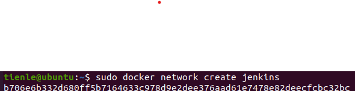
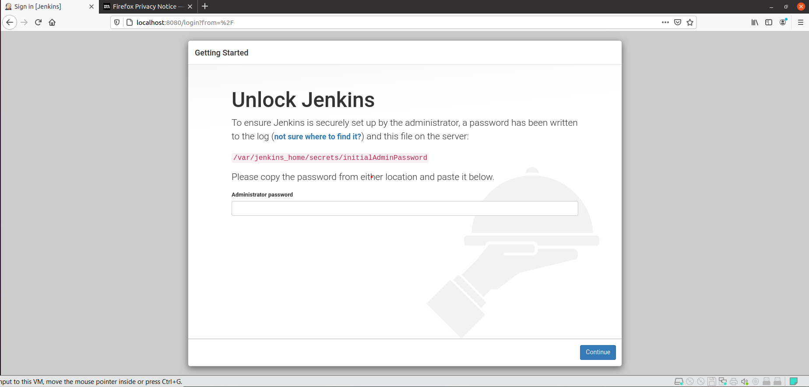
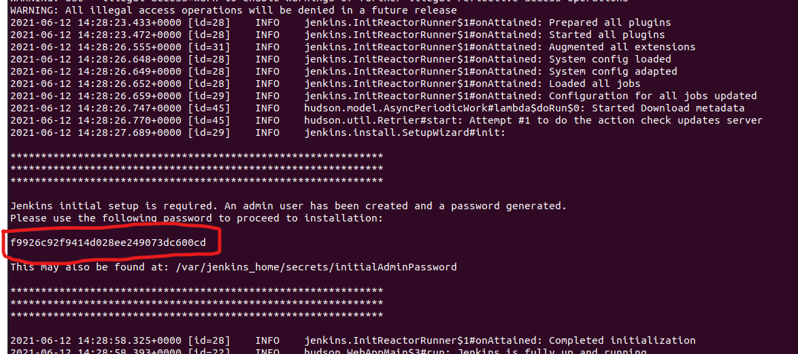
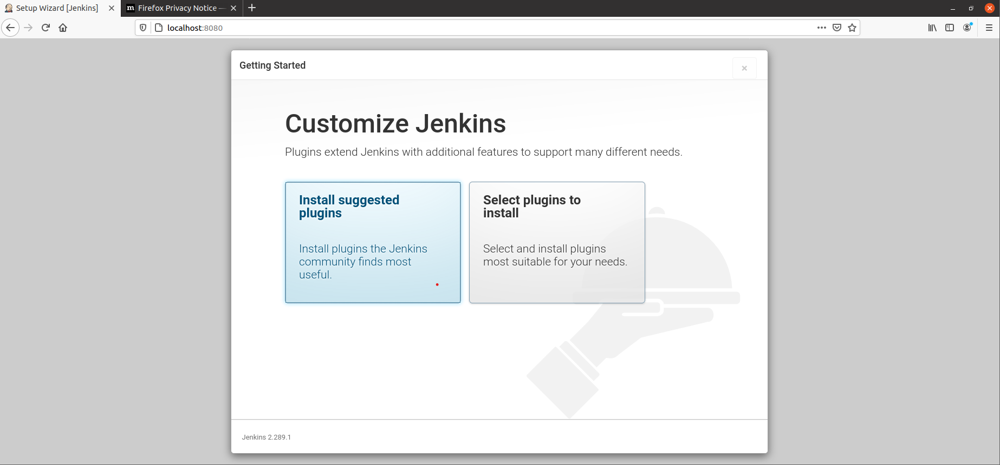
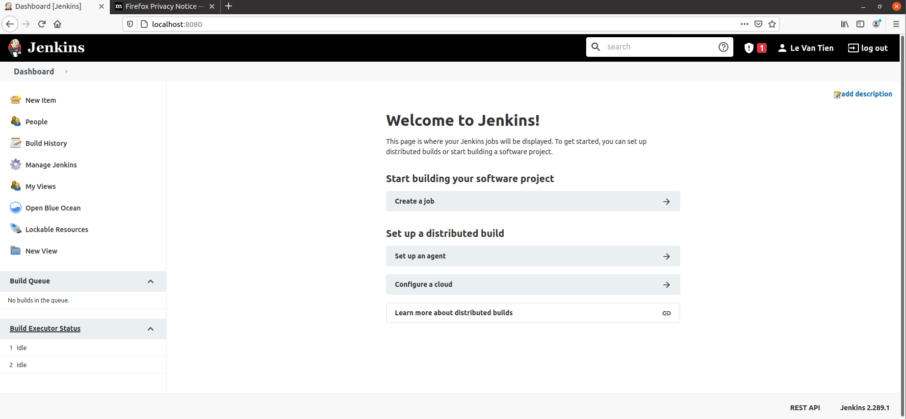
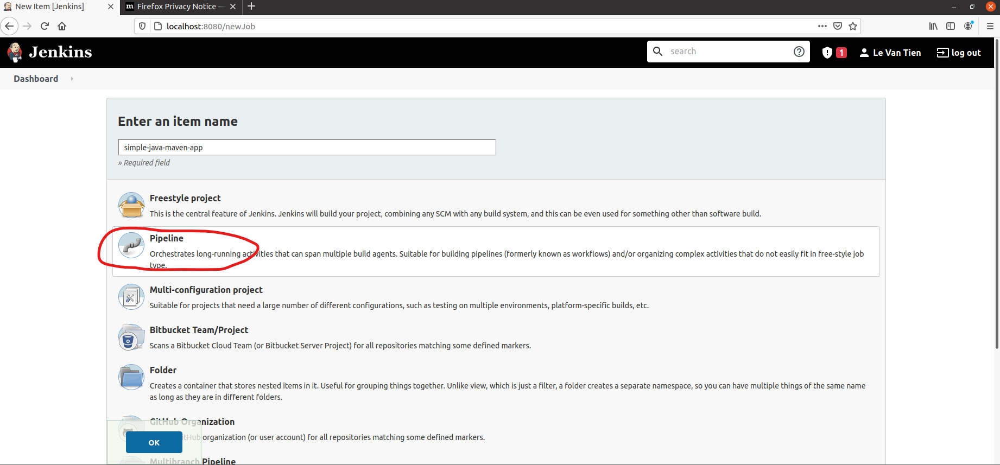
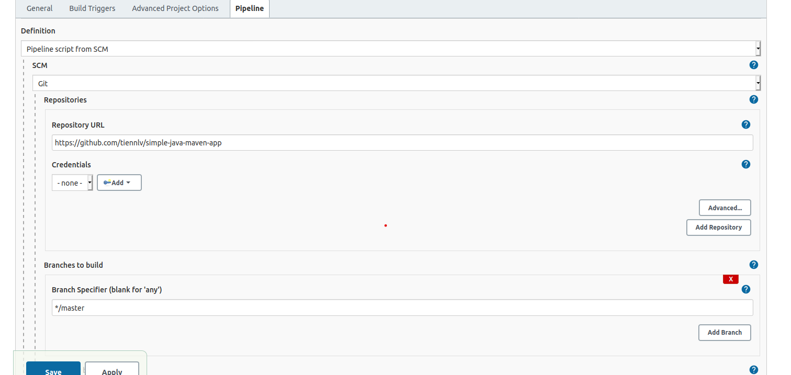
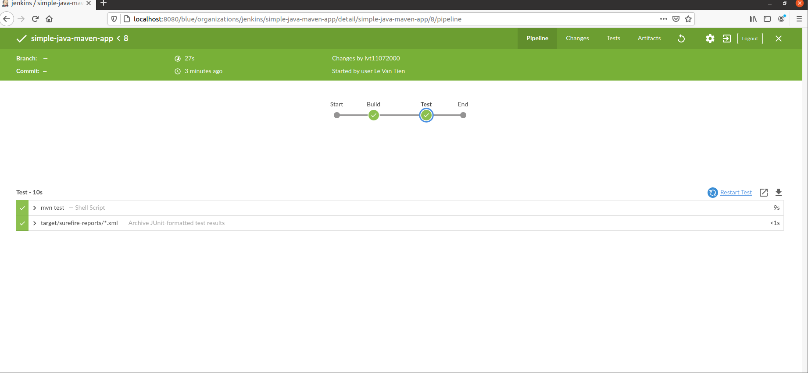
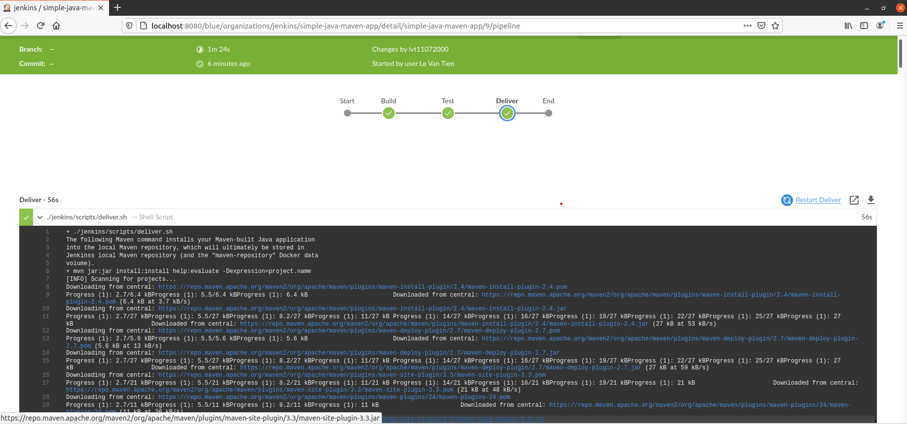
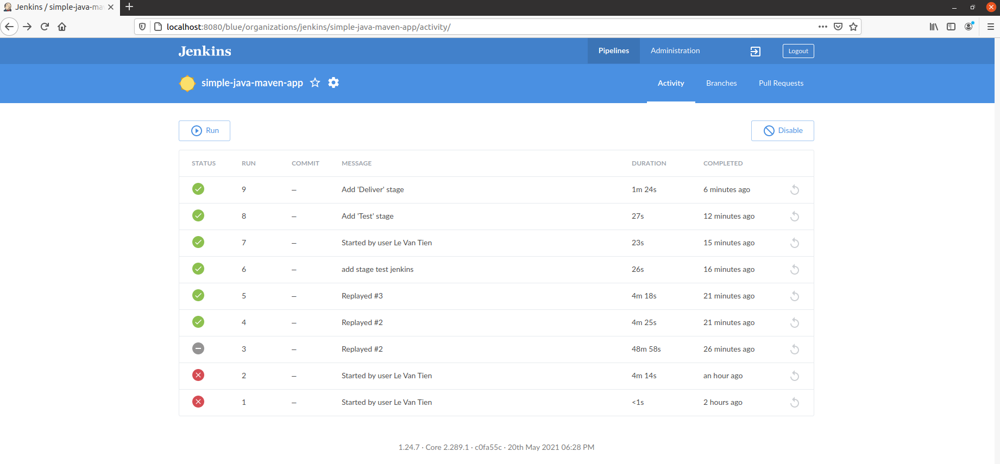

# PRACTICE JENKINS CI

## Set up

### Install docker

```shell
$ sudo apt install docker.io
```

## Run Jenkins in Docker

1. Create a bridge network in Docker 
```shell
$ docker network create jenkins
```


2. In order to execute Docker commands inside Jenkins nodes, download and run the docker:dind Docker image using the following docker run command:
```shell
$ docker run --name jenkins-docker --rm --detach \
  --privileged --network jenkins --network-alias docker \
  --env DOCKER_TLS_CERTDIR=/certs \
  --volume jenkins-docker-certs:/certs/client \
  --volume jenkins-data:/var/jenkins_home \
  --publish 2376:2376 docker:dind --storage-driver overlay2
```
3. Create Docker file with content:

```shell
docker run --name jenkins-docker --rm --detach \
  --privileged --network jenkins --network-alias docker \
  --env DOCKER_TLS_CERTDIR=/certs \
  --volume jenkins-docker-certs:/certs/client \
  --volume jenkins-data:/var/jenkins_home \
  --publish 2376:2376 docker:dind --storage-driver overlay2
```

4. Build a new docker image from this Dockerfile and assign the image a meaningful name, e.g. "myjenkins-blueocean:1.1":

```shell
$ docker build -t myjenkins-blueocean:1.1 .
```
5. Run your own ```myjenkins-blueocean:1.1``` image as a container in Docker using the following docker run command:

```shell
docker run --name jenkins-blueocean --rm --detach \
  --network jenkins --env DOCKER_HOST=tcp://docker:2376 \
  --env DOCKER_CERT_PATH=/certs/client --env DOCKER_TLS_VERIFY=1 \
  --publish 8080:8080 --publish 50000:50000 \
  --volume jenkins-data:/var/jenkins_home \
  --volume jenkins-docker-certs:/certs/client:ro \
  --volume "$HOME":/home \
  myjenkins-blueocean:1.1
```

### Setup wizard Jenkins

#### Unlocking Jenkins

1. Browse to http://localhost:8080 and wait until the Unlock Jenkins page appears.



2. Display the Jenkins console log with the command
```shell
$ docker logs jenkins-blueocean
```
3. Copy password from terminal



4. Open **Unlock Jenkins** page and paste this password

#### Customizing Jenkins with plugins and Creating the first administrator user

1. Click **Install suggested plugins** 
   


2. Specify your details in fields and click **Save and Finish**

THIS IS DASHBOARD OF JENKINS



### Fork and clone sample

1. Fork the [simple-java-maven-app](https://github.com/jenkins-docs/simple-java-maven-app) on GitHub.

2. Clone your fork ```simple-java-maven-app``` repo

### Create Pipeline in Jenkins

1. Choose **create new jobs** in Jenkins

2. **Enter an item name** field is specify name for ```Pipeline``` (here is **simple-java-maven-app**). Click Pipeline, and OK.



3. Enter your **Description**.
4. Choose **Pipeline script form SCM** in **Definition**. Set **SCM** is **Git**. And Repo URL, enter your repo forked above.



### Create your initial Pipeline as a Jenkinsfile

1. Start Pipeline Jenkins

In local cloned Git repo, create Jenkinsfile with content for initial Pipeline

- ```Jenkinsfile```

```
pipeline {
    agent {
        docker {
            image 'maven:3.8.1-adoptopenjdk-11' 
            args '-v /root/.m2:/root/.m2' 
        }
    }
    stages {
        stage('Build') { 
            steps {
                sh 'mvn -B -DskipTests clean package' 
            }
        }
    }
}
```

After save, push to Git repo
```shell
$ git add .
$ git commit -m "add jenkinsfile"
$ git push origin master
```

Now, Go back to Jenkins again, click Open Blue Ocean on the left to access Jenkins’s Blue Ocean interface. And click **Run**


2. Add a test stage to your Pipeline

- Add **test stage** to ```Jenkinsfile```

```
pipeline {
    agent {
        docker {
            image 'maven:3.8.1-adoptopenjdk-11'
            args '-v /root/.m2:/root/.m2'
        }
    }
    stages {
        stage('Build') {
            steps {
                sh 'mvn -B -DskipTests clean package'
            }
        }
        stage('Test') { 
            steps {
                sh 'mvn test' 
            }
            post {
                always {
                    junit 'target/surefire-reports/*.xml' 
                }
            }
        }
    }
}
```


After save, push to Git repo
```shell
$ git stage .
$ git commit -m "Add 'Test' stage"
$ git push origin master
```

Now, again click **Run** in Jenkins’s Blue Ocean interface



3. Add a final deliver stage to your Pipeline

- Add **delivery stage** to ```Jenkinsfile```

```
pipeline {
    agent {
        docker {
            image 'maven:3.8.1-adoptopenjdk-11'
            args '-v /root/.m2:/root/.m2'
        }
    }
    options {
        skipStagesAfterUnstable()
    }
    stages {
        stage('Build') {
            steps {
                sh 'mvn -B -DskipTests clean package'
            }
        }
        stage('Test') {
            steps {
                sh 'mvn test'
            }
            post {
                always {
                    junit 'target/surefire-reports/*.xml'
                }
            }
        }
        stage('Deliver') { 
            steps {
                sh './jenkins/scripts/deliver.sh' 
            }
        }
    }
}
```

After save, push to Git repo
```shell
$ git stage .
$ git commit -m "Add 'Deliver' stage"
$ git push origin master
```

Now, again click **Run** in Jenkins’s Blue Ocean interface



Now, back to main Blue Ocean Interface, and we just used Jenkins to build a simple Java application with Maven!



