# Microservices và CI/CD

## Content

- [Setup OpenStack AIO inside VM with Kolla](#setup-openstack-aio-inside-vm-with-kolla)
  - [Content](#content)
  - [I. Yêu cầu](#i-yêu-cầu)
  - [II. Cài đặt](#ii-cài-đặt)
  - [III. Cài đặt và cấu hình Openstack Train bằng Kolla Ansible](#iii-cài-đặt-và-cấu-hình-openstack-train-bằng-kolla-ansible)
  - [IV. DEBUG](#iv-debug)
  - [Nguồn tham khảo](#nguồn-tham-khảo)

---

## A. Kiến thức cơ bản

1. Jenkins

**Jenkins** là một opensource dùng để thực hiện chức năng tích hợp liên tục (gọi là **CI – Continuous Integration**) và xây dựng các tác vụ tự động hóa.


Nó tích hợp các source code của các members trong team lại nhanh chóng một cách liên tục, theo dõi sự thực thi và trạng thái thông qua các bước kiểm thử (**Integration test, units test**). Tất nhiên là nhằm giúp sản phẩm chạy ổn định.

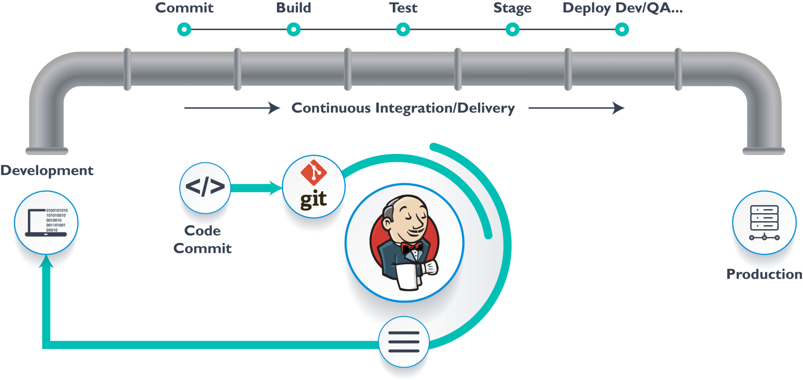

2. CI/CD

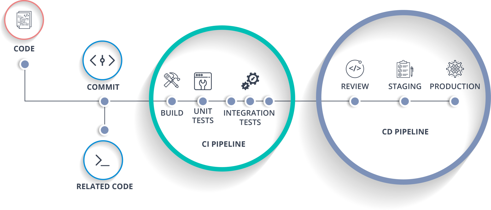

- **CI** là viết tắt của **Continuous Integration**: tích hợp liên tục, nhằm liên tục tích hợp các source code của các thành viên trong team lại một cách nhanh chóng
- **CD** là viết tắt của **Continuous Delivery**: chuyển giao liên tục, là 1 tập hợp các kỹ thuật để triển khai tích hợp souce code trên môi trường staging ( một môi trường rất giống với môi trường production).

## B. Thực hành

> Yều cầu cài đặt với VM hệ điều hành Ubuntu với cấu hình

> - CPU: 4 Core
> - RAM: 4 GB
> - Disk: 100 GB

> Lưu ý, trong bài Node Jenkins và Gitlab của mình sẽ có IP như sau

> - Jenkins: 192.168.1.159

**1. Cài đặt Jenkins**

- Cài đặt Docker
```
sudo apt-get update
sudo apt install docker.io
```
- Cấp quyền cho Docker để không phải dùng sudo

```
sudo gpasswd -a $USER docker
sudo service docker restart
sudo service docker.io restart
```

- Cài Jenkins

```
docker network create jenkins
docker run --name jenkins-docker --rm --detach \
--privileged --network jenkins --network-alias docker \
--env DOCKER_TLS_CERTDIR=/certs \
--volume jenkins-docker-certs:/certs/client \
--volume jenkins-data:/var/jenkins_home \
--publish 2376:2376 docker:dind --storage-driver overlay2
```
- Build Jenkins Images
  - Tạo Dockerfile
  ```
  nano Dockerfile
  ---
     FROM jenkins/jenkins:2.289.1-lts-jdk11
   USER root
   RUN apt-get update && apt-get install -y apt-transport-https \
       ca-certificates curl gnupg2 \
       software-properties-common
   RUN curl -fsSL https://download.docker.com/linux/debian/gpg | apt-key add -
   RUN apt-key fingerprint 0EBFCD88
   RUN add-apt-repository \
       "deb [arch=amd64] https://download.docker.com/linux/debian \
       $(lsb_release -cs) stable"
   RUN apt-get update && apt-get install -y docker-ce-cli
   USER jenkins
   RUN jenkins-plugin-cli --plugins "blueocean:1.24.6 docker-workflow:1.26"
   ```

   - Build image với tên và tag như sau
  ```
  docker build -t filjenkins:1.1 .
  ```
  - Run Jenkins
  ```
  docker run --name jenkins-blueocean --rm --detach \
  --network jenkins --env DOCKER_HOST=tcp://docker:2376 \
  --env DOCKER_CERT_PATH=/certs/client --env DOCKER_TLS_VERIFY=1 \
  --publish 8080:8080 --publish 50000:50000 \
  --volume jenkins-data:/var/jenkins_home \
  --volume jenkins-docker-certs:/certs/client:ro \
  --volume "$HOME":/home \
  filjenkins:1.1
  ```
  - Kiểm tra các container đang chạy

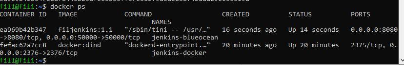

- Cấu hình Jenkins

  - Truy cập vào Dashboard tại địa chỉ http://192.168.1.159:8080/ với 192.168.1.159 là địa chỉ VM cài Jenkins của bạn.

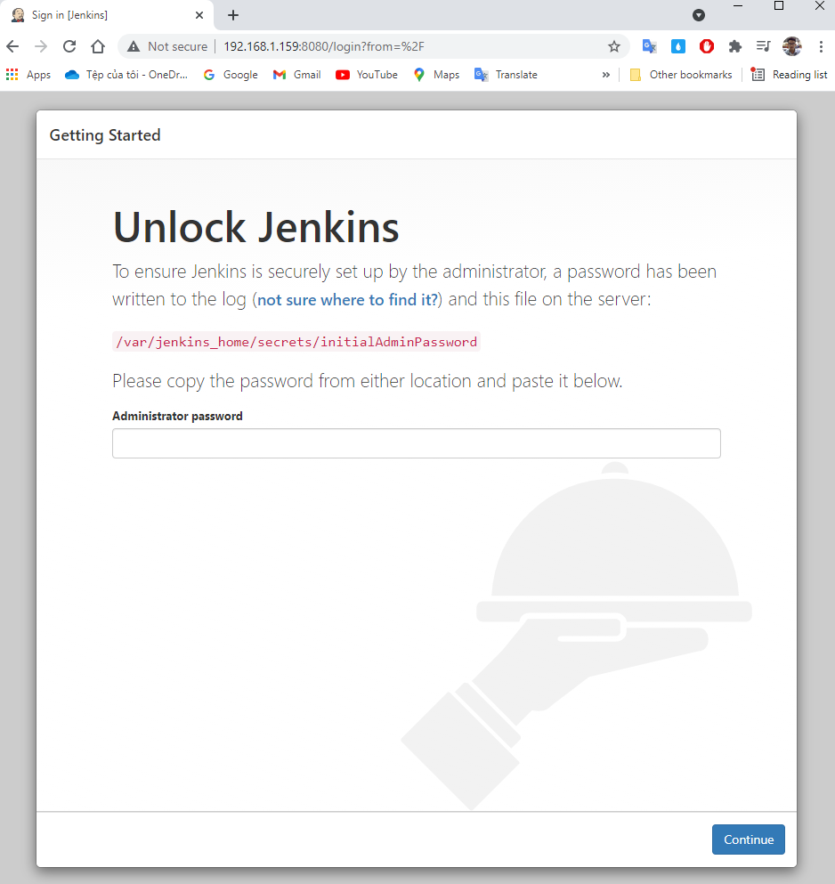

  - Chúng ta lấy password từ file logs  

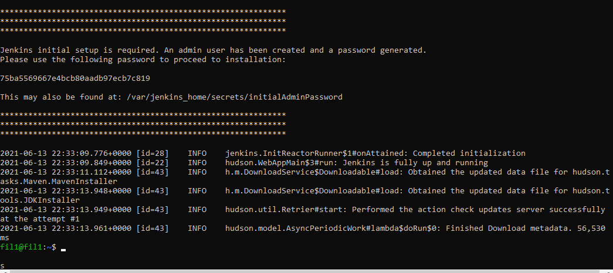

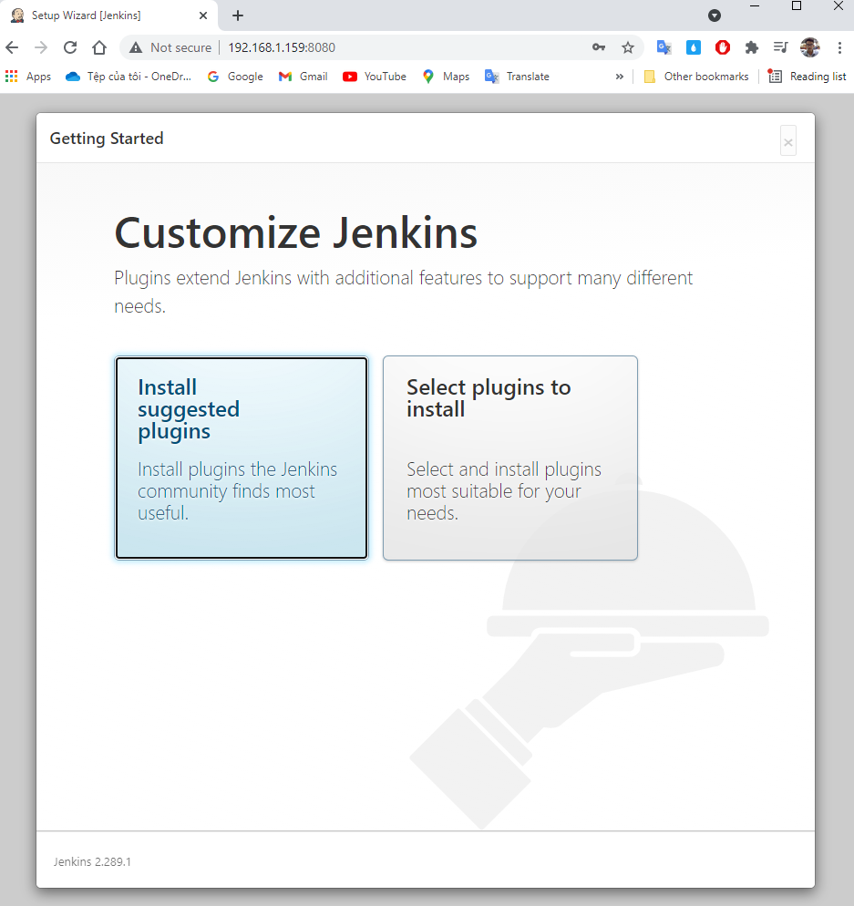

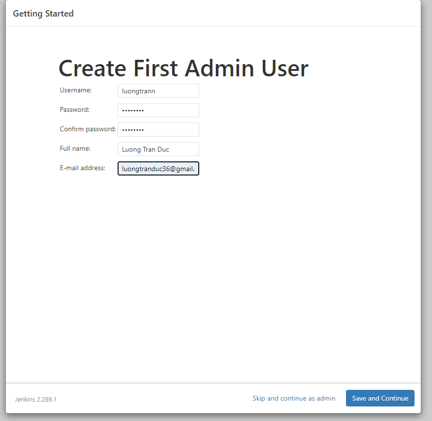

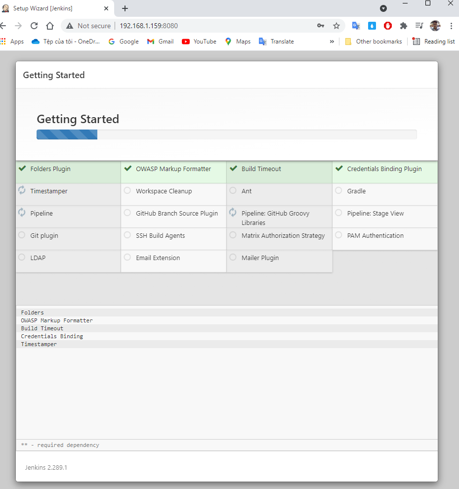

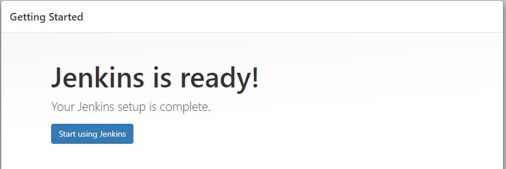

**2. Tích hợp Jenkins và Gitlab**

**Mô tả**
Luồng sau khi tích hợp Gitlab với Jenkin sẽ hoạt động như sau:

> - Khi commit source code tới Gitlab, Gitlab sẽ gửi webhook tới Jenkins
> - Jenkins nhận Webhook, và xử lý:
    >   - Clone source code
>   - Build source code thành Container
>   - Chạy test Django
>   - Deploy source bằng Docker Compose

2.1 Chuẩn bị repo gitlab

B1: Cấu hình pipeline dưới dạng Codetrong Jenkins

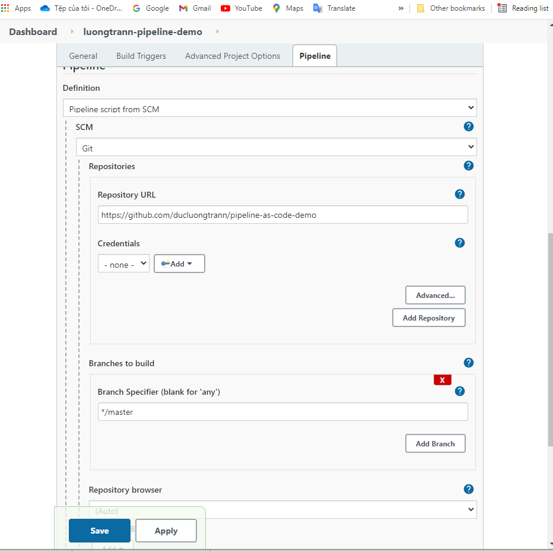

B2: Tạo một repo Github với pipeline code trong một tệp có tên Jenkinsfile

**Viết Jenkinsfile**

Đẩy code lên github: <https://github.com/ducluongtrann/pipeline-as-code-demo>

```

pipeline {
    agent {
        node {
            label 'SLAVE01'
        }
    }

    tools { 
        maven 'maven3' 
    }

    options {
        buildDiscarder logRotator( 
                    daysToKeepStr: '15', 
                    numToKeepStr: '10'
            )
    }

    environment {
        APP_NAME = "DCUBE_APP"
        APP_ENV  = "DEV"
    }

    stages {
        
        stage('Cleanup Workspace') {
            steps {
                cleanWs()
                sh """
                echo "Cleaned Up Workspace for ${APP_NAME}"
                """
            }
        }

        stage('Code Checkout') {
            steps {
                checkout([
                    $class: 'GitSCM', 
                    branches: [[name: '*/master']], 
                    userRemoteConfigs: [[url: 'https://github.com/ducluongtrann/pipeline-as-code-demo.git']]
                ])
            }
        }

        stage('Code Build') {
            steps {
                 sh 'mvn install -Dmaven.test.skip=true'
            }
        }

        stage('Priting All Global Variables') {
            steps {
                sh """
                env
                """
            }
        }

    }   
}

```

- Mở xem giao diện blue ocean

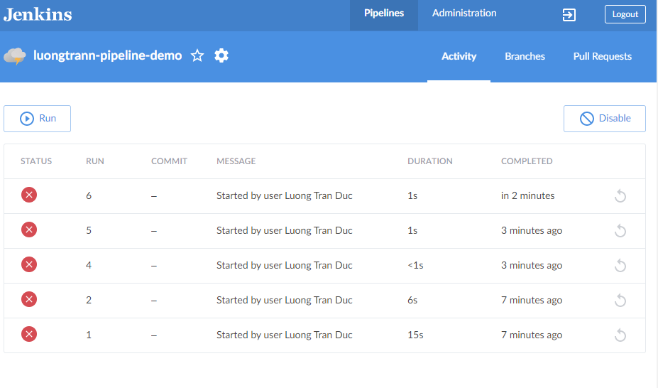

*Bài làm phần sau chỉ dưới dạng demo, còn nhiều sai sót. Sẽ bổ sung update sau khi có thêm thời gian tìm hiểu.*

## Tài liệu tham khảo

- <https://www.jenkins.io/doc/book/>
- <https://topdev.vn/blog/jenkins-la-gi/>
- <https://stackjava.com/jenkins/jenkins-la-gi-build-deploy-tu-dong-voi-jenkins.html>
- <https://cloudfun.vn/threads/jenkins-pipeline-duoi-dang-code-huong-dan-cho-nguoi-moi-bat-dau.491/>
